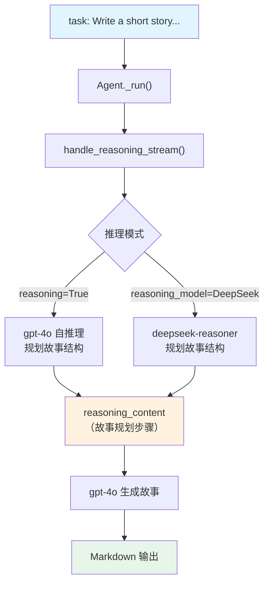

# life_in_500000_years.py — 实现原理分析

> 源文件：`cookbook/10_reasoning/agents/life_in_500000_years.py`

## 概述

本示例展示 Agno 的 **`reasoning`（内置链式思维）** 与 **`reasoning_model`（外部推理模型）** 在**创意写作**场景中的应用。两种方式都让 Agent 先进行结构化推理（规划故事背景、人物、情节），再生成未来科幻短故事。

**核心配置一览：**

| 配置项 | cot_agent | deepseek_agent | 说明 |
|--------|-----------|----------------|------|
| `model` | `OpenAIChat(id="gpt-4o")` | `OpenAIChat(id="gpt-4o")` | Chat Completions API |
| `reasoning` | `True` | `False`（默认） | 内置 COT 推理 |
| `reasoning_model` | `None` | `DeepSeek(id="deepseek-reasoner")` | 外部推理模型 |
| `markdown` | `True` | `True` | Markdown 格式化 |

## 架构分层

```
用户代码层                     agno.agent 层
┌──────────────────────┐    ┌──────────────────────────────────┐
│ life_in_500000_years │    │ Agent._run()                     │
│ .py                  │    │  ├ handle_reasoning_stream()     │
│                      │    │  │    reason() 推理阶段           │
│ task: "Write a short │───>│  │    （规划故事结构）            │
│ story about life in  │    │  └ main model response           │
│ 500000 years"        │    │       （生成故事）                │
└──────────────────────┘    └──────────────────────────────────┘
```

## System Prompt 组装

| 序号 | 组成部分 | 本文件中的值/来源 | 是否生效 |
|------|---------|-----------------|---------|
| 3.2.1 | `markdown` | `True` | 是 |
| 其他 | 未设置 | — | 否 |

### 最终 System Prompt

```text
Use markdown to format your answers.
```

## Mermaid 流程图



## 关键源码文件索引

| 文件 | 关键函数/类 | 作用 |
|------|------------|------|
| `agno/agent/agent.py` | `reasoning` L184, `reasoning_model` L185 | 推理配置 |
| `agno/agent/_response.py` | `handle_reasoning_stream()` L86 | 流式推理触发 |
