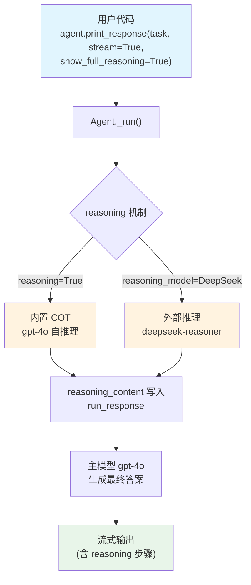

# logical_puzzle.py — 实现原理分析

> 源文件：`cookbook/10_reasoning/agents/logical_puzzle.py`

## 概述

本示例展示 Agno 的 **`reasoning`（内置链式思维）** 与 **`reasoning_model`（外部推理模型）** 两种机制在**逻辑谜题求解**场景中的对比。`reasoning=True` 使主模型自行分步推理，`reasoning_model=DeepSeek(id="deepseek-reasoner")` 则将推理委派给专用的 DeepSeek 推理模型。

**核心配置一览：**

| 配置项 | cot_agent | deepseek_agent | 说明 |
|--------|-----------|----------------|------|
| `model` | `OpenAIChat(id="gpt-4o")` | `OpenAIChat(id="gpt-4o")` | Chat Completions API |
| `reasoning` | `True` | `False`（默认） | 内置 COT 推理 |
| `reasoning_model` | `None` | `DeepSeek(id="deepseek-reasoner")` | 外部推理模型 |
| `markdown` | `True` | `True` | Markdown 格式化 |

## 架构分层

```
用户代码层                     agno.agent 层
┌──────────────────────┐    ┌──────────────────────────────────┐
│ logical_puzzle.py    │    │ Agent._run()                     │
│                      │    │  ├ handle_reasoning_stream()     │
│ cot_agent:           │    │  │    reason() →                 │
│   reasoning=True     │───>│  │    ReasoningManager.run()     │
│                      │    │  │    (使用主模型 gpt-4o)        │
│ deepseek_agent:      │    │  │                               │
│   reasoning_model=   │───>│  │    reason() →                 │
│   DeepSeek(...)      │    │  │    (使用 deepseek-reasoner)   │
└──────────────────────┘    └──────────────────────────────────┘
                                        │
                    ┌───────────────────┴────────────────────┐
                    ▼                                        ▼
            ┌──────────────┐                      ┌──────────────────┐
            │ OpenAIChat   │                      │ DeepSeek         │
            │ gpt-4o       │                      │ deepseek-reasoner│
            └──────────────┘                      └──────────────────┘
```

## 核心组件解析

### ReasoningManager 与推理步骤

推理流程由 `_response.py` 中的 `handle_reasoning_stream()` 驱动，触发条件为 `agent.reasoning or agent.reasoning_model is not None`：

```python
# _response.py:86-101
def handle_reasoning_stream(agent, run_response, run_messages, run_context, stream_events):
    if agent.reasoning or agent.reasoning_model is not None:
        reasoning_generator = reason(
            agent=agent,
            run_response=run_response,
            run_messages=run_messages,
            run_context=run_context,
            stream_events=stream_events,
        )
        yield from reasoning_generator
```

推理步骤结果写入 `run_response.reasoning_content`，由 `show_full_reasoning=True` 控制是否在流式输出中显示。

### show_full_reasoning 参数

`show_full_reasoning=True` 是 `print_response()` 的调用参数，控制推理步骤的可见性——若为 True，推理内容（`reasoning_content`）随流式输出一同打印；否则仅输出最终答案。

## System Prompt 组装

| 序号 | 组成部分 | 本文件中的值/来源 | 是否生效 |
|------|---------|-----------------|---------|
| 1 | `system_message`（自定义） | None | 否 |
| 3.1 | `instructions` | None | 否 |
| 3.2.1 | `markdown` | `True` → "Use markdown to format your answers." | 是 |
| 其他 | 所有其他步骤 | 未设置 | 否 |

### 最终 System Prompt

```text
Use markdown to format your answers.
```

## 完整 API 请求

```python
# cot_agent - 推理阶段（主模型自身推理）
client.chat.completions.create(
    model="gpt-4o",
    messages=[
        {"role": "system", "content": "Use markdown to format your answers."},
        {"role": "user", "content": "Three missionaries and three cannibals need to cross a river..."},
    ],
    stream=True,
    stream_options={"include_usage": True}
)
```

## Mermaid 流程图



## 关键源码文件索引

| 文件 | 关键函数/类 | 作用 |
|------|------------|------|
| `agno/agent/agent.py` | `reasoning` L184 | 内置 COT 开关 |
| `agno/agent/agent.py` | `reasoning_model` L185 | 外部推理模型 |
| `agno/agent/_response.py` | `handle_reasoning_stream()` L86 | 流式推理触发入口 |
| `agno/agent/_response.py` | `handle_reasoning()` L70 | 非流式推理触发入口 |
