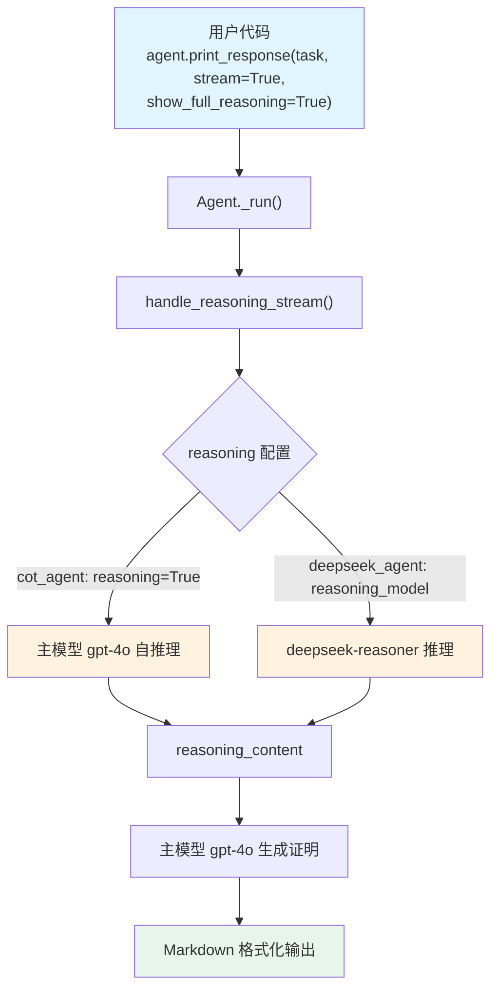

# mathematical_proof.py — 实现原理分析

> 源文件：`cookbook/10_reasoning/agents/mathematical_proof.py`

## 概述

本示例展示 Agno 的 **`reasoning`（内置链式思维）** 与 **`reasoning_model`（外部推理模型）** 在**数学证明**任务中的对比。两种方式均能在回答前完成系统性的推理，区别在于：`reasoning=True` 使用主模型自我推理，`reasoning_model=DeepSeek(id="deepseek-reasoner")` 则将推理任务交给专用推理模型。

**核心配置一览：**

| 配置项 | cot_agent | deepseek_agent | 说明 |
|--------|-----------|----------------|------|
| `model` | `OpenAIChat(id="gpt-4o")` | `OpenAIChat(id="gpt-4o")` | Chat Completions API |
| `reasoning` | `True` | `False`（默认） | 内置 COT 推理 |
| `reasoning_model` | `None` | `DeepSeek(id="deepseek-reasoner")` | 外部推理模型 |
| `markdown` | `True` | `True` | Markdown 格式化 |

## 架构分层

```
用户代码层                     agno.agent 层
┌──────────────────────┐    ┌──────────────────────────────────┐
│ mathematical_proof.py│    │ Agent._run()                     │
│                      │    │  ├ handle_reasoning_stream()     │
│ task: "Prove that    │    │  │    reason() → ReasoningManager│
│ for any positive..." │───>│  │                               │
│                      │    │  └ main model response           │
└──────────────────────┘    └──────────────────────────────────┘
                                        │
                    ┌───────────────────┴────────────────────┐
                    ▼                                        ▼
            ┌──────────────┐                      ┌──────────────────┐
            │ OpenAIChat   │                      │ DeepSeek         │
            │ gpt-4o       │                      │ deepseek-reasoner│
            │ (推理+回答)  │                      │ (仅推理阶段)     │
            └──────────────┘                      └──────────────────┘
```

## 核心组件解析

### 两种推理模式对比

| 特性 | `reasoning=True` | `reasoning_model=DeepSeek(...)` |
|------|-----------------|--------------------------------|
| 推理模型 | 主模型（gpt-4o）自身 | deepseek-reasoner |
| 推理质量 | 受主模型能力限制 | 专用推理模型，推理链更深 |
| API 调用次数 | 通常 2 轮（推理 + 回答） | 2 轮（deepseek 推理 + gpt-4o 回答） |
| 推理内容可见 | 通过 `show_full_reasoning=True` | 通过 `show_full_reasoning=True` |

推理步骤最终都写入 `run_response.reasoning_content`，格式为结构化的 `ReasoningStep` 序列。

## System Prompt 组装

| 序号 | 组成部分 | 本文件中的值/来源 | 是否生效 |
|------|---------|-----------------|---------|
| 1 | `system_message` | None | 否 |
| 3.1 | `instructions` | None | 否 |
| 3.2.1 | `markdown` | `True` → "Use markdown to format your answers." | 是 |
| 其他 | 所有其他步骤 | 未设置 | 否 |

### 最终 System Prompt

```text
Use markdown to format your answers.
```

## 完整 API 请求

```python
client.chat.completions.create(
    model="gpt-4o",
    messages=[
        {"role": "system", "content": "Use markdown to format your answers."},
        {"role": "user", "content": "Prove that for any positive integer n, the sum of the first n odd numbers is equal to n squared..."},
    ],
    stream=True,
    stream_options={"include_usage": True}
)
```

## Mermaid 流程图



## 关键源码文件索引

| 文件 | 关键函数/类 | 作用 |
|------|------------|------|
| `agno/agent/agent.py` | `reasoning` L184 | 内置 COT 推理开关 |
| `agno/agent/agent.py` | `reasoning_model` L185 | 外部推理模型配置 |
| `agno/agent/_response.py` | `handle_reasoning_stream()` L86 | 流式推理触发 |
| `agno/reasoning/step.py` | `ReasoningStep` | 推理步骤数据模型 |
