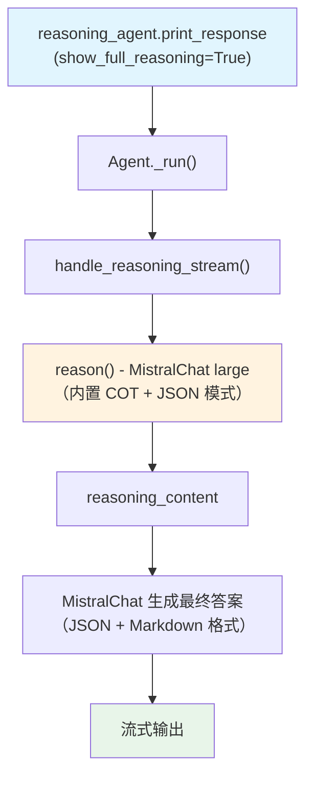

# mistral_reasoning_cot.py — 实现原理分析

> 源文件：`cookbook/10_reasoning/agents/mistral_reasoning_cot.py`

## 概述

本示例展示 Agno 的 **`reasoning=True`（内置链式思维）** 与 **Mistral 模型**（`mistral-large-latest`）的结合，同时启用 `use_json_mode=True`。Mistral 是欧洲领先的开源 LLM 公司，其模型在数学推理和代码生成上表现优异。

**核心配置一览：**

| 配置项 | 值 | 说明 |
|--------|------|------|
| `model` | `MistralChat(id="mistral-large-latest")` | Mistral Large 最新版 |
| `reasoning` | `True` | 启用内置 COT 推理 |
| `markdown` | `True` | Markdown 格式化 |
| `use_json_mode` | `True` | JSON 模式输出 |

## 架构分层

```
用户代码层                     agno.agent 层
┌──────────────────────┐    ┌──────────────────────────────────┐
│ mistral_reasoning_   │    │ Agent._run()                     │
│ cot.py               │    │  ├ handle_reasoning_stream()     │
│                      │    │  │    reason() →                 │
│ reasoning_agent:     │───>│  │    ReasoningManager.run()     │
│   MistralChat(large) │    │  └ MistralChat 主模型 response   │
│   reasoning=True     │    │                                  │
│   use_json_mode=True │    │                                  │
└──────────────────────┘    └──────────────────────────────────┘
                                        │
                                        ▼
                                ┌──────────────────┐
                                │ MistralChat      │
                                │ mistral-large    │
                                │ -latest          │
                                └──────────────────┘
```

## 核心组件解析

### use_json_mode 对推理的影响

`use_json_mode=True` 与 `reasoning=True` 共存时：
- `use_json_mode` 在 `_messages.py:420-430` 步骤 3.3.15 中注入 JSON 格式化 prompt
- 推理阶段使用同一个模型（MistralChat），因此推理步骤也会以 JSON 格式输出
- 这在某些场景下有助于结构化推理，但可能影响可读性

## System Prompt 组装

| 序号 | 组成部分 | 本文件中的值/来源 | 是否生效 |
|------|---------|-----------------|---------|
| 3.2.1 | `markdown` | `True` | 是 |
| 3.3.15 | JSON output prompt | `use_json_mode=True` | 是 |
| 其他 | 未设置 | — | 否 |

## Mermaid 流程图



## 关键源码文件索引

| 文件 | 关键函数/类 | 作用 |
|------|------------|------|
| `agno/agent/agent.py` | `reasoning` L184 | 内置 COT 开关 |
| `agno/agent/agent.py` | `use_json_mode` L296 | JSON 模式开关 |
| `agno/agent/_response.py` | `handle_reasoning_stream()` L86 | 流式推理触发 |
| `agno/agent/_messages.py` | JSON output prompt L420-430 | JSON 格式化指令注入 |
| `agno/models/mistral` | `MistralChat` | Mistral 模型类 |
