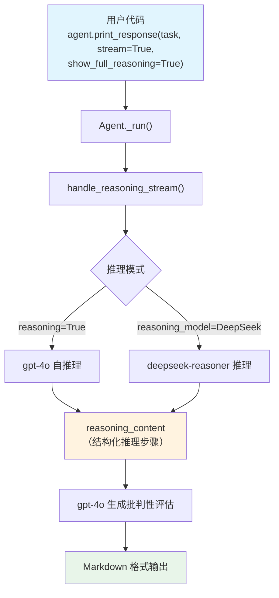

# scientific_research.py — 实现原理分析

> 源文件：`cookbook/10_reasoning/agents/scientific_research.py`

## 概述

本示例展示 Agno 的 **`reasoning`（内置链式思维）** 与 **`reasoning_model`（外部推理模型）** 在**科研论文批评评估**场景中的应用对比。通过两种方式让 Agent 对学术摘要进行方法论、结论和偏差的批判性分析。

**核心配置一览：**

| 配置项 | cot_agent | deepseek_agent | 说明 |
|--------|-----------|----------------|------|
| `model` | `OpenAIChat(id="gpt-4o")` | `OpenAIChat(id="gpt-4o")` | Chat Completions API |
| `reasoning` | `True` | `False`（默认） | 内置 COT 推理 |
| `reasoning_model` | `None` | `DeepSeek(id="deepseek-reasoner")` | 外部推理模型 |
| `markdown` | `True` | `True` | Markdown 格式化 |

## 架构分层

```
用户代码层                     agno.agent 层
┌──────────────────────┐    ┌──────────────────────────────────┐
│ scientific_research  │    │ Agent._run()                     │
│ .py                  │    │  ├ handle_reasoning_stream()     │
│                      │    │  │    reason() 推理阶段           │
│ task: "Read the      │───>│  └ main model response           │
│ following abstract   │    │       └ 批判性分析输出            │
│ ..."                 │    │                                  │
└──────────────────────┘    └──────────────────────────────────┘
                                        │
                    ┌───────────────────┴────────────────────┐
                    ▼                                        ▼
            ┌──────────────┐                      ┌──────────────────┐
            │ OpenAIChat   │                      │ DeepSeek         │
            │ gpt-4o       │                      │ deepseek-reasoner│
            └──────────────┘                      └──────────────────┘
```

## 核心组件解析

### 推理内容与最终答案的关系

两种模式的推理都通过 `handle_reasoning_stream()` 完成，推理结果写入 `run_response.reasoning_content`。推理结束后，主模型 `gpt-4o` 基于推理内容生成最终的批判性评估。

推理内容由 `ReasoningStep` 序列构成，每步包含：
- `title`：步骤标题
- `reasoning`：详细思考过程
- `action`：下一步动作
- `confidence`：置信度（0.0-1.0）

## System Prompt 组装

| 序号 | 组成部分 | 本文件中的值/来源 | 是否生效 |
|------|---------|-----------------|---------|
| 1 | `system_message` | None | 否 |
| 3.1 | `instructions` | None | 否 |
| 3.2.1 | `markdown` | `True` → "Use markdown to format your answers." | 是 |
| 其他 | 所有其他步骤 | 未设置 | 否 |

### 最终 System Prompt

```text
Use markdown to format your answers.
```

## 完整 API 请求

```python
client.chat.completions.create(
    model="gpt-4o",
    messages=[
        {"role": "system", "content": "Use markdown to format your answers."},
        {"role": "user", "content": "Read the following abstract of a scientific paper and provide a critical evaluation..."},
    ],
    stream=True,
    stream_options={"include_usage": True}
)
```

## Mermaid 流程图



## 关键源码文件索引

| 文件 | 关键函数/类 | 作用 |
|------|------------|------|
| `agno/agent/agent.py` | `reasoning` L184, `reasoning_model` L185 | 推理配置 |
| `agno/agent/_response.py` | `handle_reasoning_stream()` L86 | 流式推理触发 |
| `agno/reasoning/step.py` | `ReasoningStep` | 推理步骤数据结构 |
