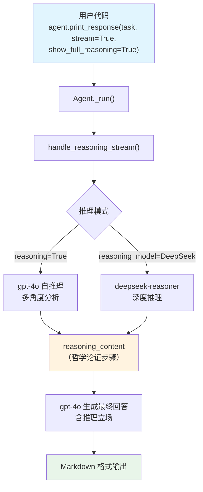

# ship_of_theseus.py — 实现原理分析

> 源文件：`cookbook/10_reasoning/agents/ship_of_theseus.py`

## 概述

本示例展示 Agno 的 **`reasoning`（内置链式思维）** 与 **`reasoning_model`（外部推理模型）** 在**哲学思辨**场景中的对比。Agent 需要分析"忒修斯之船"悖论，探讨同一性与变化的概念，并给出自己的推理立场。

**核心配置一览：**

| 配置项 | cot_agent | deepseek_agent | 说明 |
|--------|-----------|----------------|------|
| `model` | `OpenAIChat(id="gpt-4o")` | `OpenAIChat(id="gpt-4o")` | Chat Completions API |
| `reasoning` | `True` | `False`（默认） | 内置 COT 推理 |
| `reasoning_model` | `None` | `DeepSeek(id="deepseek-reasoner")` | 外部推理模型 |
| `markdown` | `True` | `True` | Markdown 格式化 |

## 架构分层

```
用户代码层                     agno.agent 层
┌──────────────────────┐    ┌──────────────────────────────────┐
│ ship_of_theseus.py   │    │ Agent._run()                     │
│                      │    │  ├ handle_reasoning_stream()     │
│ task: "Discuss the   │    │  │    reason() 推理阶段           │
│ concept of 'The Ship │───>│  └ main model response           │
│ of Theseus'..."      │    │                                  │
└──────────────────────┘    └──────────────────────────────────┘
                                        │
                    ┌───────────────────┴────────────────────┐
                    ▼                                        ▼
            ┌──────────────┐                      ┌──────────────────┐
            │ OpenAIChat   │                      │ DeepSeek         │
            │ gpt-4o       │                      │ deepseek-reasoner│
            └──────────────┘                      └──────────────────┘
```

## 核心组件解析

### 推理机制与哲学任务的契合

哲学分析需要多角度论证，这正是链式推理的强项。无论是 `reasoning=True` 还是 `reasoning_model=DeepSeek`，推理过程都会：
1. 分解问题（正方观点、反方观点）
2. 评估论证
3. 形成有根据的结论

推理完成后，`reasoning_content` 被附加到请求上下文，主模型 `gpt-4o` 基于此生成最终的哲学分析文章。

## System Prompt 组装

| 序号 | 组成部分 | 本文件中的值/来源 | 是否生效 |
|------|---------|-----------------|---------|
| 1 | `system_message` | None | 否 |
| 3.2.1 | `markdown` | `True` → "Use markdown to format your answers." | 是 |
| 其他 | 未设置 | — | 否 |

### 最终 System Prompt

```text
Use markdown to format your answers.
```

## 完整 API 请求

```python
client.chat.completions.create(
    model="gpt-4o",
    messages=[
        {"role": "system", "content": "Use markdown to format your answers."},
        {"role": "user", "content": "Discuss the concept of 'The Ship of Theseus' and its implications..."},
    ],
    stream=True,
    stream_options={"include_usage": True}
)
```

## Mermaid 流程图



## 关键源码文件索引

| 文件 | 关键函数/类 | 作用 |
|------|------------|------|
| `agno/agent/agent.py` | `reasoning` L184, `reasoning_model` L185 | 推理配置 |
| `agno/agent/_response.py` | `handle_reasoning_stream()` L86 | 流式推理触发 |
