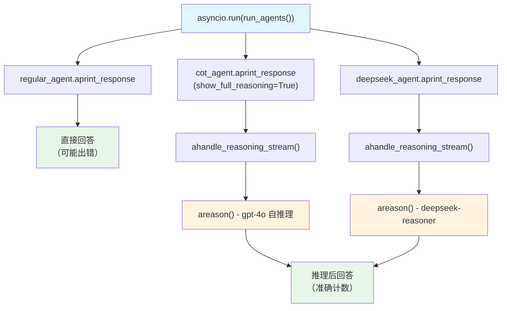

# strawberry.py — 实现原理分析

> 源文件：`cookbook/10_reasoning/agents/strawberry.py`

## 概述

本示例展示 Agno 的**异步推理**机制：使用 `asyncio.run()` + `aprint_response()` 异步调用三种 Agent（普通、内置 COT、DeepSeek 推理），对比它们在计数任务（统计 "strawberry" 中 'r' 的数量）上的准确性差异。

**核心配置一览：**

| 配置项 | regular_agent | cot_agent | deepseek_agent | 说明 |
|--------|--------------|-----------|----------------|------|
| `model` | `OpenAIChat(id="gpt-4o")` | `OpenAIChat(id="gpt-4o")` | `OpenAIChat(id="gpt-4o")` | Chat Completions API |
| `reasoning` | `False`（默认） | `True` | `False`（默认） | 内置 COT |
| `reasoning_model` | `None` | `None` | `DeepSeek(id="deepseek-reasoner")` | 外部推理模型 |
| `markdown` | `True` | `True` | `True` | Markdown 格式化 |

## 架构分层

```
用户代码层                          agno.agent 层（异步）
┌──────────────────────────┐    ┌──────────────────────────────────┐
│ strawberry.py            │    │ Agent.aprint_response()          │
│                          │    │  └ Agent._arun()                  │
│ asyncio.run(run_agents())│───>│      ├ ahandle_reasoning_stream() │
│                          │    │      │    areason() 异步推理       │
│ 三个 agent 顺序异步调用   │    │      └ main model async response  │
└──────────────────────────┘    └──────────────────────────────────┘
                                              │
                          ┌───────────────────┴────────────────────┐
                          ▼                                        ▼
                  ┌──────────────┐                      ┌──────────────────┐
                  │ OpenAIChat   │                      │ DeepSeek         │
                  │ gpt-4o       │                      │ deepseek-reasoner│
                  └──────────────┘                      └──────────────────┘
```

## 核心组件解析

### 异步推理触发（ahandle_reasoning_stream）

异步模式下触发推理的入口为 `_response.py:120` 的 `ahandle_reasoning_stream()`：

```python
# _response.py:120-136
async def ahandle_reasoning_stream(agent, run_response, run_messages, run_context, stream_events):
    if agent.reasoning or agent.reasoning_model is not None:
        reason_generator = areason(
            agent=agent,
            run_response=run_response,
            run_messages=run_messages,
            run_context=run_context,
            stream_events=stream_events,
        )
        async for item in reason_generator:
            yield item
```

与同步版本的 `handle_reasoning_stream()` 完全对应，推理步骤、`reasoning_content` 的写入逻辑相同，只是通过 `async for` 进行异步迭代。

### 计数任务的推理价值

`regular_agent` 无推理，直接回答，容易在计数时出错（GPT-4o 有时错报 2 个 r）。`cot_agent` 和 `deepseek_agent` 通过推理步骤逐字分析，准确率显著提升，这也是本示例的核心对比价值。

## System Prompt 组装

| 序号 | 组成部分 | 本文件中的值/来源 | 是否生效 |
|------|---------|-----------------|---------|
| 3.2.1 | `markdown` | `True` | 是 |
| 其他 | 未设置 | — | 否 |

### 最终 System Prompt

```text
Use markdown to format your answers.
```

## Mermaid 流程图



## 关键源码文件索引

| 文件 | 关键函数/类 | 作用 |
|------|------------|------|
| `agno/agent/agent.py` | `reasoning` L184, `reasoning_model` L185 | 推理配置 |
| `agno/agent/_response.py` | `ahandle_reasoning_stream()` L120 | 异步流式推理触发 |
| `agno/agent/_response.py` | `ahandle_reasoning()` L104 | 异步非流式推理触发 |
