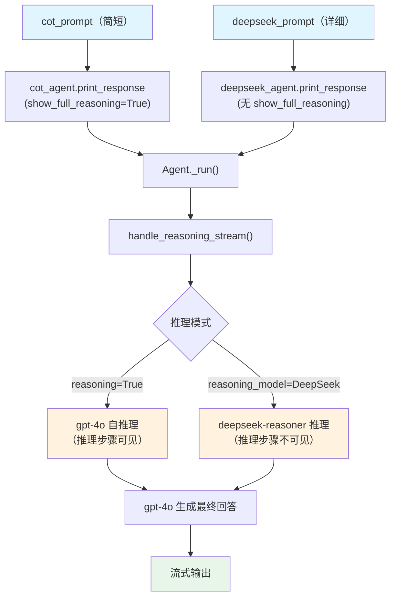

# trolley_problem.py — 实现原理分析

> 源文件：`cookbook/10_reasoning/agents/trolley_problem.py`

## 概述

本示例展示 Agno 的 **`reasoning`（内置链式思维）** 与 **`reasoning_model`（外部推理模型）** 在**伦理哲学分析**场景中的应用。`cot_agent` 使用 `reasoning=True` 自推理，`deepseek_agent` 使用 `reasoning_model=DeepSeek(id="deepseek-reasoner")` 委派推理。两个 Agent 接收不同 prompt（deepseek 版本更详细），分别从功利主义、义务论和美德伦理视角分析电车问题。

**核心配置一览：**

| 配置项 | cot_agent | deepseek_agent | 说明 |
|--------|-----------|----------------|------|
| `model` | `OpenAIChat(id="gpt-4o")` | `OpenAIChat(id="gpt-4o")` | Chat Completions API |
| `reasoning` | `True` | `False`（默认） | 内置 COT 推理 |
| `reasoning_model` | `None` | `DeepSeek(id="deepseek-reasoner")` | 外部推理模型 |
| `markdown` | `True` | `True` | Markdown 格式化 |

## 架构分层

```
用户代码层                     agno.agent 层
┌──────────────────────┐    ┌──────────────────────────────────┐
│ trolley_problem.py   │    │ Agent._run()                     │
│                      │    │  ├ handle_reasoning_stream()     │
│ cot_prompt: 简短     │    │  │    reason() 推理阶段           │
│ deepseek_prompt: 详细│───>│  └ main model response           │
└──────────────────────┘    └──────────────────────────────────┘
                                        │
                    ┌───────────────────┴────────────────────┐
                    ▼                                        ▼
            ┌──────────────┐                      ┌──────────────────┐
            │ OpenAIChat   │                      │ DeepSeek         │
            │ gpt-4o       │                      │ deepseek-reasoner│
            └──────────────┘                      └──────────────────┘
```

## 核心组件解析

### 不同 prompt 对推理质量的影响

本文件特点是两个 Agent 使用不同的 prompt：
- `cot_prompt`：简短，让 Agent 自由发挥推理
- `deepseek_prompt`：更详细，明确要求功利主义、义务论、美德伦理三个框架并附 ASCII 图

更详细的 prompt 会影响推理步骤的结构和深度，但推理机制本身（`reasoning=True` / `reasoning_model`）不受影响。

`deepseek_agent` 调用时未传 `show_full_reasoning=True`，因此推理内容不会显示在流式输出中，只返回最终答案。

## System Prompt 组装

| 序号 | 组成部分 | 本文件中的值/来源 | 是否生效 |
|------|---------|-----------------|---------|
| 1 | `system_message` | None | 否 |
| 3.1 | `instructions` | None | 否 |
| 3.2.1 | `markdown` | `True` → "Use markdown to format your answers." | 是 |
| 其他 | 所有其他步骤 | 未设置 | 否 |

### 最终 System Prompt

```text
Use markdown to format your answers.
```

## 完整 API 请求

```python
# cot_agent（show_full_reasoning=True，推理可见）
client.chat.completions.create(
    model="gpt-4o",
    messages=[
        {"role": "system", "content": "Use markdown to format your answers."},
        {"role": "user", "content": "Solve the trolley problem. Evaluate multiple ethical frameworks. Include an ASCII diagram of your solution."},
    ],
    stream=True,
    stream_options={"include_usage": True}
)
```

## Mermaid 流程图



## 关键源码文件索引

| 文件 | 关键函数/类 | 作用 |
|------|------------|------|
| `agno/agent/agent.py` | `reasoning` L184, `reasoning_model` L185 | 推理配置 |
| `agno/agent/_response.py` | `handle_reasoning_stream()` L86 | 流式推理触发 |
