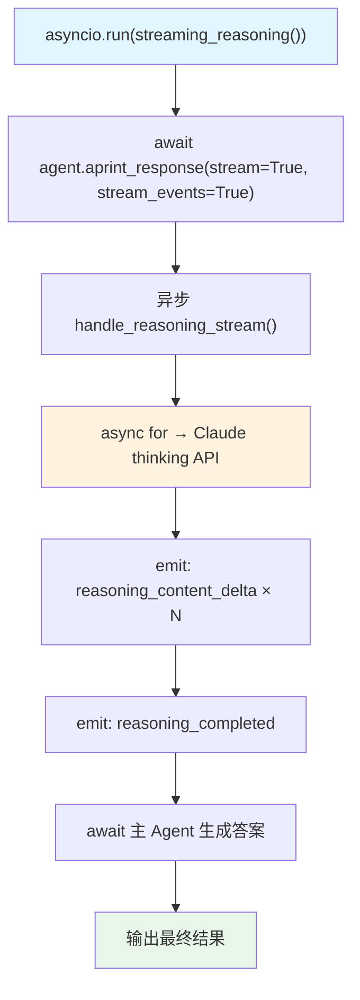

# async_reasoning_stream.py — 实现原理分析

> 源文件：`cookbook/10_reasoning/models/anthropic/async_reasoning_stream.py`

## 概述

本示例展示 **Claude Extended Thinking + 异步流式推理事件**。与 `basic_reasoning_stream.py` 的核心差异是使用 `asyncio.run()` + `aprint_response()` 实现完全异步的推理流式输出。

**核心配置一览：**

| 配置项 | 值 | 说明 |
|--------|------|------|
| `reasoning_model` | `Claude(id="claude-sonnet-4-5", thinking={"type": "enabled", "budget_tokens": 1024})` | Claude 扩展思考 |
| `reasoning` | `True` | 启用 Agno 推理包装 |
| `instructions` | `"Think step by step about the problem."` | 推理引导 |
| 执行方式 | `asyncio.run(streaming_reasoning())` | 异步执行 |

## 核心组件解析

### 异步执行结构

```python
async def streaming_reasoning():
    agent = Agent(reasoning_model=Claude(...), reasoning=True, ...)
    await agent.aprint_response(prompt, stream=True, stream_events=True)

asyncio.run(streaming_reasoning())
```

`aprint_response()` 是 `print_response()` 的异步变体，内部调用 `arun()` → `handle_reasoning_stream()` 的异步版本，使用 `async for` 迭代推理事件。

### 适用场景

异步推理流适合集成到 FastAPI、aiohttp 等异步 Web 框架中，或需要并发运行多个推理任务的场景。

## System Prompt 组装

| 序号 | 组成部分 | 值 | 是否生效 |
|------|---------|-----|---------|
| 3.1 | `instructions` | `"Think step by step about the problem."` | 是 |

## Mermaid 流程图



## 关键源码文件索引

| 文件 | 关键函数/类 | 作用 |
|------|------------|------|
| `agno/agent/agent.py` | `aprint_response()` | 异步打印响应 |
| `agno/models/anthropic/claude.py` | `Claude` | Anthropic Claude 模型 |
