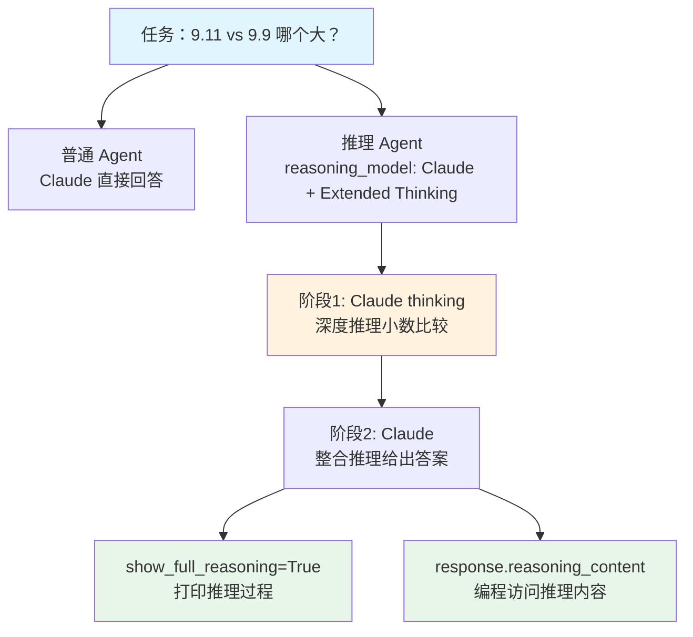

# basic_reasoning.py — 实现原理分析

> 源文件：`cookbook/10_reasoning/models/anthropic/basic_reasoning.py`

## 概述

本示例通过**对比实验**展示 Claude Extended Thinking（扩展思考）的效果：普通 Claude vs Claude with Extended Thinking，任务是比较小数 9.11 与 9.9 的大小。同时展示如何通过 `response.reasoning_content` 以编程方式访问推理内容。

**核心配置对比：**

| 配置项 | 普通 Agent | 推理 Agent |
|--------|-----------|-----------|
| `model` | `Claude(id="claude-sonnet-4-5")` | `Claude(id="claude-sonnet-4-5")` |
| `reasoning_model` | 无 | `Claude(id="claude-sonnet-4-5", thinking={"type": "enabled", "budget_tokens": 1024})` |
| `markdown` | `True` | `True` |

## 核心组件解析

### Claude Extended Thinking 配置

Claude 的扩展思考通过 `thinking` 参数在模型层配置：

```python
Claude(
    id="claude-sonnet-4-5",
    thinking={"type": "enabled", "budget_tokens": 1024},
)
```

- `"type": "enabled"` — 启用扩展思考
- `"budget_tokens": 1024` — 最多允许 1024 个思考 token
- 思考 token 在 API 响应中作为特殊 block 返回，不计入常规 token 配额

### show_full_reasoning=True

`print_response(task, stream=True, show_full_reasoning=True)` 让 Agno 在终端打印完整推理过程，不设置则只显示最终答案。

### reasoning_content 属性访问

```python
response = reasoning_agent.run(task, stream=False)
if response.reasoning_content:
    print(response.reasoning_content[:300])
```

`RunOutput.reasoning_content` 包含模型的完整思考内容，可用于调试、评估或存储。

## System Prompt 组装

| 序号 | 组成部分 | 值 | 是否生效 |
|------|---------|-----|---------|
| 3.2.1 | `markdown` | `True` | 是 |

## Mermaid 流程图



## 关键源码文件索引

| 文件 | 关键函数/类 | 作用 |
|------|------------|------|
| `agno/models/anthropic/claude.py` | `Claude` | Anthropic Claude 模型（支持 thinking） |
| `agno/run/response.py` | `RunOutput.reasoning_content` | 推理内容访问属性 |
