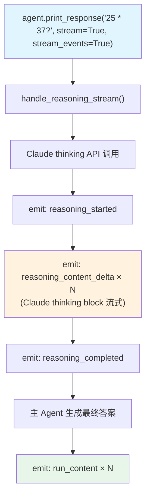

# basic_reasoning_stream.py — 实现原理分析

> 源文件：`cookbook/10_reasoning/models/anthropic/basic_reasoning_stream.py`

## 概述

本示例展示 **Claude Extended Thinking + `reasoning=True` + `stream_events=True`** 的同步流式推理。使用 Claude 的 `thinking` 参数启用扩展思考，通过 Agno 的流式事件系统实时观察推理过程。

**核心配置一览：**

| 配置项 | 值 | 说明 |
|--------|------|------|
| `reasoning_model` | `Claude(id="claude-sonnet-4-5", thinking={"type": "enabled", "budget_tokens": 1024})` | Claude 扩展思考 |
| `reasoning` | `True` | 启用 Agno 推理包装 |
| `instructions` | `"Think step by step about the problem."` | 推理引导 |
| `stream_events` | `True` | 流式事件输出 |

## 核心组件解析

### Claude thinking 参数

`budget_tokens: 1024` 设置扩展思考的 token 上限。Anthropic 会在 API 响应中返回 `thinking` 类型的 content block，Agno 将其映射为 `reasoning_content_delta` 事件流式发出。

### 同步 vs 异步

本文件使用同步的 `agent.print_response()`（对应 `async_reasoning_stream.py` 使用 `aprint_response()`），两者产生相同的事件序列，差异仅在于执行上下文。

## System Prompt 组装

| 序号 | 组成部分 | 值 | 是否生效 |
|------|---------|-----|---------|
| 3.1 | `instructions` | `"Think step by step about the problem."` | 是 |

## Mermaid 流程图

## 关键源码文件索引

| 文件 | 关键函数/类 | 作用 |
|------|------------|------|
| `agno/agent/_response.py` | `handle_reasoning_stream()` L86 | 流式推理事件入口 |
| `agno/models/anthropic/claude.py` | `Claude` | Anthropic Claude 模型 |
