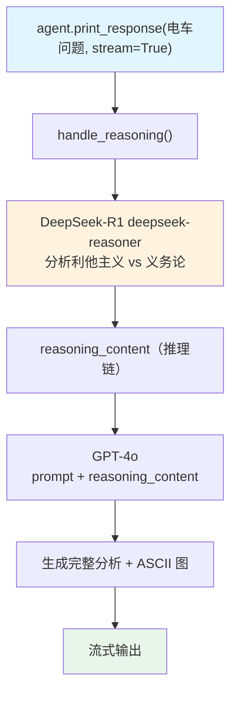

# ethical_dilemma.py — 实现原理分析

> 源文件：`cookbook/10_reasoning/models/deepseek/ethical_dilemma.py`

## 概述

本示例展示 **`model=gpt-4o` + `reasoning_model=DeepSeek(deepseek-reasoner)`** 的跨厂商推理组合。DeepSeek-R1 专注于伦理问题推理，GPT-4o 负责生成最终的结构化答案（含 ASCII 图）。

**核心配置一览：**

| 配置项 | 值 | 说明 |
|--------|------|------|
| `model` | `OpenAIChat(id="gpt-4o")` | 响应生成（OpenAI） |
| `reasoning_model` | `DeepSeek(id="deepseek-reasoner")` | 推理模型（DeepSeek） |
| `markdown` | `True` | Markdown 格式化 |

## 核心组件解析

### DeepSeek-R1 推理机制

`deepseek-reasoner` 是 DeepSeek 的 R1 推理模型：
- 通过 `<think>...</think>` 标签暴露内部推理链
- Agno 将 `<think>` 标签内容解析为 `reasoning_content`
- 推理完成后，DeepSeek 返回正式答案
- Agno 将推理内容传递给 GPT-4o 作为上下文

### 跨厂商组合优势

- DeepSeek-R1：开源、推理能力强、成本低
- GPT-4o：格式化输出质量高（ASCII 图、Markdown）
- 两者 API 均基于 OpenAI 兼容格式

## System Prompt 组装

| 序号 | 组成部分 | 值 | 是否生效 |
|------|---------|-----|---------|
| 3.2.1 | `markdown` | `True` | 是 |

## Mermaid 流程图

## 关键源码文件索引

| 文件 | 关键函数/类 | 作用 |
|------|------------|------|
| `agno/models/deepseek/deepseek.py` | `DeepSeek` | DeepSeek 模型（R1 推理） |
| `agno/models/openai/chat.py` | `OpenAIChat` | GPT-4o 响应生成 |
