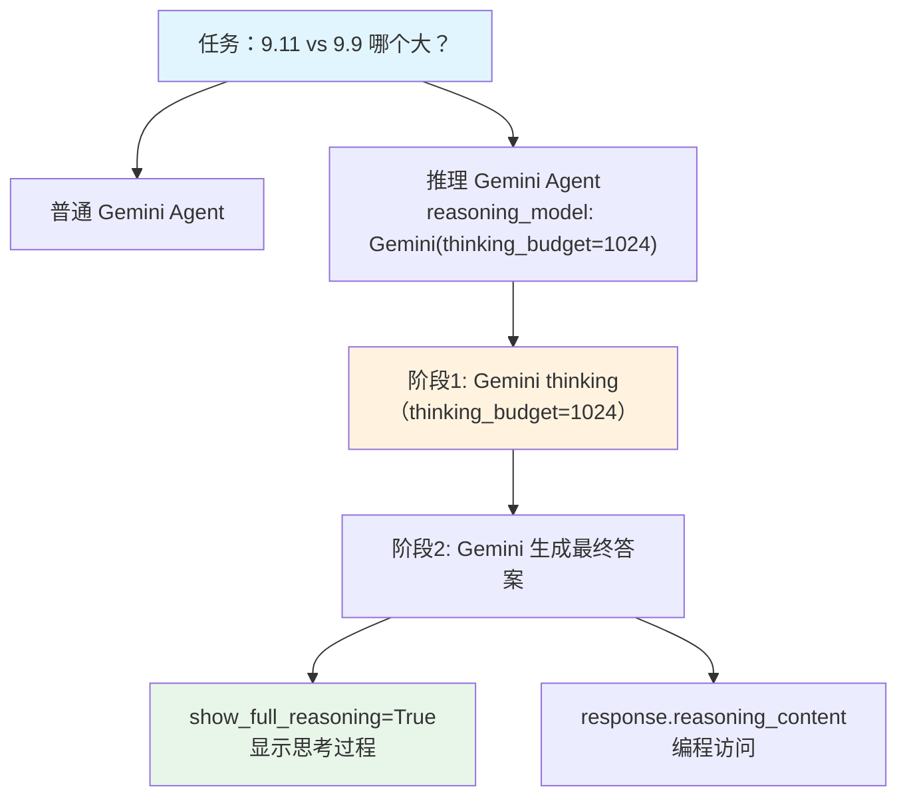

# basic_reasoning.py — 实现原理分析

> 源文件：`cookbook/10_reasoning/models/gemini/basic_reasoning.py`

## 概述

本示例通过**对比实验**展示 **Gemini Thinking Budget** 的效果：普通 Gemini vs Gemini with Thinking Budget，任务是比较小数 9.11 与 9.9。与 Claude 的 `thinking` 参数对应，Gemini 使用 `thinking_budget` 控制思考 token 上限。

**核心配置对比：**

| 配置项 | 普通 Agent | 推理 Agent |
|--------|-----------|-----------|
| `model` | `Gemini(id="gemini-2.5-flash")` | `Gemini(id="gemini-2.5-flash")` |
| `reasoning_model` | 无 | `Gemini(id="gemini-2.5-flash", thinking_budget=1024)` |
| `markdown` | `True` | `True` |

## 核心组件解析

### Gemini thinking_budget 参数

```python
Gemini(
    id="gemini-2.5-flash",
    thinking_budget=1024,  # 必须设置才能启用 thinking 模式
)
```

- `thinking_budget` 是 Gemini 特有参数，控制 thinking token 上限
- **必须设置此参数**才能启用 Gemini 的 thinking 模式（区别于 Claude 的 `type: enabled`）
- 设置为 0 则禁用 thinking

### 三阶段运行

```python
# 普通对比
regular_agent.print_response(task, stream=True)

# 推理 + 显示完整推理过程
reasoning_agent.print_response(task, stream=True, show_full_reasoning=True)

# 编程方式访问推理内容
response = reasoning_agent.run(task, stream=False)
response.reasoning_content  # Gemini 的思考内容
```

## System Prompt 组装

| 序号 | 组成部分 | 值 | 是否生效 |
|------|---------|-----|---------|
| 3.2.1 | `markdown` | `True` | 是 |

## Mermaid 流程图



## 关键源码文件索引

| 文件 | 关键函数/类 | 作用 |
|------|------------|------|
| `agno/models/google/gemini.py` | `Gemini` | Google Gemini 模型（支持 thinking_budget） |
