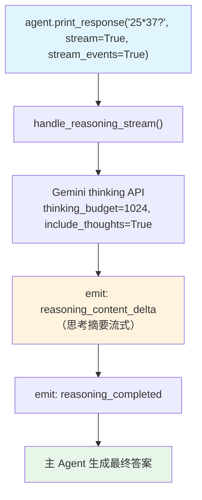

# basic_reasoning_stream.py — 实现原理分析

> 源文件：`cookbook/10_reasoning/models/gemini/basic_reasoning_stream.py`

## 概述

本示例展示 **Gemini thinking_budget + include_thoughts + `reasoning=True` + 同步流式事件**。`include_thoughts=True` 让 Gemini 在响应中包含思考摘要，配合 Agno 的事件流可实时观察推理过程。

**核心配置一览：**

| 配置项 | 值 | 说明 |
|--------|------|------|
| `reasoning_model` | `Gemini(id="gemini-2.5-flash", thinking_budget=1024, include_thoughts=True)` | Gemini 思考模式 + 思考摘要 |
| `reasoning` | `True` | 启用 Agno 推理包装 |
| `instructions` | `"Think step by step about the problem."` | 推理引导 |
| `stream_events` | `True` | 流式事件输出 |

## 核心组件解析

### include_thoughts 参数

`include_thoughts=True` 是 Gemini 特有参数：
- `False`（默认）— 思考内容不出现在响应中，仅影响推理质量
- `True` — 在响应中包含思考摘要（thought summaries），Agno 将其作为 `reasoning_content_delta` 事件发出

与 `thinking_budget` 的关系：`thinking_budget` 控制思考容量，`include_thoughts` 控制是否将思考内容传回客户端。

### 同步流式推理

使用 `agent.print_response(prompt, stream=True, stream_events=True)`（同步），底层调用 `handle_reasoning_stream()` 同步版本。

## System Prompt 组装

| 序号 | 组成部分 | 值 | 是否生效 |
|------|---------|-----|---------|
| 3.1 | `instructions` | `"Think step by step about the problem."` | 是 |

## Mermaid 流程图

## 关键源码文件索引

| 文件 | 关键函数/类 | 作用 |
|------|------------|------|
| `agno/models/google/gemini.py` | `Gemini` | Google Gemini 模型（支持 thinking_budget） |
| `agno/agent/_response.py` | `handle_reasoning_stream()` L86 | 流式推理事件 |
