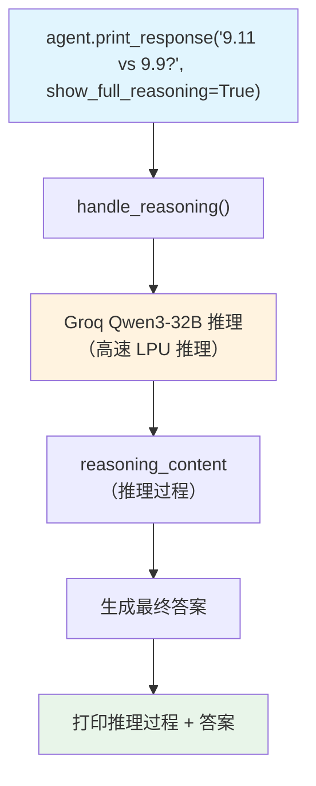

# 9_11_or_9_9.py — 实现原理分析

> 源文件：`cookbook/10_reasoning/models/groq/9_11_or_9_9.py`

## 概述

本示例展示 **Groq 上的 Qwen3-32B + `reasoning=True`** 实现经典推理测试（9.11 vs 9.9 哪个大）。Qwen3 是具备原生推理能力的模型，通过 Groq 的高速推理基础设施运行，配合 `show_full_reasoning=True` 展示完整思考过程。

**核心配置一览：**

| 配置项 | 值 | 说明 |
|--------|------|------|
| `model` | `Groq(id="qwen/qwen3-32b", temperature=0.6, max_tokens=1024, top_p=0.95)` | Qwen3-32B on Groq |
| `reasoning` | `True` | 启用 Agno 推理包装 |
| `markdown` | `True` | Markdown 格式化 |
| `show_full_reasoning` | `True`（在 print_response 中） | 显示完整推理过程 |

## 核心组件解析

### Groq + Qwen3 推理参数

Qwen3 的推理参数配置：
- `temperature=0.6` — 适中随机性，有助于推理的探索性
- `max_tokens=1024` — 限制推理 token，避免过长
- `top_p=0.95` — 核采样，平衡多样性和连贯性

这些参数是 Qwen3 官方推荐的推理配置，通过 `Groq()` 构造函数直接传递给 API。

### Groq 推理速度优势

Groq 使用自研 LPU（Language Processing Unit），推理速度远超 GPU。配合 Qwen3 的原生推理能力，实现 **快速 + 深度推理** 的组合。

## System Prompt 组装

| 序号 | 组成部分 | 值 | 是否生效 |
|------|---------|-----|---------|
| 3.2.1 | `markdown` | `True` | 是 |

## Mermaid 流程图

## 关键源码文件索引

| 文件 | 关键函数/类 | 作用 |
|------|------------|------|
| `agno/models/groq/groq.py` | `Groq` | Groq 模型（高速推理） |
