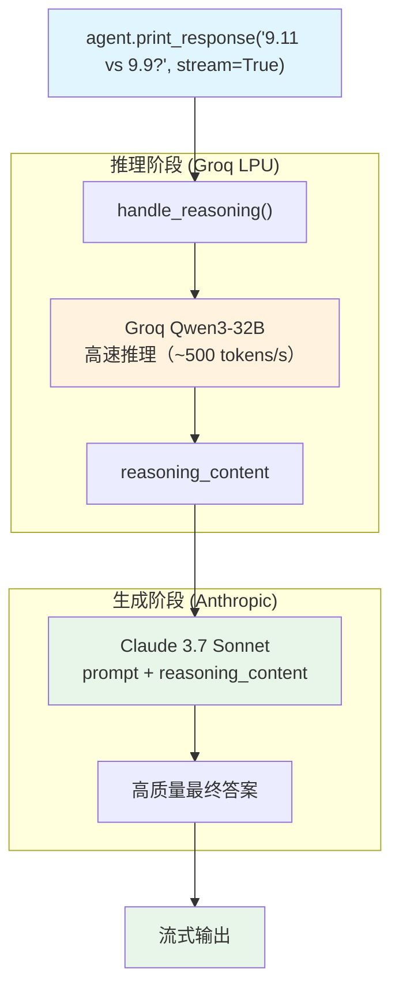

# deepseek_plus_claude.py — 实现原理分析

> 源文件：`cookbook/10_reasoning/models/groq/deepseek_plus_claude.py`

## 概述

本示例展示一个独特的**三厂商混合推理组合**：`model=Claude 3.7 Sonnet`（Anthropic）+ `reasoning_model=Groq(Qwen3-32B)`（Groq/Alibaba）。Qwen3-32B 在 Groq 的高速 LPU 上执行快速推理，Claude 负责生成高质量最终答案，实现速度与质量的极致组合。

**核心配置一览：**

| 配置项 | 值 | 说明 |
|--------|------|------|
| `model` | `Claude(id="claude-3-7-sonnet-20250219")` | 响应生成（Anthropic） |
| `reasoning_model` | `Groq(id="qwen/qwen3-32b", temperature=0.6, max_tokens=1024, top_p=0.95)` | Groq 上的快速推理 |

## 核心组件解析

### 混合推理的价值

| 阶段 | 模型 | 优势 |
|------|------|------|
| 推理 | Groq + Qwen3-32B | 高速（LPU）、开源、推理能力强 |
| 生成 | Claude 3.7 Sonnet | 表达能力强、指令遵循好、输出质量高 |

### Agno 跨厂商协调

Agno 的 `reasoning_model` 机制与具体模型厂商无关——只要模型返回推理内容，Agno 就能将其作为上下文传递给主模型。不需要两个模型来自同一厂商或使用相同 API 格式。

### Qwen3 推理参数选择

- `temperature=0.6, top_p=0.95` — Qwen3 官方推荐的推理配置
- `max_tokens=1024` — 限制推理长度，避免 Groq 的 token 速率限制

## System Prompt 组装

| 序号 | 组成部分 | 值 | 是否生效 |
|------|---------|-----|---------|
| 所有配置 | 均未设置 | — | 否（最简配置） |

## Mermaid 流程图

## 关键源码文件索引

| 文件 | 关键函数/类 | 作用 |
|------|------------|------|
| `agno/models/anthropic/claude.py` | `Claude` | Anthropic Claude 模型 |
| `agno/models/groq/groq.py` | `Groq` | Groq 高速推理模型 |
| `agno/agent/_response.py` | `handle_reasoning()` L70 | 两阶段推理协调 |
