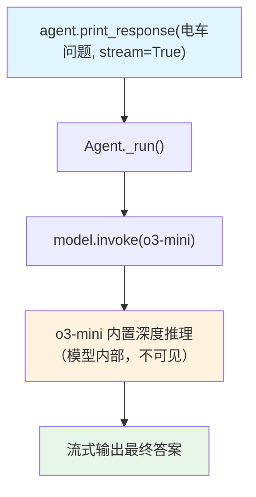

# o3_mini.py — 实现原理分析

> 源文件：`cookbook/10_reasoning/models/openai/o3_mini.py`

## 概述

本示例展示直接使用 **OpenAI o3-mini 原生推理模型**。o3-mini 是 OpenAI 的原生推理模型，内置深度思考能力，无需 `reasoning=True` 或 `ReasoningTools`——推理过程在模型内部完成，API 返回最终答案。

**核心配置一览：**

| 配置项 | 值 | 说明 |
|--------|------|------|
| `model` | `OpenAIChat(id="o3-mini")` | OpenAI o3-mini 原生推理模型 |
| `reasoning` | `False`（默认） | 无 Agno 层推理包装 |
| `reasoning_model` | `None` | 直接使用 o3-mini 内置推理 |
| `markdown` | `False`（默认） | 未设置 |

## 架构分层

```
用户代码层                     agno.agent 层
┌──────────────────────┐    ┌──────────────────────────────────┐
│ o3_mini.py           │    │ Agent._run()                     │
│                      │    │  ├ get_system_message() → None   │
│ agent:               │    │  │   （无任何配置，system msg 为空）│
│   OpenAIChat("o3-    │───>│  └ model.invoke()                │
│   mini")             │    │       o3-mini 内部推理           │
└──────────────────────┘    └──────────────────────────────────┘
                                        │
                                        ▼
                                ┌──────────────────┐
                                │ OpenAIChat       │
                                │ o3-mini          │
                                │ (原生推理能力)   │
                                └──────────────────┘
```

## 核心组件解析

### o3-mini 的原生推理机制

与 Agno 的 `reasoning=True` 不同，o3-mini 的推理发生在**模型内部**：
- OpenAI API 在服务端执行思考过程（不可见）
- 返回的响应直接是推理后的最终答案
- 没有额外的 API 调用轮次
- 推理 token 由模型内部消耗，通过 `reasoning_effort` 控制

### 空 System Prompt

由于没有 `instructions`、`markdown`、`description` 等任何配置，system prompt 为空或仅包含最基础内容（取决于模型默认行为）。

## System Prompt 组装

| 序号 | 组成部分 | 本文件中的值/来源 | 是否生效 |
|------|---------|-----------------|---------|
| 所有步骤 | 均未设置 | — | 否 |

### 最终 System Prompt

```text
（空）
```

## 完整 API 请求

```python
client.chat.completions.create(
    model="o3-mini",
    messages=[
        {"role": "user", "content": "Solve the trolley problem. Evaluate multiple ethical frameworks. Include an ASCII diagram of your solution."},
    ],
    stream=True,
    stream_options={"include_usage": True}
)
```

## Mermaid 流程图



## 关键源码文件索引

| 文件 | 关键函数/类 | 作用 |
|------|------------|------|
| `agno/models/openai/chat.py` | `OpenAIChat` | OpenAI Chat Completions 模型 |
