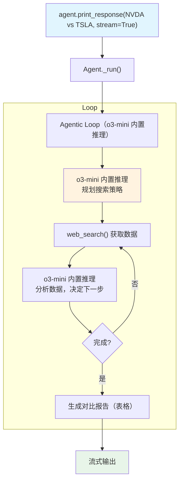

# o3_mini_with_tools.py — 实现原理分析

> 源文件：`cookbook/10_reasoning/models/openai/o3_mini_with_tools.py`

## 概述

本示例展示 **OpenAI o3-mini 原生推理模型 + `WebSearchTools`** 的组合。o3-mini 使用内置推理能力规划金融分析步骤，同时通过工具调用获取实时网络数据，实现推理能力与信息获取的结合。

**核心配置一览：**

| 配置项 | 值 | 说明 |
|--------|------|------|
| `model` | `OpenAIChat(id="o3-mini")` | OpenAI o3-mini 原生推理模型 |
| `tools` | `[WebSearchTools(enable_news=False)]` | 网络搜索工具（禁用新闻） |
| `instructions` | `"Use tables to display data."` | 表格格式化指令 |
| `markdown` | `True` | Markdown 格式化 |

## System Prompt 组装

| 序号 | 组成部分 | 本文件中的值/来源 | 是否生效 |
|------|---------|-----------------|---------|
| 3.1 | `instructions` | `"Use tables to display data."` | 是 |
| 3.2.1 | `markdown` | `True` | 是 |
| 3.3.5 | `_tool_instructions` | WebSearchTools 说明 | 是 |

## Mermaid 流程图

## 关键源码文件索引

| 文件 | 关键函数/类 | 作用 |
|------|------------|------|
| `agno/models/openai/chat.py` | `OpenAIChat` | OpenAI Chat Completions 模型 |
| `agno/tools/websearch.py` | `WebSearchTools` L16 | 网络搜索工具 |
