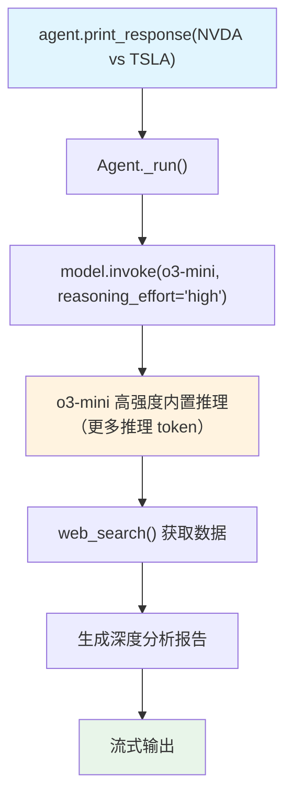

# reasoning_effort.py — 实现原理分析

> 源文件：`cookbook/10_reasoning/models/openai/reasoning_effort.py`

## 概述

本示例展示 **`reasoning_effort` 参数**在 OpenAI o3-mini 上的使用。`reasoning_effort` 控制推理模型在思考上投入的计算量，`"high"` 表示最高推理质量，相应地会使用更多推理 token 和增加延迟，但分析结果更深入。

**核心配置一览：**

| 配置项 | 值 | 说明 |
|--------|------|------|
| `model` | `OpenAIChat(id="o3-mini", reasoning_effort="high")` | o3-mini 高推理努力度 |
| `tools` | `[WebSearchTools(enable_news=False)]` | 网络搜索工具 |
| `instructions` | `"Use tables to display data."` | 格式化指令 |
| `markdown` | `True` | Markdown 格式化 |

## 核心组件解析

### reasoning_effort 参数

`reasoning_effort` 是 `OpenAIChat` 模型的构造参数，直接传递给 OpenAI API：
- `"low"` — 快速推理，推理 token 少，适合简单任务
- `"medium"` — 平衡模式（默认）
- `"high"` — 最深度推理，推理 token 多，适合复杂任务

本示例使用 `"high"`，确保金融分析的深度和准确性。此参数在 Agno 的 `OpenAIChat` 类中作为额外参数透传给 API。

## System Prompt 组装

| 序号 | 组成部分 | 本文件中的值/来源 | 是否生效 |
|------|---------|-----------------|---------|
| 3.1 | `instructions` | `"Use tables to display data."` | 是 |
| 3.2.1 | `markdown` | `True` | 是 |

## Mermaid 流程图

## 关键源码文件索引

| 文件 | 关键函数/类 | 作用 |
|------|------------|------|
| `agno/models/openai/chat.py` | `OpenAIChat` | OpenAI 模型（支持 reasoning_effort） |
| `agno/tools/websearch.py` | `WebSearchTools` L16 | 网络搜索工具 |
