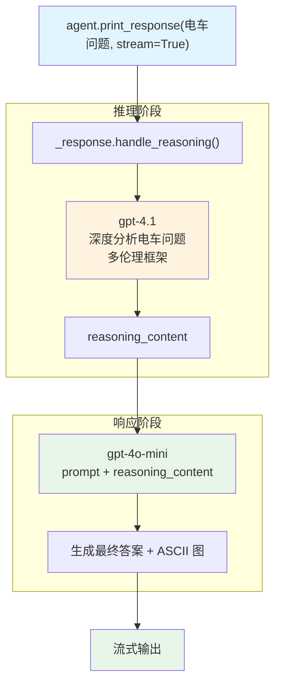

# reasoning_model_gpt_4_1.py — 实现原理分析

> 源文件：`cookbook/10_reasoning/models/openai/reasoning_model_gpt_4_1.py`

## 概述

本示例展示 **`model=gpt-4o-mini` + `reasoning_model=gpt-4.1`** 的异模型组合。gpt-4.1 承担推理阶段（深度分析），gpt-4o-mini 承担响应阶段（生成最终答案），实现推理能力与生成速度的平衡。

**核心配置一览：**

| 配置项 | 值 | 说明 |
|--------|------|------|
| `model` | `OpenAIResponses(id="gpt-4o-mini")` | 响应生成模型（轻量快速） |
| `reasoning_model` | `OpenAIResponses(id="gpt-4.1")` | 推理模型（强能力） |
| `reasoning` | 隐式 `True`（由 reasoning_model 触发） | 启用两阶段推理 |

## 核心组件解析

### 异模型两阶段推理

当 `reasoning_model` 与 `model` 为不同模型时，Agno 执行两次独立 API 调用：

1. **阶段 1（gpt-4.1）**：接收完整 prompt，进行深度推理，返回推理内容
2. **阶段 2（gpt-4o-mini）**：接收 prompt + 推理内容，生成最终用户响应

这种模式的优势：
- 推理阶段用强模型保证质量
- 响应阶段用快模型降低延迟和成本
- 两阶段解耦，可独立替换

### 两个模型都使用 OpenAIResponses

`OpenAIResponses` 支持 gpt-4.1 的推理能力和流式响应，比 `OpenAIChat` 在推理场景中更合适。

## System Prompt 组装

| 序号 | 组成部分 | 值 | 是否生效 |
|------|---------|-----|---------|
| 所有配置 | 均未设置 | — | 否 |

## Mermaid 流程图

## 关键源码文件索引

| 文件 | 关键函数/类 | 作用 |
|------|------------|------|
| `agno/agent/_response.py` | `handle_reasoning()` L70 | 两阶段推理入口 |
| `agno/models/openai/responses.py` | `OpenAIResponses` | Responses API 模型 |
