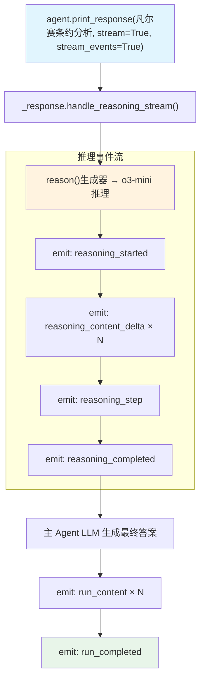

# reasoning_stream.py — 实现原理分析

> 源文件：`cookbook/10_reasoning/models/openai/reasoning_stream.py`

## 概述

本示例展示 **`reasoning_model=OpenAIResponses(o3-mini)` + `reasoning=True` + 流式事件（`stream_events=True`）**的组合。o3-mini 作为专属推理模型（低推理努力度），主 Agent 无需额外 model 配置，通过 `stream_events=True` 可订阅 `reasoning_started`、`reasoning_content_delta`、`reasoning_step`、`reasoning_completed` 等推理生命周期事件。

**核心配置一览：**

| 配置项 | 值 | 说明 |
|--------|------|------|
| `reasoning_model` | `OpenAIResponses(id="o3-mini", reasoning_effort="low")` | o3-mini 低努力度推理 |
| `reasoning` | `True` | 启用 Agno 推理包装 |
| `instructions` | `"Think step by step about the problem."` | 推理引导 |
| `stream_events` | `True` | 暴露推理事件流 |

## 核心组件解析

### 推理事件系统

`stream_events=True` 会触发 Agno 发出细粒度事件：

| 事件 | 说明 |
|------|------|
| `RunEvent.reasoning_started` | 推理阶段开始 |
| `RunEvent.reasoning_content_delta` | 推理内容增量（逐字流式） |
| `RunEvent.reasoning_step` | 推理步骤完成 |
| `RunEvent.reasoning_completed` | 推理阶段结束 |
| `RunEvent.run_content` | 最终答案内容增量 |

### reasoning_effort="low"

低推理努力度下，o3-mini 快速给出推理结果，适合对延迟敏感的场景。与 `"high"` 相比，推理 token 消耗更少。

## System Prompt 组装

| 序号 | 组成部分 | 本文件中的值/来源 | 是否生效 |
|------|---------|-----------------|---------|
| 3.1 | `instructions` | `"Think step by step about the problem."` | 是（注入到主 Agent system msg） |

## Mermaid 流程图

## 关键源码文件索引

| 文件 | 关键函数/类 | 作用 |
|------|------------|------|
| `agno/agent/_response.py` | `handle_reasoning_stream()` L86 | 推理流式事件入口 |
| `agno/models/openai/responses.py` | `OpenAIResponses` | Responses API 模型 |
| `agno/run/agent.py` | `RunEvent` | 运行事件枚举 |
