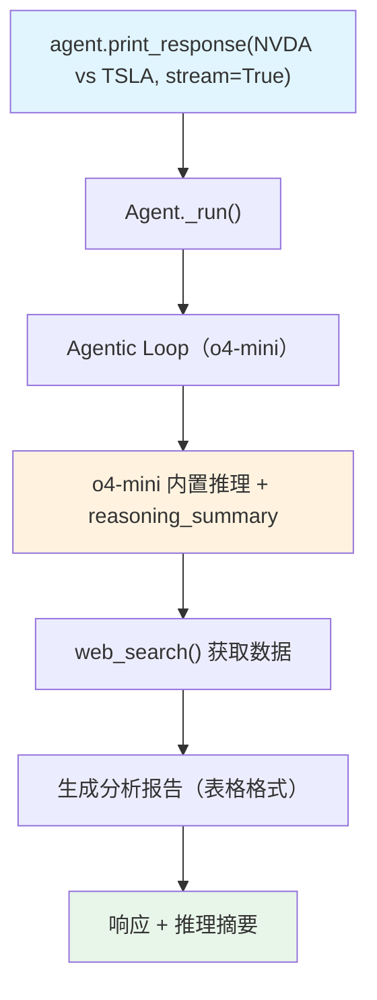

# reasoning_summary.py — 实现原理分析

> 源文件：`cookbook/10_reasoning/models/openai/reasoning_summary.py`

## 概述

本示例展示 **`OpenAIResponses` + `reasoning_summary` 参数**的使用。`reasoning_summary="auto"` 让 o4-mini 在返回响应时附带推理摘要，使开发者能了解模型的思考过程而无需暴露完整推理 token。

**核心配置一览：**

| 配置项 | 值 | 说明 |
|--------|------|------|
| `model` | `OpenAIResponses(id="o4-mini", reasoning_summary="auto")` | o4-mini + 自动推理摘要 |
| `tools` | `[WebSearchTools(enable_news=False)]` | 网络搜索（禁用新闻） |
| `instructions` | `"Use tables to display the analysis"` | 表格格式化指令 |
| `markdown` | `True` | Markdown 格式化 |

## 核心组件解析

### reasoning_summary 参数

`reasoning_summary` 是 `OpenAIResponses` 的构造参数，透传给 OpenAI Responses API：
- `"auto"` — 模型自动决定是否返回推理摘要
- `"concise"` — 返回简短推理摘要
- `"detailed"` — 返回详细推理摘要

推理摘要出现在响应的 `reasoning` 字段中，不消耗用户 token 配额，帮助调试模型决策过程。

### OpenAIResponses vs OpenAIChat

`OpenAIResponses` 使用 OpenAI **Responses API**（`/v1/responses`），支持更丰富的元数据如 `reasoning_summary`，而 `OpenAIChat` 使用标准 Chat Completions API。

## System Prompt 组装

| 序号 | 组成部分 | 本文件中的值/来源 | 是否生效 |
|------|---------|-----------------|---------|
| 3.1 | `instructions` | `"Use tables to display the analysis"` | 是 |
| 3.2.1 | `markdown` | `True` | 是 |

## Mermaid 流程图

## 关键源码文件索引

| 文件 | 关键函数/类 | 作用 |
|------|------------|------|
| `agno/models/openai/responses.py` | `OpenAIResponses` | Responses API 模型（支持 reasoning_summary） |
| `agno/tools/websearch.py` | `WebSearchTools` L16 | 网络搜索工具 |
