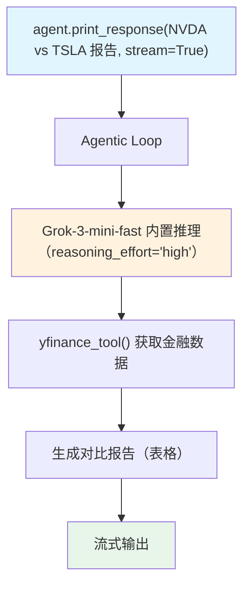

# reasoning_effort.py — 实现原理分析

> 源文件：`cookbook/10_reasoning/models/xai/reasoning_effort.py`

## 概述

本示例展示 **xAI Grok-3-mini-fast + `reasoning_effort="high"` + `YFinanceTools`** 的组合。Grok-3-mini-fast 是 xAI 的快速推理模型，`reasoning_effort` 参数控制内置推理深度，与 OpenAI o3-mini 的同名参数具有相似语义。

**核心配置一览：**

| 配置项 | 值 | 说明 |
|--------|------|------|
| `model` | `xAI(id="grok-3-mini-fast", reasoning_effort="high")` | Grok-3-mini 高推理努力度 |
| `tools` | `[YFinanceTools()]` | 金融数据工具 |
| `instructions` | `"Use tables to display data."` | 表格格式化 |
| `markdown` | `True` | Markdown 格式化 |

## 核心组件解析

### Grok-3-mini-fast + reasoning_effort

Grok-3-mini-fast 是 xAI 针对速度优化的推理模型：
- `"fast"` 后缀表示优化了推理速度
- `reasoning_effort="high"` 启用高强度内置推理
- 尽管名称含 `fast`，高推理努力度会增加延迟换取更高质量

### YFinanceTools 的使用

与 OpenAI o3-mini 示例使用 `WebSearchTools` 不同，本示例使用 `YFinanceTools` 获取实时金融数据：
- 可获取股票价格、财务报表、分析师评级等结构化数据
- 配合 `"Use tables to display data."` 指令生成清晰表格

## System Prompt 组装

| 序号 | 组成部分 | 值 | 是否生效 |
|------|---------|-----|---------|
| 3.1 | `instructions` | `"Use tables to display data."` | 是 |
| 3.2.1 | `markdown` | `True` | 是 |
| 3.3.5 | `_tool_instructions` | YFinanceTools 说明 | 是 |

## Mermaid 流程图

## 关键源码文件索引

| 文件 | 关键函数/类 | 作用 |
|------|------------|------|
| `agno/models/xai/xai.py` | `xAI` | xAI Grok 模型（支持 reasoning_effort） |
| `agno/tools/yfinance.py` | `YFinanceTools` | Yahoo Finance 金融数据工具 |
