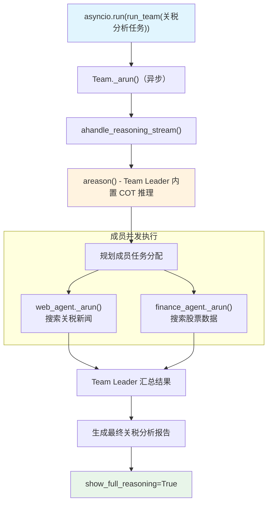

# finance_team_chain_of_thought.py — 实现原理分析

> 源文件：`cookbook/10_reasoning/teams/finance_team_chain_of_thought.py`

## 概述

本示例展示 **Team 使用 `reasoning=True`（内置链式思维）** 的模式：Team Leader（默认模型）通过 `reasoning=True` 在协调成员时进行内置 COT 推理，并以**异步**方式（`asyncio.run` + `aprint_response`）运行。

**核心配置一览：**

| 层级 | 配置项 | 值 | 说明 |
|------|--------|------|------|
| Team Leader | `model` | 默认（未指定，使用框架默认） | — |
| Team Leader | `reasoning` | `True` | 内置 COT 推理 |
| Team Leader | `members` | `[web_agent, finance_agent]` | 两个专业 Agent |
| Team Leader | `show_members_responses` | `True` | 显示成员响应 |
| Team Leader | `markdown` | `True` | Markdown 格式化 |
| web_agent | `model` | `OpenAIChat(id="gpt-4o-mini")` | Web 搜索专家 |
| finance_agent | `model` | `OpenAIChat(id="gpt-4o-mini")` | 金融数据专家 |

## 架构分层

```
用户代码层（异步）                  agno 层
┌──────────────────────────┐    ┌──────────────────────────────────────┐
│ finance_team_chain_of_   │    │ Team._arun()（异步）                  │
│ thought.py               │    │  ├ ahandle_reasoning_stream()        │
│                          │    │  │    areason() 推理阶段             │
│ asyncio.run(run_team())  │───>│  ├ 委派任务给成员 Agent              │
│ team_leader.aprint_      │    │  └ 异步汇总生成分析                  │
│ response(task, stream=T) │    │                                      │
└──────────────────────────┘    └──────────────────────────────────────┘
```

## 核心组件解析

### Team 的 reasoning=True

与 Agent 的 `reasoning=True` 机制相同，Team 也支持此参数。当 Team Leader 在协调成员时，会先通过推理阶段（`areason()`）规划任务分配策略，然后再委派给成员 Agent 执行。

`reasoning=True` 使 Team Leader 具备**元推理**能力：思考"哪个成员最适合处理哪个子任务"，而不是简单的轮询式委派。

### 异步执行模式

```python
async def run_team(task: str):
    await team_leader.aprint_response(task, stream=True, show_full_reasoning=True)

asyncio.run(run_team(task))
```

Team 的异步模式允许成员 Agent 并发执行，而不必等待前一个成员完成后再启动下一个。

## System Prompt 组装（Team Leader）

| 序号 | 组成部分 | 本文件中的值/来源 | 是否生效 |
|------|---------|-----------------|---------|
| 3.1 | `instructions` | `["Only output the final answer...", "Use tables to display data"]` | 是 |
| 3.2.1 | `markdown` | `True` | 是 |

## Mermaid 流程图



## 关键源码文件索引

| 文件 | 关键函数/类 | 作用 |
|------|------------|------|
| `agno/team/team.py` | `Team` | 多 Agent 团队类 |
| `agno/agent/_response.py` | `ahandle_reasoning_stream()` L120 | 异步推理触发 |
| `agno/tools/websearch.py` | `WebSearchTools` L16 | 成员 Agent 工具 |
