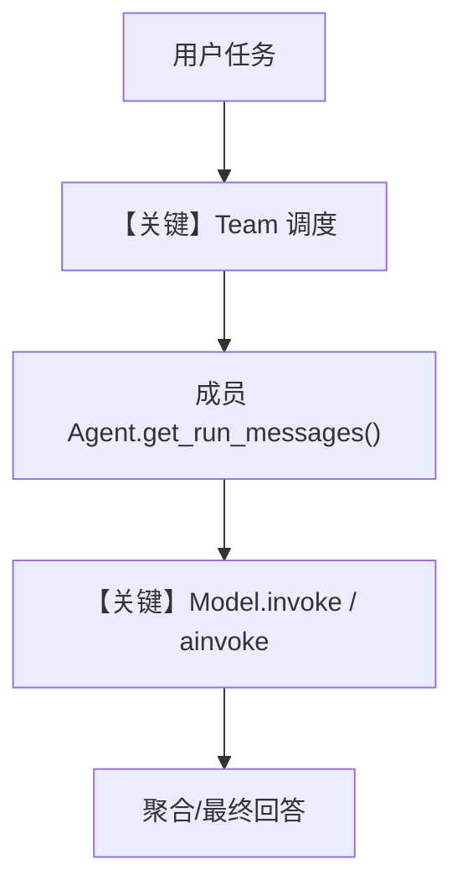

# finance_team_chain_of_thought.py — 实现原理分析

> 源文件：`cookbook/10_reasoning/teams/finance_team_chain_of_thought.py`

## 概述

本示例展示 Agno 的 **Team 多智能体协作**（以及可选的 **推理/工具/知识**）机制：由 `Team` 协调成员 Agent 完成任务，系统提示与用户消息在队长与成员之间分配。

**核心配置一览（Team）：**

| 配置项 | 值 | 说明 |
|--------|------|------|
| `instructions` | `['Only output the final answer, no other text.', 'Use tables to display data']` | Team 显式参数 |
| `markdown` | `True` | Team 显式参数 |
| `members` | `[web_agent, finance_agent]` | Team 显式参数 |
| `name` | `'Reasoning Finance Team Leader'` | Team 显式参数 |
| `reasoning` | `True` | Team 显式参数 |
| `show_members_responses` | `True` | Team 显式参数 |

成员 Agent 另见源码中各 `Agent(...)` 构造参数。

## 架构分层

```
用户代码层                agno.team / agno.agent 层
┌──────────────────┐    ┌──────────────────────────────────┐
│ finance_team_chain│    │ Team.run / Team._arun            │
│ Team + members   │───>│  成员 Agent：get_system_message  │
│ 任务字符串        │    │  get_run_messages → 模型 invoke  │
└──────────────────┘    └──────────────────────────────────┘
                                │
                                ▼
                        ┌──────────────┐
                        │ 各成员 Model  │
                        └──────────────┘
```

## 核心组件解析

### Team 协调

`Team` 在 `agno/team/` 中运行；队长模型（若配置）将任务拆解并调度成员，成员各自使用其 `Agent` 的 `get_system_message()` 与 `get_run_messages()`。

### 运行机制与因果链

1. **数据路径**：用户任务字符串进入 `Team` 运行入口，队长与成员按需多轮调用底层 `Model`。
2. **状态**：若未配置 `db`/持久化，本示例主要停留在内存中的 run 上下文；知识库示例会写入 LanceDB 数据目录。
3. **分支**：是否启用 `reasoning=True`、`tools`、`knowledge` 会改变消息与事件流。
4. **定位**：本文件在 cookbook 中属于 **推理/模型变体** 主题下的团队协作示例。

## System Prompt 组装

本示例存在多个 `Agent`/`Team`，各自走 `get_system_message()`（`agno/agent/_messages.py`）。

| 序号 | 组成部分 | 本文件中的值/来源 | 是否生效 |
|------|---------|-----------------|---------|
| 1 | `description` | 见各 Agent/Team | 视成员而定 |
| 2 | `role` | 见成员 Agent | 若设置则生效 |
| 3 | `instructions` | 见 Team/成员 | 是 |
| 4.1 | `markdown` | 多为 True | 通常生效，触发 markdown 附加段 |

### 拼装顺序与源码锚点

默认路径：`# 3.1` 指令列表 → `# 3.2` 附加信息（含 markdown 段 `# 3.2.1`）→ `# 3.3.3` 拼 instructions → `# 3.3.4` additional_information → …（见 `_messages.py`）。

### 还原后的完整 System 文本

因存在多名 Agent，完整 system 需针对每个 Agent 分别还原；请在运行时于 `get_system_message()` 返回处打印 `Message.content` 对照。

```text
（多 Agent：请按成员分别抓取 system 文本。）
```

### 段落释义（模型视角）

- 队长 `instructions` 常约束最终输出形式（如仅输出答案、表格展示）。
- 成员 `instructions` 约束检索与数据呈现方式。
- `markdown` 打开时附加「Use markdown…」段，统一版式。

### 与 User / Developer 消息的边界

用户任务作为 user 消息进入 Team 流程；若底层模型将 system 映射为 developer，以具体 `Model` 适配器为准。

## 完整 API 请求

```python
# 成员多为 OpenAIChat：chat.completions.create(model=..., messages=[...])
# 若队长为 Claude/Gemini，请参考对应 agno/models 下 invoke 实现
```

> 一次典型成员调用：`messages` 含 system（或映射角色）+ user/工具结果。

## Mermaid 流程图


```mermaid
flowchart TD
    U["用户任务"] --> T["【关键】Team 调度"]
    T --> M["成员 Agent.get_run_messages()"]
    M --> I["【关键】Model.invoke / ainvoke"]
    I --> R["聚合/最终回答"]
```

- **【关键】Team 调度**：多智能体任务分配与结果合并。
- **【关键】Model.invoke**：实际提供商 API 调用。

## 关键源码文件索引

| 文件 | 关键函数/类 | 作用 |
|------|------------|------|
| `agno/team/team.py` | `Team` | 团队运行与成员调度 |
| `agno/agent/_messages.py` | `get_system_message()` L106+ | system 拼装 |
| `agno/agent/_run.py` | `handle_reasoning` 等 | 推理阶段 |
