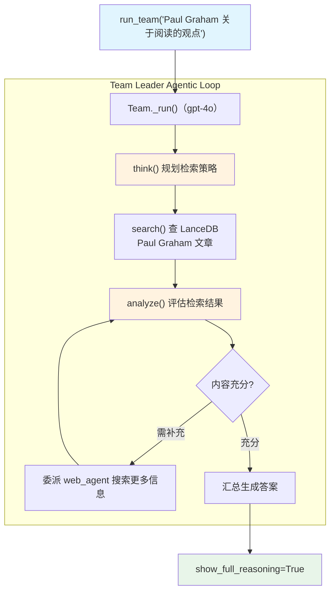

# knowledge_tool_team.py — 实现原理分析

> 源文件：`cookbook/10_reasoning/teams/knowledge_tool_team.py`

## 概述

本示例展示 **Team Leader 配备 `KnowledgeTools`**，与 Web 搜索 Agent 和 Finance Agent 协作，回答关于 Paul Graham 文章内容的问题。Team Leader（`gpt-4o`）使用 `KnowledgeTools`（think + search + analyze）从向量知识库检索文章内容，同时可以委派成员进行补充搜索。

**核心配置一览：**

| 层级 | 配置项 | 值 | 说明 |
|------|--------|------|------|
| Team Leader | `model` | `OpenAIChat(id="gpt-4o")` | Chat Completions API |
| Team Leader | `tools` | `[KnowledgeTools(knowledge=agno_docs, enable_think=True, enable_search=True, enable_analyze=True, add_few_shot=True)]` | 知识推理工具 |
| Team Leader | `members` | `[web_agent, finance_agent]` | 两个成员 |
| Team Leader | `show_members_responses` | `True` | 显示成员响应 |
| Team Leader | `add_datetime_to_context` | `True` | 注入时间 |
| Knowledge | `vector_db` | `LanceDb(hybrid)` | LanceDB 混合搜索 |

## 架构分层

```
用户代码层                          agno 层
┌──────────────────────────┐    ┌──────────────────────────────────────┐
│ knowledge_tool_team.py   │    │ Team._run()（gpt-4o team_leader）    │
│                          │    │  ├ KnowledgeTools:                   │
│ team_leader:             │───>│  │    think() → search() → analyze() │
│   KnowledgeTools(        │    │  ├ 按需委派给成员 Agent              │
│     knowledge=agno_docs) │    │  └ 汇总生成最终答案                  │
└──────────────────────────┘    └──────────────────────────────────────┘
                                        │            │
                          ┌─────────────┘            └──────────────┐
                          ▼                                         ▼
                  ┌──────────────┐                       ┌─────────────────┐
                  │ OpenAIChat   │                       │ LanceDb         │
                  │ gpt-4o       │                       │ hybrid 搜索     │
                  │ (Team 主脑)  │                       │ Paul Graham 文章│
                  └──────────────┘                       └─────────────────┘
```

## 核心组件解析

### KnowledgeTools 在 Team 中的角色

Team Leader 使用 `KnowledgeTools.search()` 检索 Paul Graham 的文章内容（存储在 LanceDB），而非将知识库直接挂载给某个成员 Agent（`search_knowledge=True` 方式）。这使得**知识检索是 Team Leader 的主动行为**，Leader 可以决定是否以及何时检索，而不是自动预检索。

### LanceDb 无 embedder（使用默认）

`LanceDb(uri="tmp/lancedb", table_name="agno_docs", search_type=SearchType.hybrid)` 未指定 embedder，使用 LanceDB 的默认嵌入器。对比 `knowledge_tools.py` 示例明确指定了 `OpenAIEmbedder`，本例依赖默认配置。

## System Prompt 组装（Team Leader）

| 序号 | 组成部分 | 本文件中的值/来源 | 是否生效 |
|------|---------|-----------------|---------|
| 3.1 | `instructions` | `["Only output the final answer...", "Use tables to display data"]` | 是 |
| 3.2.1 | `markdown` | `True` | 是 |
| 3.2.2 | `add_datetime_to_context` | `True` | 是 |
| 3.3.5 | `_tool_instructions` | KnowledgeTools 使用说明 + FEW_SHOT | 是 |

## Mermaid 流程图



## 关键源码文件索引

| 文件 | 关键函数/类 | 作用 |
|------|------------|------|
| `agno/team/team.py` | `Team` | 多 Agent 团队类 |
| `agno/tools/knowledge.py` | `KnowledgeTools` | 知识推理工具 |
| `agno/knowledge/knowledge.py` | `Knowledge` L41 | 知识库核心类 |
| `agno/vectordb/lancedb` | `LanceDb` | LanceDB 向量数据库 |
