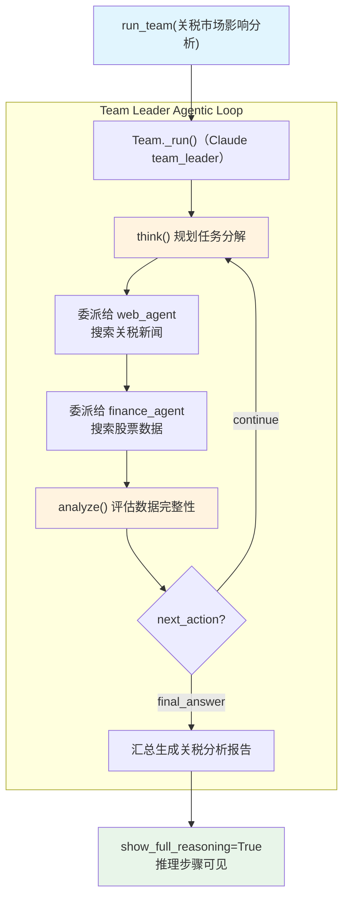

# reasoning_finance_team.py — 实现原理分析

> 源文件：`cookbook/10_reasoning/teams/reasoning_finance_team.py`

## 概述

本示例展示 **Team 中使用 `ReasoningTools`** 的模式：Team Leader（Claude claude-sonnet-4-5）配备 `ReasoningTools`，在协调 Web 搜索 Agent 和 Finance Agent 时进行结构化推理，分析关税对各行业的市场影响。这是**工具推理 + 多 Agent 协作**的组合模式。

**核心配置一览：**

| 层级 | 配置项 | 值 | 说明 |
|------|--------|------|------|
| Team Leader | `model` | `Claude(id="claude-sonnet-4-5")` | Anthropic Claude |
| Team Leader | `tools` | `[ReasoningTools(add_instructions=True)]` | 推理工具（无搜索） |
| Team Leader | `members` | `[web_agent, finance_agent]` | 两个专业 Agent |
| Team Leader | `show_members_responses` | `True` | 显示成员响应 |
| Team Leader | `markdown` | `True` | Markdown 格式化 |
| web_agent | `model` | `OpenAIChat(id="gpt-4o-mini")` | Web 搜索专家 |
| web_agent | `tools` | `[WebSearchTools()]` | 网络搜索 |
| finance_agent | `model` | `OpenAIChat(id="gpt-4o-mini")` | 金融数据专家 |
| finance_agent | `tools` | `[WebSearchTools(enable_news=False)]` | 搜索（禁新闻） |

## 架构分层

```
用户代码层                          agno 层
┌──────────────────────────┐    ┌──────────────────────────────────────┐
│ reasoning_finance_team.py│    │ Team._run()（Claude team_leader）     │
│                          │    │  ├ ReasoningTools: think/analyze     │
│ team_leader:             │───>│  ├ 委派任务给 web_agent              │
│   Claude + ReasoningTools│    │  │    └ Agent._run(web_agent)        │
│   members=[web, finance] │    │  ├ 委派任务给 finance_agent          │
│                          │    │  │    └ Agent._run(finance_agent)    │
│ run_team(task)           │    │  └ 汇总响应，生成最终分析            │
└──────────────────────────┘    └──────────────────────────────────────┘
                                        │            │
                          ┌─────────────┘            └─────────────┐
                          ▼                                        ▼
                  ┌──────────────┐                      ┌──────────────────┐
                  │ Claude       │                      │ OpenAIChat       │
                  │ sonnet-4-5   │                      │ gpt-4o-mini      │
                  │ (Team 主脑)  │                      │ (成员 Agent)     │
                  └──────────────┘                      └──────────────────┘
```

## 核心组件解析

### Team Leader 使用 ReasoningTools 的特殊性

Team Leader 同时拥有 `ReasoningTools` 和成员委派能力：
1. 使用 `think()` 规划如何分解复杂的关税分析任务
2. 委派具体数据收集工作给 `web_agent`（搜索新闻）和 `finance_agent`（搜索财务数据）
3. 使用 `analyze()` 评估成员返回的数据是否充分
4. 汇总分析，生成最终报告

### add_datetime_to_context 在 Team 成员中的使用

`web_agent` 和 `finance_agent` 都设置了 `add_datetime_to_context=True`，而 Team Leader 也设置了此项。这确保所有层级的 Agent 都有时间感知，对于"最近关税影响"这类时效性强的分析至关重要。

## System Prompt 组装（Team Leader）

| 序号 | 组成部分 | 本文件中的值/来源 | 是否生效 |
|------|---------|-----------------|---------|
| 3.1 | `instructions` | `["Only output the final answer...", "Use tables to display data"]` | 是 |
| 3.2.1 | `markdown` | `True` | 是 |
| 3.2.2 | `add_datetime_to_context` | `True` | 是 |
| 3.3.5 | `_tool_instructions` | ReasoningTools 使用说明 | 是 |

## Mermaid 流程图



## 关键源码文件索引

| 文件 | 关键函数/类 | 作用 |
|------|------------|------|
| `agno/team/team.py` | `Team` | 多 Agent 团队类 |
| `agno/tools/reasoning.py` | `ReasoningTools` L10 | 推理工具（Team 层级） |
| `agno/tools/websearch.py` | `WebSearchTools` L16 | 网络搜索工具（成员层级） |
| `agno/models/anthropic` | `Claude` | Team Leader 模型 |
