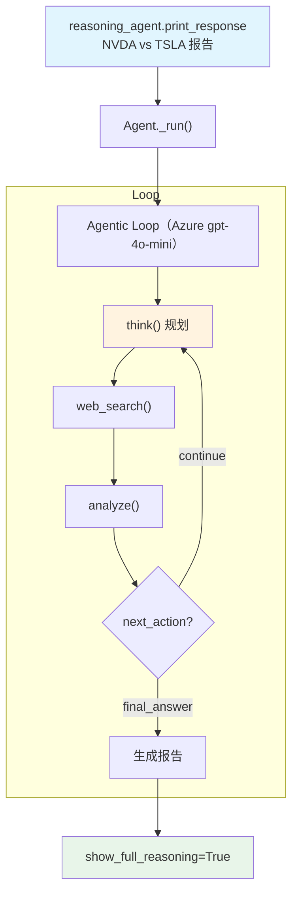

# azure_openai_reasoning_tools.md — 实现原理分析

> 源文件：`cookbook/10_reasoning/tools/azure_openai_reasoning_tools.py`

## 概述

本示例展示 **`ReasoningTools`** 与 **Azure OpenAI**（`gpt-4o-mini`）及 **`WebSearchTools`** 的组合。使用 Azure OpenAI 时，所有 API 调用通过 Azure 的端点路由，而非直接调用 OpenAI，适合企业环境下需要数据合规、私有网络部署的场景。

**核心配置一览：**

| 配置项 | 值 | 说明 |
|--------|------|------|
| `model` | `AzureOpenAI(id="gpt-4o-mini")` | Azure OpenAI 服务 |
| `tools` | `[WebSearchTools(), ReasoningTools(enable_think=True, enable_analyze=True, add_instructions=True, add_few_shot=True)]` | 网络搜索 + 推理工具（含说明+示例） |
| `instructions` | `"Use tables where possible. Think about the problem step by step."` | 格式化 + 推理引导 |
| `markdown` | `True` | Markdown 格式化 |

## System Prompt 组装

| 序号 | 组成部分 | 本文件中的值/来源 | 是否生效 |
|------|---------|-----------------|---------|
| 3.1 | `instructions` | "Use tables where possible. Think about the problem step by step." | 是 |
| 3.2.1 | `markdown` | `True` | 是 |
| 3.3.5 | `_tool_instructions` | ReasoningTools 使用说明 + FEW_SHOT_EXAMPLES | 是 |

## Mermaid 流程图

## 关键源码文件索引

| 文件 | 关键函数/类 | 作用 |
|------|------------|------|
| `agno/tools/reasoning.py` | `ReasoningTools` L10 | 推理工具 |
| `agno/tools/websearch.py` | `WebSearchTools` L16 | 网络搜索工具 |
| `agno/models/azure/openai_chat.py` | `AzureOpenAI` | Azure OpenAI 模型类 |
