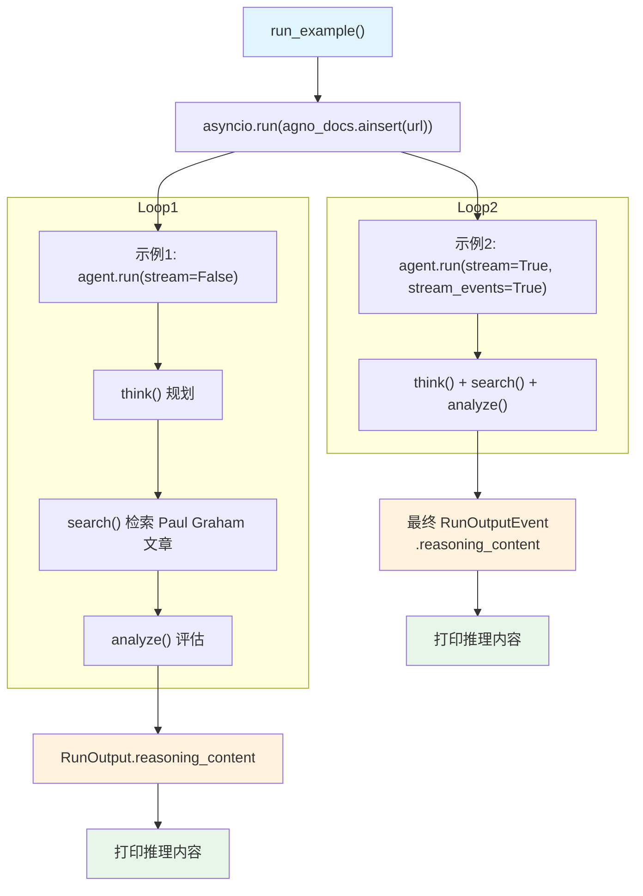

# capture_reasoning_content_knowledge_tools.py — 实现原理分析

> 源文件：`cookbook/10_reasoning/tools/capture_reasoning_content_knowledge_tools.py`

## 概述

本示例展示如何通过 **`KnowledgeTools`** 捕获 **`reasoning_content`**，演示了非流式和流式模式下从 `RunOutput` 获取 `KnowledgeTools`（think + search + analyze）产生的推理步骤内容。知识库来自 Paul Graham 的文章 URL，通过异步插入（`asyncio.run(agno_docs.ainsert(...))`）构建。

**核心配置一览：**

| 配置项 | agent（示例1） | streaming_agent（示例2） |
|--------|----------------|--------------------------|
| `model` | `OpenAIChat(id="gpt-4o")` | `OpenAIChat(id="gpt-4o")` |
| `tools` | `[KnowledgeTools(knowledge=agno_docs, enable_think=True, enable_search=True, enable_analyze=True, add_instructions=True)]` | 同左 |
| `instructions` | 解析助手专家指引 | 解析助手专家指引 |
| `markdown` | `True` | `True` |

## 核心组件解析

### 异步知识库插入

```python
asyncio.run(agno_docs.ainsert(url="https://www.paulgraham.com/read.html"))
```

`ainsert()` 是 `Knowledge` 的异步批量插入接口，这里通过 `asyncio.run()` 在同步上下文中调用。内部执行：
1. 从 URL 下载文章内容
2. 分块（chunking）处理文本
3. 调用 `OpenAIEmbedder`（未显式指定，使用默认）生成向量
4. 写入 LanceDB `cookbook_knowledge_tools` 表

### KnowledgeTools 的 reasoning_content 来源

与 `ReasoningTools` 相同，`KnowledgeTools` 的 `think()` 和 `analyze()` 调用会把推理步骤写入 `session_state`，最终汇总到 `RunOutput.reasoning_content`。`search()` 工具本身不产生推理内容，但检索结果会被 `analyze()` 分析并生成推理步骤。

## System Prompt 组装

| 序号 | 组成部分 | 本文件中的值/来源 | 是否生效 |
|------|---------|-----------------|---------|
| 3.1 | `instructions` | "You are an expert problem-solving assistant..." | 是 |
| 3.2.1 | `markdown` | `True` | 是 |
| 3.3.5 | `_tool_instructions` | KnowledgeTools 使用说明 | 是 |

## Mermaid 流程图



## 关键源码文件索引

| 文件 | 关键函数/类 | 作用 |
|------|------------|------|
| `agno/tools/knowledge.py` | `KnowledgeTools` | 知识推理工具 Toolkit |
| `agno/knowledge/knowledge.py` | `Knowledge.ainsert()` | 异步批量插入文档 |
| `agno/run/agent.py` | `RunOutput` L581 | 含 reasoning_content 的输出容器 |
