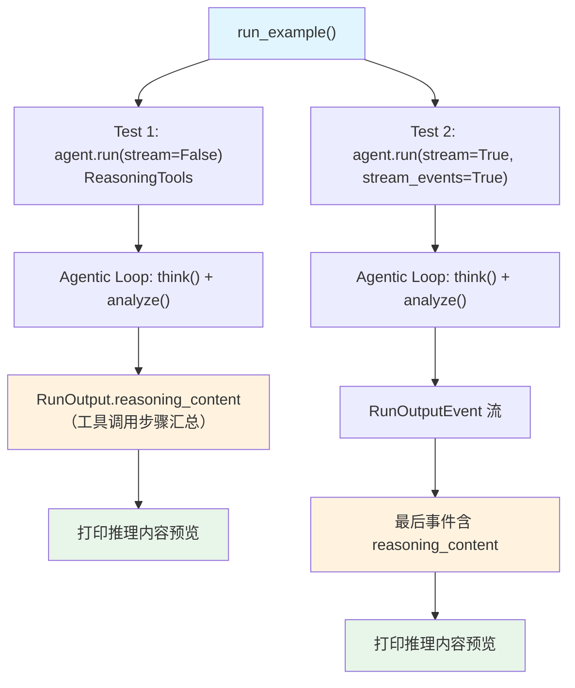

# capture_reasoning_content_reasoning_tools.py — 实现原理分析

> 源文件：`cookbook/10_reasoning/tools/capture_reasoning_content_reasoning_tools.py`

## 概述

本示例展示如何通过 **`ReasoningTools`** 捕获 **`reasoning_content`**，演示了在非流式和流式（`stream_events=True`）两种模式下，从 `RunOutput` 对象中获取 `ReasoningTools` 产生的推理步骤内容。与 `capture_reasoning_content_default_COT.py` 不同，推理内容来自工具调用而非内置 COT。

**核心配置一览：**

| 配置项 | agent（Test 1） | streaming_agent_alt（Test 2） |
|--------|----------------|-------------------------------|
| `model` | `OpenAIChat(id="gpt-4o")` | `OpenAIChat(id="gpt-4o")` |
| `tools` | `[ReasoningTools(add_instructions=True)]` | `[ReasoningTools(add_instructions=True)]` |
| `instructions` | 解析助手专家指引 | 解析助手专家指引 |

## 核心组件解析

### ReasoningTools 产生的 reasoning_content

当 Agent 使用 `ReasoningTools` 时，每次调用 `think()` 或 `analyze()` 工具，推理步骤会存入 `session_state["reasoning_steps"]`。`RunOutput.reasoning_content` 是对这些步骤的**格式化文本汇总**，由 `_response.py` 中的工具函数汇总写入。

### 非流式捕获

```python
response = agent.run("What is the sum of the first 10 natural numbers?", stream=False)
if hasattr(response, "reasoning_content") and response.reasoning_content:
    print(f"Length: {len(response.reasoning_content)} characters")
    print(response.reasoning_content[:1000])
```

### 流式捕获

```python
for event in streaming_agent_alt.run(..., stream=True, stream_events=True):
    if hasattr(event, "reasoning_content"):
        final_response = event  # 保留最后一个含 reasoning_content 的事件
```

## System Prompt 组装

| 序号 | 组成部分 | 本文件中的值/来源 | 是否生效 |
|------|---------|-----------------|---------|
| 3.1 | `instructions` | "You are an expert problem-solving assistant..." | 是 |
| 3.3.5 | `_tool_instructions` | ReasoningTools 使用说明 | 是 |

## Mermaid 流程图



## 关键源码文件索引

| 文件 | 关键函数/类 | 作用 |
|------|------------|------|
| `agno/tools/reasoning.py` | `ReasoningTools`, `think()`, `analyze()` | 推理工具 |
| `agno/run/agent.py` | `RunOutput` L581 | 含 reasoning_content 的输出 |
