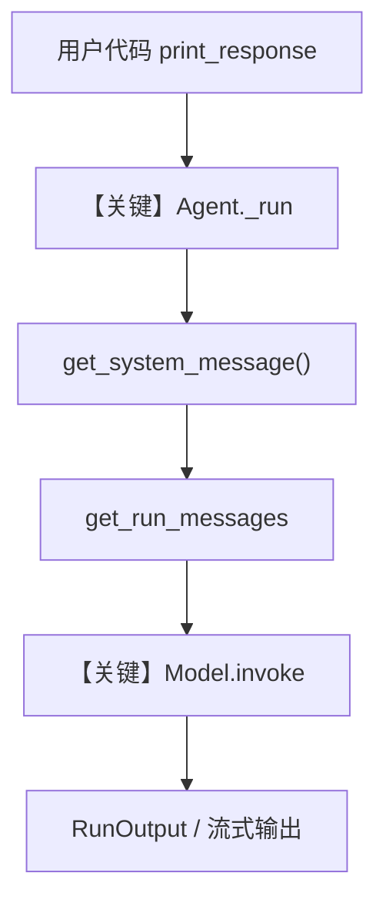

# capture_reasoning_content_reasoning_tools.py — 实现原理分析

<!-- cookbook-py-source:start -->
## 完整源码

```python
"""
Capture Reasoning Content Reasoning Tools
=========================================

Demonstrates this reasoning cookbook example.
"""

from textwrap import dedent

from agno.agent import Agent
from agno.models.openai import OpenAIChat
from agno.tools.reasoning import ReasoningTools


# ---------------------------------------------------------------------------
# Create Example
# ---------------------------------------------------------------------------
def run_example() -> None:
    """Test function to verify reasoning_content is populated in RunOutput."""
    print("\n=== Testing reasoning_content generation ===\n")

    # Create an agent with ReasoningTools
    agent = Agent(
        model=OpenAIChat(id="gpt-4o"),
        tools=[ReasoningTools(add_instructions=True)],
        instructions=dedent("""\
            You are an expert problem-solving assistant with strong analytical skills!         Use step-by-step reasoning to solve the problem.
            \
        """),
    )

    # Test 1: Non-streaming mode
    print("Running with stream=False...")
    response = agent.run(
        "What is the sum of the first 10 natural numbers?", stream=False
    )

    # Check reasoning_content
    if hasattr(response, "reasoning_content") and response.reasoning_content:
        print("[OK] reasoning_content FOUND in non-streaming response")
        print(f"   Length: {len(response.reasoning_content)} characters")
        print("\n=== reasoning_content preview (non-streaming) ===")
        preview = response.reasoning_content[:1000]
        if len(response.reasoning_content) > 1000:
            preview += "..."
        print(preview)
    else:
        print("[NOT FOUND] reasoning_content NOT FOUND in non-streaming response")

    # Process streaming responses to find the final one
    print("\n\n=== Test 2: Processing stream to find final response ===\n")

    # Create another fresh agent
    streaming_agent_alt = Agent(
        model=OpenAIChat(id="gpt-4o"),
        tools=[ReasoningTools(add_instructions=True)],
        instructions=dedent("""\
            You are an expert problem-solving assistant with strong analytical skills!         Use step-by-step reasoning to solve the problem.
            \
        """),
    )

    # Process streaming responses and look for the final RunOutput
    final_response = None
    for event in streaming_agent_alt.run(
        "What is the value of 3! (factorial)?",
        stream=True,
        stream_events=True,
    ):
        # The final event in the stream should be a RunOutput object
        if hasattr(event, "reasoning_content"):
            final_response = event

    print("--- Checking reasoning_content from final stream event ---")
    if (
        final_response
        and hasattr(final_response, "reasoning_content")
        and final_response.reasoning_content
    ):
        print("[OK] reasoning_content FOUND in final stream event")
        print(f"   Length: {len(final_response.reasoning_content)} characters")
        print("\n=== reasoning_content preview (final stream event) ===")
        preview = final_response.reasoning_content[:1000]
        if len(final_response.reasoning_content) > 1000:
            preview += "..."
        print(preview)
    else:
        print("[NOT FOUND] reasoning_content NOT FOUND in final stream event")


# ---------------------------------------------------------------------------
# Run Example
# ---------------------------------------------------------------------------
if __name__ == "__main__":
    run_example()
```

<!-- cookbook-py-source:end -->

> 源文件：`cookbook/10_reasoning/tools/capture_reasoning_content_reasoning_tools.py`

## 概述

本示例展示 Agno 的 **工具调用** 机制：通过 `Agent` 配置模型与可选推理链路，完成示例任务。

> 源码含多个 `Agent(...)`：下表以文件中**出现顺序的第一个** `Agent` 为准；并列对比场景请结合源码中的变量名（如 `cot_agent` / `deepseek_agent`）。

**核心配置一览（首个/主要 Agent）：**

| 配置项 | 值 | 说明 |
|--------|------|------|
| `instructions` | `dedent('            You are an expert problem-solving assistant with strong analytical skills!         Use step-by-step reasoning to solve the problem.\n                    ')` | 显式参数 |
| `model` | `OpenAIChat(id='gpt-4o')` | 显式参数 |
| `tools` | `[ReasoningTools(add_instructions=True)]` | 显式参数 |
| `db` | `None` | 未设置 |
| `knowledge` | `None` | 未设置 |
| `description` | `None` | 未设置 |
| `system_message` | `None` | 未设置 |

## 架构分层

```
用户代码层                agno.agent 层
┌──────────────────┐    ┌──────────────────────────────────┐
│ capture_reasoning_│    │ Agent._run / _arun               │
│ Agent(...)       │───>│  get_system_message()            │
│ print_response   │    │  get_run_messages()              │
└──────────────────┘    │  handle_reasoning（若启用）       │
                        └──────────────────────────────────┘
                                │
                                ▼
                        ┌──────────────┐
                        │ Model.invoke │
                        └──────────────┘
```

## 核心组件解析

### Agent 与推理

当 `reasoning=True` 或配置了 `reasoning_model` 时，`_run` 在适当时机调用 `handle_reasoning` / `handle_reasoning_stream`（`agno/agent/_response.py` L72+），内部进入 `reason()` 生成推理内容。

### 运行机制与因果链

1. **路径**：`Agent.run` / `print_response` → `get_system_message` → `get_run_messages` → 模型；推理启用时插入推理阶段。
2. **状态**：默认不写 session/db；若配置 `db`、`update_memory_on_run` 等则会持久化（见各文件）。
3. **分支**：仅主模型 vs `reasoning_model`、流式 `stream=True`、`show_full_reasoning` 影响输出展示。
4. **定位**：位于 `cookbook` 的 **推理与工具组合** 主题，对照同目录示例可看出参数差异。

## System Prompt 组装

| 序号 | 组成部分 | 本文件中的值/来源 | 是否生效 |
|------|---------|-----------------|---------|
| 1 | `description` | 未设置 | 否 |
| 2 | `role` | 未设置 | 否 |
| 3 | `instructions` | `dedent('            You are an expert problem-solving assistant with strong analytical skills!         Use step-by-step ...` | 是 |
| 4.1 | `markdown` | False | 否 |

### 拼装顺序与源码锚点

默认：`# 1` 自定义 `system_message` 早退 → 否则 `# 2` build_context → `# 3.1` instructions → `# 3.2.1` markdown 附加段 → `# 3.3.1-3.3.4` description/role/instructions 拼接…（`agno/agent/_messages.py`）。

### 还原后的完整 System 文本

```text
dedent('            You are an expert problem-solving assistant with strong analytical skills!         Use step-by-step reasoning to solve the problem.\n                    ')
```

### 段落释义（模型视角）

- `instructions`：直接约束角色与解题步骤（若存在）。
- `markdown`：附加格式化要求，减少非结构化输出。
- 无业务 instructions 时，模型仅受默认附加段约束，行为更依赖用户消息。

### 与 User / Developer 消息的边界

用户任务来自 `print_response`/`run` 的输入字符串；OpenAI Chat 适配器使用 `messages` 列表中的 `system`/`user`/`assistant` 角色。

## 完整 API 请求

```python
# OpenAIChat（常见）：
# client.chat.completions.create(
#     model=<id>,
#     messages=[...],  # system + user + ...
#     **get_request_params(...),
# )
# 见 agno/models/openai/chat.py invoke() L385+
```

> 其他厂商请对照对应 `Model` 子类的 `invoke`/`ainvoke`。

## Mermaid 流程图


```mermaid
flowchart TD
    A["用户代码 print_response"] --> B["【关键】Agent._run"]
    B --> C["get_system_message()"]
    C --> D["get_run_messages"]
    D --> E["【关键】Model.invoke"]
    E --> F["RunOutput / 流式输出"]
```

- **【关键】Agent._run**：单次运行的调度与消息组装入口。
- **【关键】Model.invoke**：实际调用模型适配器（厂商相关）。

## 关键源码文件索引

| 文件 | 关键函数/类 | 作用 |
|------|------------|------|
| `agno/agent/agent.py` | `get_system_message` L799+ | 委托 `_messages` |
| `agno/agent/_messages.py` | `get_system_message()` L106+ | system 拼装 |
| `agno/agent/_response.py` | `handle_reasoning()` L72+ | 推理处理 |
| `agno/agent/_run.py` | run 主循环 | 调用推理与模型 |
| `agno/models/openai/chat.py` | `invoke()` L385+ | Chat Completions |
