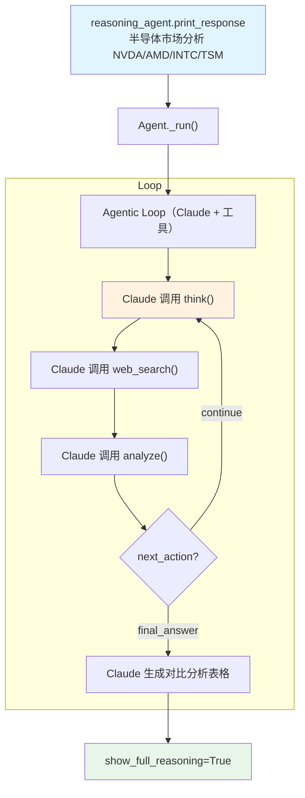

# claude_reasoning_tools.py — 实现原理分析

> 源文件：`cookbook/10_reasoning/tools/claude_reasoning_tools.py`

## 概述

本示例展示 **`ReasoningTools`** 与 **Claude** 模型（`claude-sonnet-4-20250514`）及 **`WebSearchTools`** 的组合。Claude 原生支持扩展思考（extended thinking），但本示例使用 ReasoningTools 的工具调用式推理，让 Claude 通过显式的 `think/analyze` 工具调用来结构化分析半导体市场。

**核心配置一览：**

| 配置项 | 值 | 说明 |
|--------|------|------|
| `model` | `Claude(id="claude-sonnet-4-20250514")` | Anthropic Claude |
| `tools` | `[ReasoningTools(add_instructions=True), WebSearchTools(enable_news=False)]` | 推理工具 + 网络搜索（禁用新闻） |
| `instructions` | `"Use tables to display data."` | 表格格式化指令 |
| `markdown` | `True` | Markdown 格式化 |

## 核心组件解析

### Claude 使用 ReasoningTools vs 原生扩展思考

| 方式 | 机制 | 特点 |
|------|------|------|
| ReasoningTools | 工具调用（`think/analyze`） | 推理步骤显式可见、可与其他工具并行 |
| `reasoning_model=Claude(thinking=...)` | 原生 extended thinking | 内置推理，API 级别，推理内容在特殊字段中 |

本示例使用 ReasoningTools，Claude 会生成工具调用请求，Agno 执行工具并返回推理步骤历史。

### WebSearchTools 的 enable_news=False

`enable_news=False` 禁用新闻搜索工具，仅保留通用网络搜索。对于半导体市场分析，这避免了噪音新闻干扰，专注于官方财务数据和分析报告。

## System Prompt 组装

| 序号 | 组成部分 | 本文件中的值/来源 | 是否生效 |
|------|---------|-----------------|---------|
| 3.1 | `instructions` | `"Use tables to display data."` | 是 |
| 3.2.1 | `markdown` | `True` | 是 |
| 3.3.5 | `_tool_instructions` | ReasoningTools 使用说明 | 是 |

## Mermaid 流程图

## 关键源码文件索引

| 文件 | 关键函数/类 | 作用 |
|------|------------|------|
| `agno/tools/reasoning.py` | `ReasoningTools` L10 | 推理工具 |
| `agno/tools/websearch.py` | `WebSearchTools` L16 | 网络搜索工具 |
| `agno/models/anthropic` | `Claude` | Anthropic Claude 模型 |
