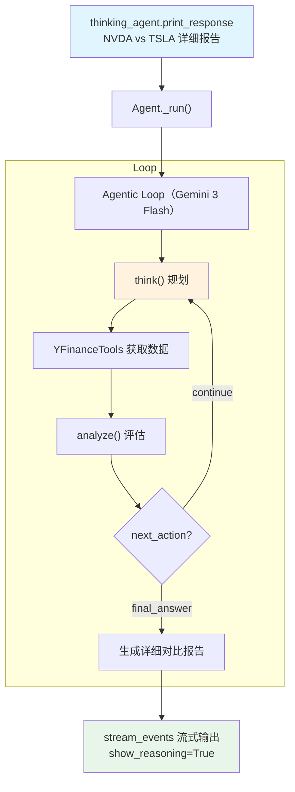

# gemini_finance_agent.py — 实现原理分析

> 源文件：`cookbook/10_reasoning/tools/gemini_finance_agent.py`

## 概述

本示例展示 **`ReasoningTools`（仅 add_instructions）** 与 **Gemini 3 Flash Preview**（`gemini-3-flash-preview`）及 **`YFinanceTools`** 的组合，并启用 `stream_events=True` 事件流模式。使用 `show_reasoning=True`（注意：与 `show_full_reasoning=True` 略有区别）展示推理内容。

**核心配置一览：**

| 配置项 | 值 | 说明 |
|--------|------|------|
| `model` | `Gemini(id="gemini-3-flash-preview")` | Google Gemini 3 Flash Preview |
| `tools` | `[ReasoningTools(add_instructions=True), YFinanceTools()]` | 推理工具（含说明）+ YFinance |
| `instructions` | `"Use tables where possible"` | 格式化指令 |
| `markdown` | `True` | Markdown 格式化 |
| `stream_events` | `True` | 流式事件模式 |

## System Prompt 组装

| 序号 | 组成部分 | 本文件中的值/来源 | 是否生效 |
|------|---------|-----------------|---------|
| 3.1 | `instructions` | `"Use tables where possible"` | 是 |
| 3.2.1 | `markdown` | `True` | 是 |
| 3.3.5 | `_tool_instructions` | ReasoningTools 默认使用说明 | 是 |

## Mermaid 流程图

## 关键源码文件索引

| 文件 | 关键函数/类 | 作用 |
|------|------------|------|
| `agno/tools/reasoning.py` | `ReasoningTools` L10 | 推理工具 |
| `agno/tools/yfinance.py` | `YFinanceTools` | Yahoo Finance 工具 |
| `agno/models/google` | `Gemini` | Google Gemini 模型 |
