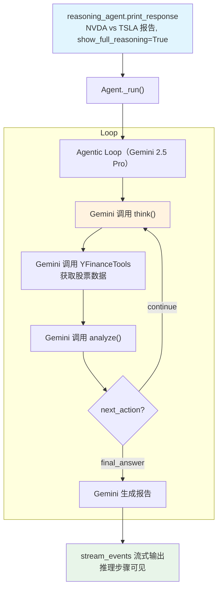

# gemini_reasoning_tools.py — 实现原理分析

> 源文件：`cookbook/10_reasoning/tools/gemini_reasoning_tools.py`

## 概述

本示例展示 **`ReasoningTools`** 与 **Gemini 2.5 Pro**（`gemini-2.5-pro`）及 **`YFinanceTools`** 的组合。Gemini 2.5 Pro 具备原生长上下文推理能力，配合 ReasoningTools 的显式工具推理，可以完成复杂的金融分析任务。

**核心配置一览：**

| 配置项 | 值 | 说明 |
|--------|------|------|
| `model` | `Gemini(id="gemini-2.5-pro")` | Google Gemini 2.5 Pro |
| `tools` | `[ReasoningTools(enable_think=True, enable_analyze=True), YFinanceTools()]` | 推理工具（无 add_instructions）+ YFinance |
| `instructions` | `"Use tables where possible"` | 表格格式化指令 |
| `stream_events` | `True` | 流式事件模式 |
| `markdown` | `True` | Markdown 格式化 |

## 核心组件解析

### enable_think=True, enable_analyze=True（不设 add_instructions）

本示例不使用 `add_instructions=True`，这意味着推理工具使用说明**不注入** system prompt。Gemini 2.5 Pro 依靠工具的 `docstring` 描述（`tools/reasoning.py:59-68` 的 `think()` 文档字符串）来理解工具用途，而非依赖预先注入的使用说明。

这种方式适合能力较强的模型（如 Gemini 2.5 Pro），无需额外指引即可正确使用推理工具。

### stream_events=True 与 show_full_reasoning

本示例调用时不传 `stream=True`，但设置了 `stream_events=True`（Agent 级别）。同时，`show_full_reasoning=True` 作为 `print_response()` 参数传入，使推理工具调用结果（think/analyze 的返回值）在输出中可见。

## System Prompt 组装

| 序号 | 组成部分 | 本文件中的值/来源 | 是否生效 |
|------|---------|-----------------|---------|
| 3.1 | `instructions` | `"Use tables where possible"` | 是 |
| 3.2.1 | `markdown` | `True` | 是 |
| 3.3.5 | `_tool_instructions` | 无（`add_instructions=False`） | 否 |

## Mermaid 流程图

## 关键源码文件索引

| 文件 | 关键函数/类 | 作用 |
|------|------------|------|
| `agno/tools/reasoning.py` | `ReasoningTools` L10 | 推理工具 |
| `agno/tools/yfinance.py` | `YFinanceTools` | Yahoo Finance 工具 |
| `agno/models/google` | `Gemini` | Google Gemini 模型 |
