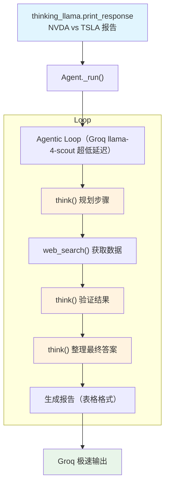

# groq_llama_finance_agent.py — 实现原理分析

> 源文件：`cookbook/10_reasoning/tools/groq_llama_finance_agent.py`

## 概述

本示例展示 **`ReasoningTools`（仅默认配置）** 与 **Groq 平台上的 Llama 4 Scout**（`meta-llama/llama-4-scout-17b-16e-instruct`）及 **`WebSearchTools`** 的组合。Groq 以极低推理延迟著称，配合 `ReasoningTools()` 默认配置（`enable_think=True`，无 `add_instructions`）实现快速结构化分析。

**核心配置一览：**

| 配置项 | 值 | 说明 |
|--------|------|------|
| `model` | `Groq(id="meta-llama/llama-4-scout-17b-16e-instruct")` | Groq 超低延迟平台 |
| `tools` | `[ReasoningTools(), WebSearchTools()]` | 默认推理工具 + 网络搜索 |
| `instructions` | 详细的工具使用规范（`dedent`） | 显式指导 think 工具使用时机 |
| `markdown` | `True` | Markdown 格式化 |

## 核心组件解析

### ReasoningTools() 默认配置

`ReasoningTools()` 不传任何参数时，等价于 `ReasoningTools(enable_think=True, enable_analyze=True, add_instructions=False, add_few_shot=False)`。工具使用说明**不注入** system prompt，而是通过 `instructions` 参数中的自定义指令来引导模型使用 think 工具。

本示例的 instructions 明确规定了 think 工具的使用时机：
- 任务开始时：规划执行步骤
- 获取工具结果后：验证结果正确性
- 响应用户前：整理最终思路

### 自定义 instructions 替代 add_instructions

```python
instructions=dedent("""\
## General Instructions
- Always start by using the think tool to map out the steps...
- After receiving tool results, use the think tool as a scratchpad to validate...
- Before responding to the user, use the think tool to jot down final thoughts...
...""")
```

这种方式比 `add_instructions=True` 提供了更精细的控制，将推理工具使用策略直接嵌入 instructions。

## System Prompt 组装

| 序号 | 组成部分 | 本文件中的值/来源 | 是否生效 |
|------|---------|-----------------|---------|
| 3.1 | `instructions` | 详细的 think 工具使用规范 | 是 |
| 3.2.1 | `markdown` | `True` | 是 |
| 3.3.5 | `_tool_instructions` | 无（`add_instructions=False`） | 否 |

## Mermaid 流程图



## 关键源码文件索引

| 文件 | 关键函数/类 | 作用 |
|------|------------|------|
| `agno/tools/reasoning.py` | `ReasoningTools` L10 | 推理工具（默认配置） |
| `agno/tools/websearch.py` | `WebSearchTools` L16 | 网络搜索工具 |
| `agno/models/groq` | `Groq` | Groq 平台模型类 |
