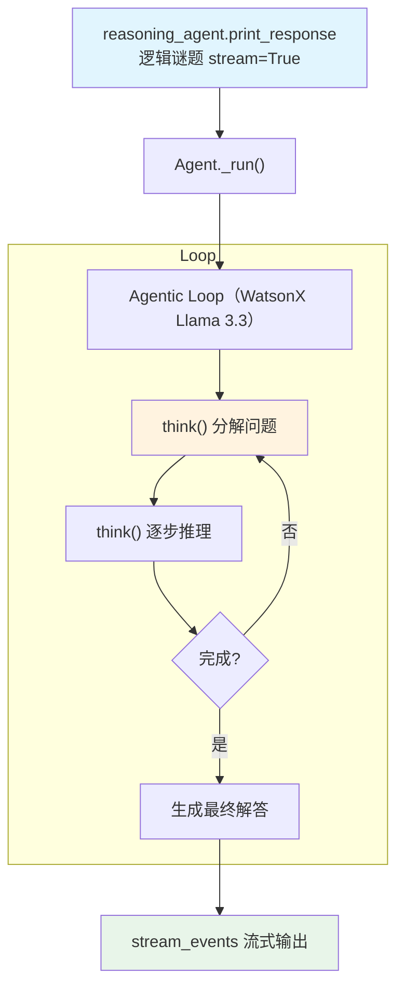

# ibm_watsonx_reasoning_tools.py — 实现原理分析

> 源文件：`cookbook/10_reasoning/tools/ibm_watsonx_reasoning_tools.py`

## 概述

本示例展示 **`ReasoningTools`** 与 **IBM WatsonX**（`meta-llama/llama-3-3-70b-instruct`）的组合，并启用 `stream_events=True` 和 `add_datetime_to_context=True`。同 `reasoning_tools.py` 一样采用详细的 instructions 引导，但模型为 WatsonX 平台上的 Llama 3.3。

**核心配置一览：**

| 配置项 | 值 | 说明 |
|--------|------|------|
| `model` | `WatsonX(id="meta-llama/llama-3-3-70b-instruct")` | IBM WatsonX 平台 |
| `tools` | `[ReasoningTools(add_instructions=True)]` | 推理工具（含说明，无 analyze） |
| `instructions` | 详细的问题解决指引（9 条） | 引导推理方法 |
| `add_datetime_to_context` | `True` | 注入当前时间 |
| `stream_events` | `True` | 流式事件模式 |
| `markdown` | `True` | Markdown 格式化 |

## System Prompt 组装

| 序号 | 组成部分 | 本文件中的值/来源 | 是否生效 |
|------|---------|-----------------|---------|
| 3.1 | `instructions` | 详细问题解决指引 | 是 |
| 3.2.1 | `markdown` | `True` | 是 |
| 3.2.2 | `add_datetime_to_context` | `True` → 当前时间 | 是 |
| 3.3.5 | `_tool_instructions` | ReasoningTools 使用说明 | 是 |

## Mermaid 流程图

## 关键源码文件索引

| 文件 | 关键函数/类 | 作用 |
|------|------------|------|
| `agno/tools/reasoning.py` | `ReasoningTools` L10 | 推理工具 |
| `agno/models/ibm` | `WatsonX` | IBM WatsonX 模型类 |
