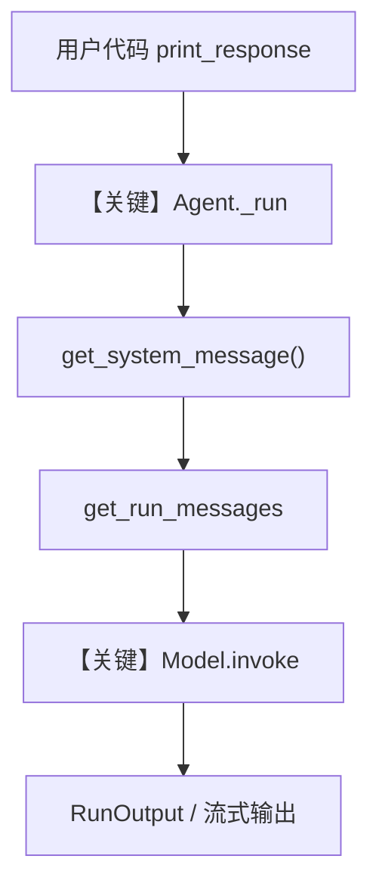

# ibm_watsonx_reasoning_tools.py — 实现原理分析

<!-- cookbook-py-source:start -->
## 完整源码

```python
"""
Ibm Watsonx Reasoning Tools
===========================

Demonstrates this reasoning cookbook example.
"""

from textwrap import dedent

from agno.agent import Agent, RunOutput  # noqa
from agno.models.ibm import WatsonX
from agno.tools.reasoning import ReasoningTools


# ---------------------------------------------------------------------------
# Create Example
# ---------------------------------------------------------------------------
def run_example() -> None:
    """Problem-Solving Reasoning Agent

    This example shows how to create an agent that uses the ReasoningTools to solve
    complex problems through step-by-step reasoning. The agent breaks down questions,
    analyzes intermediate results, and builds structured reasoning paths to arrive at
    well-justified conclusions.

    Example prompts to try:
    - "Solve this logic puzzle: A man has to take a fox, a chicken, and a sack of grain across a river."
    - "Is it better to rent or buy a home given current interest rates?"
    - "Evaluate the pros and cons of remote work versus office work."
    - "How would increasing interest rates affect the housing market?"
    - "What's the best strategy for saving for retirement in your 30s?"
    """

    reasoning_agent = Agent(
        model=WatsonX(id="meta-llama/llama-3-3-70b-instruct"),
        tools=[ReasoningTools(add_instructions=True)],
        instructions=dedent("""\
            You are an expert problem-solving assistant with strong analytical skills! 

            Your approach to problems:
            1. First, break down complex questions into component parts
            2. Clearly state your assumptions
            3. Develop a structured reasoning path
            4. Consider multiple perspectives
            5. Evaluate evidence and counter-arguments
            6. Draw well-justified conclusions

            When solving problems:
            - Use explicit step-by-step reasoning
            - Identify key variables and constraints
            - Explore alternative scenarios
            - Highlight areas of uncertainty
            - Explain your thought process clearly
            - Consider both short and long-term implications
            - Evaluate trade-offs explicitly

            For quantitative problems:
            - Show your calculations
            - Explain the significance of numbers
            - Consider confidence intervals when appropriate
            - Identify source data reliability

            For qualitative reasoning:
            - Assess how different factors interact
            - Consider psychological and social dynamics
            - Evaluate practical constraints
            - Address value considerations
            \
        """),
        add_datetime_to_context=True,
        stream_events=True,
        markdown=True,
    )

    # Example usage with a complex reasoning problem
    reasoning_agent.print_response(
        "Solve this logic puzzle: A man has to take a fox, a chicken, and a sack of grain across a river. "
        "The boat is only big enough for the man and one item. If left unattended together, the fox will "
        "eat the chicken, and the chicken will eat the grain. How can the man get everything across safely?",
        stream=True,
    )

    # # Economic analysis example
    # reasoning_agent.print_response(
    #     "Is it better to rent or buy a home given current interest rates, inflation, and market trends? "
    #     "Consider both financial and lifestyle factors in your analysis.",
    #     stream=True
    # )

    # # Strategic decision-making example
    # reasoning_agent.print_response(
    #     "A startup has $500,000 in funding and needs to decide between spending it on marketing or "
    #     "product development. They want to maximize growth and user acquisition within 12 months. "
    #     "What factors should they consider and how should they analyze this decision?",
    #     stream=True
    # )


# ---------------------------------------------------------------------------
# Run Example
# ---------------------------------------------------------------------------
if __name__ == "__main__":
    run_example()
```

<!-- cookbook-py-source:end -->

> 源文件：`cookbook/10_reasoning/tools/ibm_watsonx_reasoning_tools.py`

## 概述

本示例展示 Agno 的 **工具调用** 机制：通过 `Agent` 配置模型与可选推理链路，完成示例任务。
**核心配置一览（首个/主要 Agent）：**

| 配置项 | 值 | 说明 |
|--------|------|------|
| `add_datetime_to_context` | `True` | 显式参数 |
| `instructions` | `dedent('            You are an expert problem-solving assistant with strong analytical skills! \n\n            Your approach to problems:\n            1. First, break down complex ...` | 显式参数 |
| `markdown` | `True` | 显式参数 |
| `model` | `WatsonX(id='meta-llama/llama-3-3-70b-instruct')` | 显式参数 |
| `stream_events` | `True` | 显式参数 |
| `tools` | `[ReasoningTools(add_instructions=True)]` | 显式参数 |
| `db` | `None` | 未设置 |
| `knowledge` | `None` | 未设置 |
| `description` | `None` | 未设置 |
| `system_message` | `None` | 未设置 |

## 架构分层

```
用户代码层                agno.agent 层
┌──────────────────┐    ┌──────────────────────────────────┐
│ ibm_watsonx_reason│    │ Agent._run / _arun               │
│ Agent(...)       │───>│  get_system_message()            │
│ print_response   │    │  get_run_messages()              │
└──────────────────┘    │  handle_reasoning（若启用）       │
                        └──────────────────────────────────┘
                                │
                                ▼
                        ┌──────────────┐
                        │ Model.invoke │
                        └──────────────┘
```

## 核心组件解析

### Agent 与推理

当 `reasoning=True` 或配置了 `reasoning_model` 时，`_run` 在适当时机调用 `handle_reasoning` / `handle_reasoning_stream`（`agno/agent/_response.py` L72+），内部进入 `reason()` 生成推理内容。

### 运行机制与因果链

1. **路径**：`Agent.run` / `print_response` → `get_system_message` → `get_run_messages` → 模型；推理启用时插入推理阶段。
2. **状态**：默认不写 session/db；若配置 `db`、`update_memory_on_run` 等则会持久化（见各文件）。
3. **分支**：仅主模型 vs `reasoning_model`、流式 `stream=True`、`show_full_reasoning` 影响输出展示。
4. **定位**：位于 `cookbook` 的 **推理与工具组合** 主题，对照同目录示例可看出参数差异。

## System Prompt 组装

| 序号 | 组成部分 | 本文件中的值/来源 | 是否生效 |
|------|---------|-----------------|---------|
| 1 | `description` | 未设置 | 否 |
| 2 | `role` | 未设置 | 否 |
| 3 | `instructions` | `dedent('            You are an expert problem-solving assistant with strong analytical skills! \n\n            Your appr...` | 是 |
| 4.1 | `markdown` | True | 是 |

### 拼装顺序与源码锚点

默认：`# 1` 自定义 `system_message` 早退 → 否则 `# 2` build_context → `# 3.1` instructions → `# 3.2.1` markdown 附加段 → `# 3.3.1-3.3.4` description/role/instructions 拼接…（`agno/agent/_messages.py`）。

### 还原后的完整 System 文本

```text
dedent('            You are an expert problem-solving assistant with strong analytical skills! \n\n            Your approach to problems:\n            1. First, break down complex questions into component parts\n            2. Clearly state your assumptions\n            3. Develop a structured reasoning path\n            4. Consider multiple perspectives\n            5. Evaluate evidence and counter-arguments\n            6. Draw well-justified conclusions\n\n            When solving problems:\n            - Use explicit step-by-step reasoning\n            - Identify key variables and constraints\n            - Explore alternative scenarios\n            - Highlight areas of uncertainty\n            - Explain your thought process clearly\n            - Consider both short and long-term implications\n            - Evaluate trade-offs explicitly\n\n            For quantitative problems:\n            - Show your calculations\n            - Explain the significance of numbers\n            - Consider confidence intervals when appropriate\n            - Identify source data reliability\n\n            For qualitative reasoning:\n            - Assess how different factors interact\n            - Consider psychological and social dynamics\n            - Evaluate practical constraints\n            - Address value considerations\n                    ')

<additional_information>
- Use markdown to format your answers.
</additional_information>
```

### 段落释义（模型视角）

- `instructions`：直接约束角色与解题步骤（若存在）。
- `markdown`：附加格式化要求，减少非结构化输出。
- 无业务 instructions 时，模型仅受默认附加段约束，行为更依赖用户消息。

### 与 User / Developer 消息的边界

用户任务来自 `print_response`/`run` 的输入字符串；OpenAI Chat 适配器使用 `messages` 列表中的 `system`/`user`/`assistant` 角色。

## 完整 API 请求

```python
# OpenAIChat（常见）：
# client.chat.completions.create(
#     model=<id>,
#     messages=[...],  # system + user + ...
#     **get_request_params(...),
# )
# 见 agno/models/openai/chat.py invoke() L385+
```

> 其他厂商请对照对应 `Model` 子类的 `invoke`/`ainvoke`。

## Mermaid 流程图


```mermaid
flowchart TD
    A["用户代码 print_response"] --> B["【关键】Agent._run"]
    B --> C["get_system_message()"]
    C --> D["get_run_messages"]
    D --> E["【关键】Model.invoke"]
    E --> F["RunOutput / 流式输出"]
```

- **【关键】Agent._run**：单次运行的调度与消息组装入口。
- **【关键】Model.invoke**：实际调用模型适配器（厂商相关）。

## 关键源码文件索引

| 文件 | 关键函数/类 | 作用 |
|------|------------|------|
| `agno/agent/agent.py` | `get_system_message` L799+ | 委托 `_messages` |
| `agno/agent/_messages.py` | `get_system_message()` L106+ | system 拼装 |
| `agno/agent/_response.py` | `handle_reasoning()` L72+ | 推理处理 |
| `agno/agent/_run.py` | run 主循环 | 调用推理与模型 |
| `agno/models/openai/chat.py` | `invoke()` L385+ | Chat Completions |
