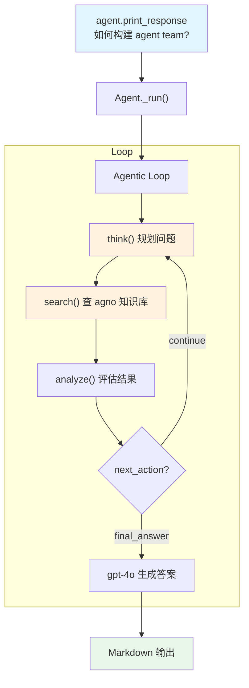

# knowledge_tools.py — 实现原理分析

> 源文件：`cookbook/10_reasoning/tools/knowledge_tools.py`

## 概述

本示例展示 **`KnowledgeTools`（知识工具）** 的使用，将 **`ReasoningTools` 的推理工具**（think/analyze/search 合一）与**向量知识库**（LanceDB）集成，让 Agent 在回答问题时能够结合结构化推理和知识检索。

**核心配置一览：**

| 配置项 | 值 | 说明 |
|--------|------|------|
| `model` | `OpenAIChat(id="gpt-4o")` | Chat Completions API |
| `tools` | `[KnowledgeTools(knowledge=agno_docs, enable_think=True, enable_search=True, enable_analyze=True, add_few_shot=True)]` | 知识工具（含推理+搜索+分析） |
| `markdown` | `True` | Markdown 格式化 |
| knowledge | `Knowledge(LanceDb hybrid)` | 从 agno 文档 URL 建立的知识库 |

## 架构分层

```
用户代码层                          agno.agent 层
┌──────────────────────────┐    ┌──────────────────────────────────┐
│ knowledge_tools.py       │    │ Agent._run()                     │
│                          │    │  ├ get_tools()                   │
│ KnowledgeTools(          │───>│  │    → think(), search(),       │
│   knowledge=agno_docs,   │    │  │      analyze()                │
│   enable_think=True,     │    │  └ Agentic Loop                  │
│   enable_search=True,    │    │      ├ think() 规划              │
│   enable_analyze=True,   │    │      ├ search() 查知识库          │
│   add_few_shot=True)     │    │      └ analyze() 评估            │
└──────────────────────────┘    └──────────────────────────────────┘
                                              │
                                    ┌─────────┴──────────┐
                                    ▼                    ▼
                              ┌──────────┐       ┌──────────────┐
                              │OpenAIChat│       │ LanceDb      │
                              │ gpt-4o   │       │ hybrid 搜索  │
                              └──────────┘       └──────────────┘
```

## 核心组件解析

### KnowledgeTools 的工具组合

`KnowledgeTools` 将推理和知识检索合并为一个 Toolkit：
- `think()` — 规划问题解决步骤（同 ReasoningTools.think）
- `search(query)` — 在向量知识库中检索相关文档
- `analyze()` — 评估检索结果和推理步骤

这与分别使用 `ReasoningTools + search_knowledge` 的方式不同：KnowledgeTools 将它们集成为工具调用形式，推理和检索步骤都显式可见。

### 知识库构建

```python
agno_docs = Knowledge(
    vector_db=LanceDb(
        uri="tmp/lancedb",
        table_name="agno_docs",
        search_type=SearchType.hybrid,      # 混合搜索（向量 + 全文）
        embedder=OpenAIEmbedder(id="text-embedding-3-small"),
    ),
)
agno_docs.insert(url="https://docs.agno.com/llms-full.txt")  # 从 URL 插入内容
```

## System Prompt 组装

| 序号 | 组成部分 | 本文件中的值/来源 | 是否生效 |
|------|---------|-----------------|---------|
| 3.2.1 | `markdown` | `True` | 是 |
| 3.3.5 | `_tool_instructions` | KnowledgeTools 说明（含 FEW_SHOT） | 是 |
| 其他 | 未设置 | — | 否 |

## Mermaid 流程图



## 关键源码文件索引

| 文件 | 关键函数/类 | 作用 |
|------|------------|------|
| `agno/tools/knowledge.py` | `KnowledgeTools` | 知识推理工具 Toolkit |
| `agno/knowledge/knowledge.py` | `Knowledge` L41 | 知识库核心类 |
| `agno/vectordb/lancedb` | `LanceDb` | LanceDB 向量数据库 |
| `agno/knowledge/embedder/openai.py` | `OpenAIEmbedder` | 文本嵌入器 |
