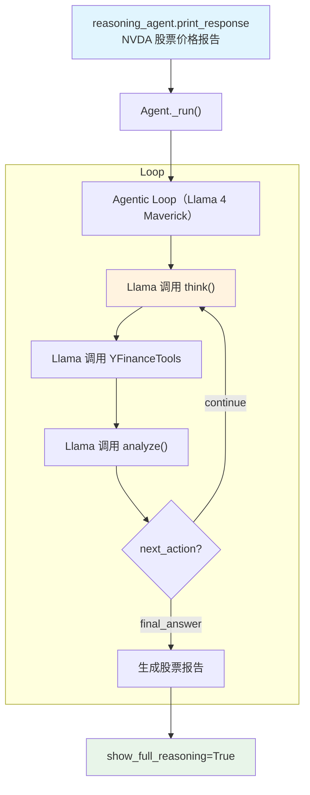

# llama_reasoning_tools.py — 实现原理分析

> 源文件：`cookbook/10_reasoning/tools/llama_reasoning_tools.py`

## 概述

本示例展示 **`ReasoningTools`** 与 **Meta Llama 4 Maverick**（`Llama-4-Maverick-17B-128E-Instruct-FP8`）及 **`YFinanceTools`** 的组合。Meta 的 Llama 4 系列是最新的开源大模型，通过 Meta 的官方 API 提供服务。

**核心配置一览：**

| 配置项 | 值 | 说明 |
|--------|------|------|
| `model` | `Llama(id="Llama-4-Maverick-17B-128E-Instruct-FP8")` | Meta Llama 4 Maverick |
| `tools` | `[ReasoningTools(enable_think=True, enable_analyze=True, add_instructions=True), YFinanceTools()]` | 推理工具（含说明）+ YFinance |
| `instructions` | `"Use tables where possible"` | 表格格式化指令 |
| `markdown` | `True` | Markdown 格式化 |

## System Prompt 组装

| 序号 | 组成部分 | 本文件中的值/来源 | 是否生效 |
|------|---------|-----------------|---------|
| 3.1 | `instructions` | `"Use tables where possible"` | 是 |
| 3.2.1 | `markdown` | `True` | 是 |
| 3.3.5 | `_tool_instructions` | ReasoningTools 使用说明 | 是 |

## Mermaid 流程图

## 关键源码文件索引

| 文件 | 关键函数/类 | 作用 |
|------|------------|------|
| `agno/tools/reasoning.py` | `ReasoningTools` L10 | 推理工具 |
| `agno/tools/yfinance.py` | `YFinanceTools` | Yahoo Finance 工具 |
| `agno/models/meta` | `Llama` | Meta Llama 模型类 |
