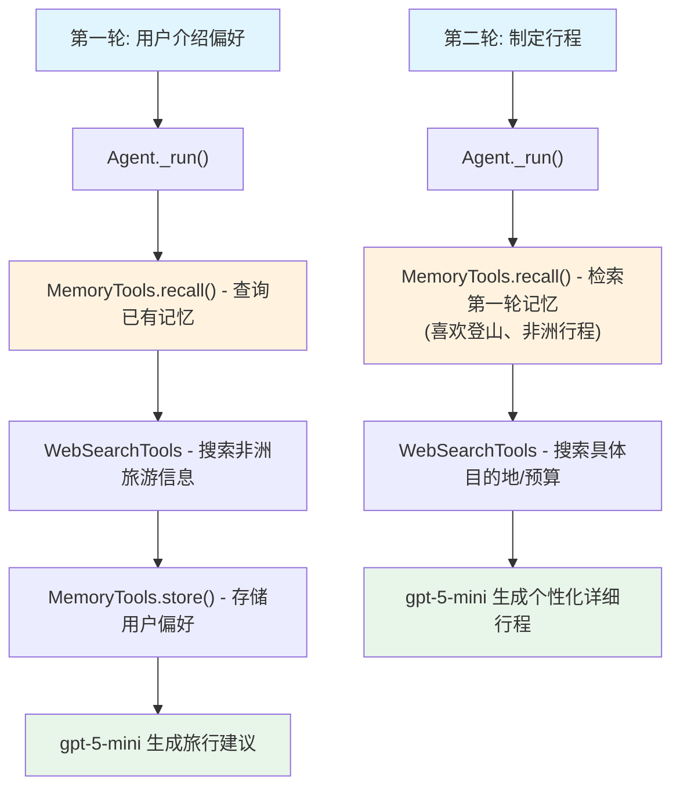

# memory_tools.py — 实现原理分析

> 源文件：`cookbook/10_reasoning/tools/memory_tools.py`

## 概述

本示例展示 **`MemoryTools`（记忆工具）** 与 **`WebSearchTools`** 的组合，实现一个能够**记住用户偏好**并结合实时搜索制定旅行计划的个性化 Agent。`MemoryTools` 提供跨会话的持久化记忆能力，让 Agent 能记住用户的喜好、历史交互等信息。

**核心配置一览：**

| 配置项 | 值 | 说明 |
|--------|------|------|
| `model` | `OpenAIChat(id="gpt-5-mini")` | Chat Completions API |
| `tools` | `[MemoryTools(db=db), WebSearchTools()]` | 记忆工具（SQLite 持久化）+ 网络搜索 |
| `instructions` | 5 条个性化旅行规划指令 | 引导 Agent 主动检索记忆和存储信息 |
| `markdown` | `True` | Markdown 格式化 |

## 架构分层

```
用户代码层                          agno.agent 层
┌──────────────────────────┐    ┌──────────────────────────────────┐
│ memory_tools.py          │    │ Agent._run()                     │
│                          │    │  ├ get_tools()                   │
│ MemoryTools(db=db)       │───>│  │    → MemoryTools 工具函数     │
│ WebSearchTools()         │───>│  │    → WebSearchTools 工具函数  │
│                          │    │  └ Agentic Loop                  │
│ agent.print_response(    │    │      ├ 调用 MemoryTools.recall   │
│   ..., user_id=...)      │    │      ├ 调用 WebSearchTools       │
└──────────────────────────┘    │      └ 调用 MemoryTools.store    │
                                └──────────────────────────────────┘
                                              │
                                              ▼
                                    ┌──────────────────┐
                                    │ OpenAIChat       │
                                    │ gpt-5-mini       │
                                    └──────────────────┘
                                              │
                                              ▼
                                    ┌──────────────────┐
                                    │ SqliteDb         │
                                    │ tmp/memory.db    │
                                    └──────────────────┘
```

## 核心组件解析

### MemoryTools 的工作机制

`MemoryTools(db=db)` 提供记忆存取工具，底层使用 `SqliteDb` 持久化：
- `recall(user_id, query)` — 从数据库检索与 `user_id` 关联的记忆
- `store(user_id, memory)` — 将新信息存储为用户记忆

Agent 的 instructions 明确要求：
1. **优先检索**：每次对话开始时先调用 `recall` 获取已存储的用户信息
2. **主动存储**：将用户提到的偏好、计划等存入记忆
3. **个性化响应**：基于已知用户信息直接提出具体建议，而非询问

### user_id 的作用

`agent.print_response(..., user_id=john_doe_id)` 将 `user_id` 传入 `RunContext`，`MemoryTools` 使用此 ID 在数据库中隔离不同用户的记忆，实现多用户记忆隔离。

### 两轮对话的记忆链

- 第一轮：Agent 接收用户偏好 → 存储记忆（喜欢登山、计划去非洲）
- 第二轮：Agent 调用 recall → 获取第一轮存储的偏好 → 结合 WebSearch 制定个性化计划

## System Prompt 组装

| 序号 | 组成部分 | 本文件中的值/来源 | 是否生效 |
|------|---------|-----------------|---------|
| 3.1 | `instructions` | 5 条个性化旅行规划指令（记忆检索/存储/个性化建议） | 是 |
| 3.2.1 | `markdown` | `True` | 是 |
| 3.3.5 | `_tool_instructions` | MemoryTools 工具说明 | 是 |

## Mermaid 流程图



## 关键源码文件索引

| 文件 | 关键函数/类 | 作用 |
|------|------------|------|
| `agno/tools/memory.py` | `MemoryTools` | 记忆工具 Toolkit 类 |
| `agno/tools/websearch.py` | `WebSearchTools` L16 | 网络搜索工具 |
| `agno/db/sqlite` | `SqliteDb` | SQLite 数据库后端 |
