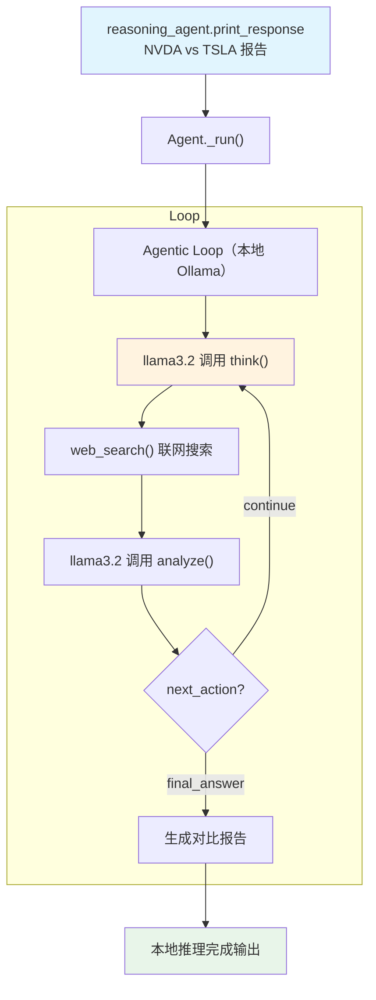

# ollama_reasoning_tools.py — 实现原理分析

> 源文件：`cookbook/10_reasoning/tools/ollama_reasoning_tools.py`

## 概述

本示例展示 **`ReasoningTools`** 与 **本地 Ollama 模型**（`llama3.2:latest`）及 **`WebSearchTools`** 的组合，实现**完全本地化的推理 + 联网搜索**工作流。Ollama 在本地运行开源模型，无需 API Key，保护数据隐私。

**核心配置一览：**

| 配置项 | 值 | 说明 |
|--------|------|------|
| `model` | `Ollama(id="llama3.2:latest")` | 本地 Ollama llama3.2 |
| `tools` | `[ReasoningTools(enable_think=True, enable_analyze=True, add_instructions=True, add_few_shot=True), WebSearchTools()]` | 推理工具（含说明+示例）+ 网络搜索 |
| `instructions` | `"Use tables where possible"` | 格式化指令 |
| `markdown` | `True` | Markdown 格式化 |

## 核心组件解析

### add_few_shot=True 对本地模型的必要性

本地小模型（如 llama3.2）对工具使用的理解能力弱于 GPT-4o 等大模型，`add_few_shot=True` 注入的两个完整示例（`FEW_SHOT_EXAMPLES`）显著提升了本地模型正确调用 think/analyze 工具的成功率。

### Ollama 模型的工具调用支持

`Ollama` 类在 `agno/models/ollama/chat.py` 中实现，支持 OpenAI 兼容的工具调用接口。只要本地模型支持 function calling（如 llama3.2），即可无缝使用 ReasoningTools。

## System Prompt 组装

| 序号 | 组成部分 | 本文件中的值/来源 | 是否生效 |
|------|---------|-----------------|---------|
| 3.1 | `instructions` | `"Use tables where possible"` | 是 |
| 3.2.1 | `markdown` | `True` | 是 |
| 3.3.5 | `_tool_instructions` | ReasoningTools 使用说明 + FEW_SHOT_EXAMPLES | 是 |

## Mermaid 流程图

## 关键源码文件索引

| 文件 | 关键函数/类 | 作用 |
|------|------------|------|
| `agno/tools/reasoning.py` | `ReasoningTools` L10 | 推理工具 |
| `agno/tools/websearch.py` | `WebSearchTools` L16 | 网络搜索工具 |
| `agno/models/ollama/chat.py` | `Ollama` | 本地 Ollama 模型类 |
