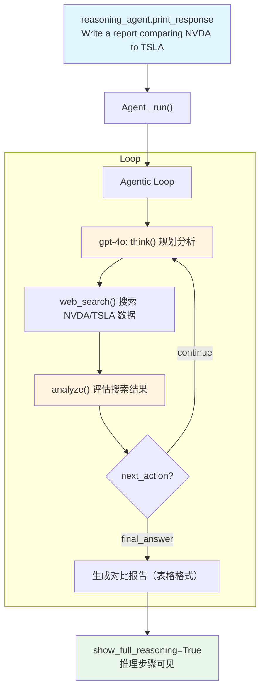

# openai_reasoning_tools.py — 实现原理分析

> 源文件：`cookbook/10_reasoning/tools/openai_reasoning_tools.py`

## 概述

本示例展示 **`ReasoningTools`（推理工具）** 与 **`WebSearchTools`（网络搜索工具）** 的组合使用，让 OpenAI `gpt-4o` 在撰写金融分析报告时，先通过 `think/analyze` 工具规划分析步骤，再通过网络搜索获取实时数据，形成**思考→搜索→分析→结论**的完整推理循环。

**核心配置一览：**

| 配置项 | 值 | 说明 |
|--------|------|------|
| `model` | `OpenAIChat(id="gpt-4o")` | Chat Completions API |
| `tools` | `[ReasoningTools(enable_think=True, enable_analyze=True, add_instructions=True, add_few_shot=True), WebSearchTools()]` | 推理工具 + 网络搜索 |
| `instructions` | `"Use tables where possible"` | 格式化指令 |
| `markdown` | `True` | Markdown 格式化 |

## 核心组件解析

### add_few_shot=True 的效果

`add_few_shot=True` 时，`ReasoningTools.__init__()` 将 `FEW_SHOT_EXAMPLES`（`tools/reasoning.py:214`）附加到 `DEFAULT_INSTRUCTIONS` 后面，一起注入 `<reasoning_instructions>` 标签中。FEW_SHOT_EXAMPLES 包含两个完整的推理示例（简单事实检索 + 多步信息收集），帮助模型理解如何正确使用 think/analyze 工具。

### 推理工具 + 搜索工具的协作

模型在 Agentic Loop 中的典型调用模式：
1. 调用 `think()` 规划分析步骤（确定需要搜索哪些数据）
2. 调用 `WebSearchTools.web_search()` 获取 NVDA/TSLA 实时数据
3. 调用 `analyze()` 评估搜索结果
4. 调用 `think()` 规划下一步（比较数据、生成表格）
5. 生成最终报告（`next_action=final_answer`）

## System Prompt 组装

| 序号 | 组成部分 | 本文件中的值/来源 | 是否生效 |
|------|---------|-----------------|---------|
| 3.1 | `instructions` | `"Use tables where possible"` | 是 |
| 3.2.1 | `markdown` | `True` | 是 |
| 3.3.5 | `_tool_instructions` | ReasoningTools 使用说明（含 FEW_SHOT） | 是 |

## Mermaid 流程图

## 关键源码文件索引

| 文件 | 关键函数/类 | 作用 |
|------|------------|------|
| `agno/tools/reasoning.py` | `ReasoningTools` L10 | 推理工具 |
| `agno/tools/reasoning.py` | `FEW_SHOT_EXAMPLES` L214 | few-shot 示例 |
| `agno/tools/websearch.py` | `WebSearchTools` L16 | 网络搜索工具 |
