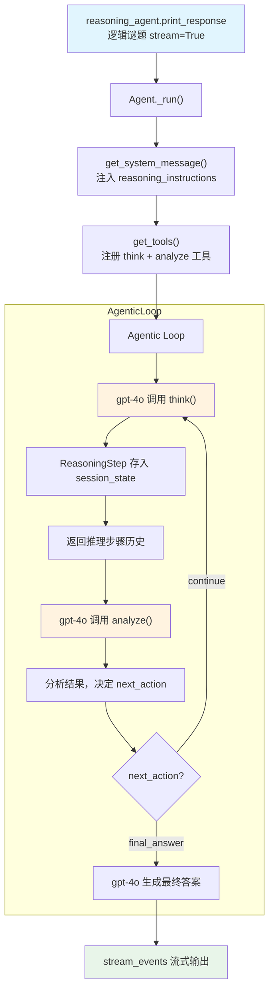

# reasoning_tools.py — 实现原理分析

> 源文件：`cookbook/10_reasoning/tools/reasoning_tools.py`

## 概述

本示例展示 Agno 的 **`ReasoningTools`（推理工具）** 机制：通过注册 `think` 和 `analyze` 两个显式工具，让模型在解决复杂问题时进行结构化的分步推理。这与 `reasoning=True` 的内置 COT 不同——ReasoningTools 是**工具调用式推理**，推理步骤对用户可见，且与其他工具（如搜索）可并发使用。

**核心配置一览：**

| 配置项 | 值 | 说明 |
|--------|------|------|
| `model` | `OpenAIChat(id="gpt-4o")` | Chat Completions API |
| `tools` | `[ReasoningTools(add_instructions=True)]` | 推理工具（含使用说明注入） |
| `instructions` | 详细的问题解决步骤指引（多行） | 引导模型解题方法 |
| `add_datetime_to_context` | `True` | 注入当前时间 |
| `stream_events` | `True` | 流式事件模式 |
| `markdown` | `True` | Markdown 格式化 |

## 架构分层

```
用户代码层                          agno.agent 层
┌──────────────────────────┐    ┌──────────────────────────────────┐
│ reasoning_tools.py       │    │ Agent._run()                     │
│                          │    │  ├ get_system_message()          │
│ ReasoningTools(          │    │  │    3.3.5 _tool_instructions   │
│   add_instructions=True) │───>│  │    （注入推理使用说明）        │
│                          │    │  ├ get_tools()                   │
│ instructions: 详细指引   │    │  │    → think(), analyze()       │
│ stream_events=True       │    │  └ Agentic Loop:                 │
└──────────────────────────┘    │      模型调用 think/analyze 工具  │
                                └──────────────────────────────────┘
                                              │
                                              ▼
                                      ┌──────────────┐
                                      │ OpenAIChat   │
                                      │ gpt-4o       │
                                      └──────────────┘
```

## 核心组件解析

### ReasoningTools 工具注册

`ReasoningTools` 继承自 `Toolkit`（`tools/reasoning.py:10`），注册两个工具：

```python
class ReasoningTools(Toolkit):
    def __init__(self, enable_think=True, enable_analyze=True, add_instructions=False, ...):
        # 构建 <reasoning_instructions> 格式的指令
        self.instructions = "<reasoning_instructions>\n" + self.DEFAULT_INSTRUCTIONS + "\n</reasoning_instructions>\n"
        tools = []
        if enable_think:
            tools.append(self.think)    # 结构化思考工具
        if enable_analyze:
            tools.append(self.analyze)  # 分析评估工具
        super().__init__(name="reasoning_tools", instructions=self.instructions, add_instructions=add_instructions, ...)
```

`add_instructions=True` 时，工具使用说明通过 `_tool_instructions` 注入 system prompt 的步骤 3.3.5。

### think() 工具的执行机制

`think()` 工具（`tools/reasoning.py:51`）：
1. 创建 `ReasoningStep`（含 title、reasoning、action、confidence）
2. 将步骤序列化为 JSON，存入 `run_context.session_state["reasoning_steps"][run_id]`
3. 返回当前会话所有推理步骤的格式化文本（供模型参考）

```python
# tools/reasoning.py:76-111
reasoning_step = ReasoningStep(title=title, reasoning=thought, action=action, ...)
run_context.session_state["reasoning_steps"][current_run_id].append(reasoning_step.model_dump_json())
```

### analyze() 工具

`analyze()` 工具（`tools/reasoning.py:117`）功能类似 `think()`，但侧重**评估**：
- 接收 `result`（上一步结果）、`analysis`（分析）、`next_action`（continue/validate/final_answer）
- 同样存入 session_state 并返回全部历史步骤

## System Prompt 组装

| 序号 | 组成部分 | 本文件中的值/来源 | 是否生效 |
|------|---------|-----------------|---------|
| 3.1 | `instructions` | 详细问题解决指引（9 条主要指令 + 子指令） | 是 |
| 3.2.1 | `markdown` | `True` | 是 |
| 3.2.2 | `add_datetime_to_context` | `True` → 注入当前时间 | 是 |
| 3.3.5 | `_tool_instructions` | `<reasoning_instructions>` 推理工具使用说明（DEFAULT_INSTRUCTIONS） | 是 |

### 最终 System Prompt（概要）

```text
You are an expert problem-solving assistant with strong analytical skills! 
[详细问题解决步骤指引...]

<additional_information>
- The current time is <当前时间>.
</additional_information>

<reasoning_instructions>
You have access to the `think` and `analyze` tools to work through problems step-by-step...
[完整推理使用说明 + FEW_SHOT_EXAMPLES]
</reasoning_instructions>

Use markdown to format your answers.
```

## 完整 API 请求

```python
# 第一轮：模型决定调用 think 工具
client.chat.completions.create(
    model="gpt-4o",
    messages=[
        {"role": "system", "content": "You are an expert problem-solving assistant...\n<reasoning_instructions>...</reasoning_instructions>..."},
        {"role": "user", "content": "Solve this logic puzzle: A man has to take a fox..."},
    ],
    tools=[
        {"type": "function", "function": {"name": "think", "description": "Use this tool as a scratchpad...", "parameters": {...}}},
        {"type": "function", "function": {"name": "analyze", "description": "Use this tool to analyze results...", "parameters": {...}}}
    ],
    stream=True,
    stream_options={"include_usage": True}
)
# 后续轮：工具结果注入，继续调用
```

## Mermaid 流程图



## 关键源码文件索引

| 文件 | 关键函数/类 | 作用 |
|------|------------|------|
| `agno/tools/reasoning.py` | `ReasoningTools` L10 | 推理工具 Toolkit 类 |
| `agno/tools/reasoning.py` | `think()` L51 | 结构化思考工具 |
| `agno/tools/reasoning.py` | `analyze()` L117 | 分析评估工具 |
| `agno/tools/reasoning.py` | `DEFAULT_INSTRUCTIONS` L193 | 推理使用说明文本 |
| `agno/reasoning/step.py` | `ReasoningStep` | 推理步骤数据模型 |
| `agno/run/base.py` | `RunContext` L16 | 运行上下文（含 session_state） |
