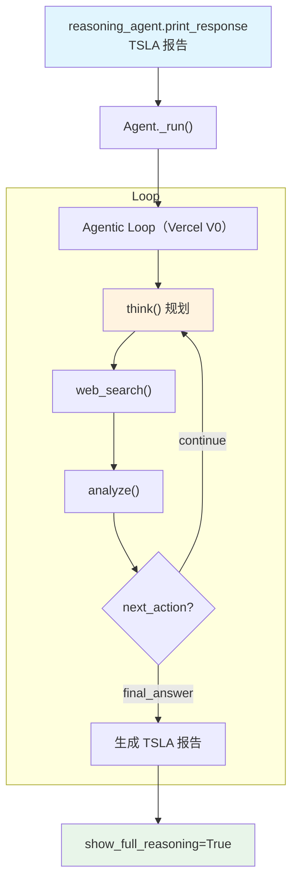

# vercel_reasoning_tools.py — 实现原理分析

> 源文件：`cookbook/10_reasoning/tools/vercel_reasoning_tools.py`

## 概述

本示例展示 **`ReasoningTools`** 与 **Vercel V0**（`v0-1.0-md`）及 **`WebSearchTools`** 的组合。V0 是 Vercel 的生成式 UI 模型，专为代码生成和前端开发设计，但同样可以用于复杂分析任务。

**核心配置一览：**

| 配置项 | 值 | 说明 |
|--------|------|------|
| `model` | `V0(id="v0-1.0-md")` | Vercel V0 模型 |
| `tools` | `[ReasoningTools(add_instructions=True, add_few_shot=True), WebSearchTools()]` | 推理工具（含说明+示例）+ 网络搜索 |
| `instructions` | `["Use tables to display data", "Only output the report, no other text"]` | 格式化指令（列表形式） |
| `markdown` | `True` | Markdown 格式化 |

## System Prompt 组装

| 序号 | 组成部分 | 本文件中的值/来源 | 是否生效 |
|------|---------|-----------------|---------|
| 3.1 | `instructions` | `["Use tables to display data", "Only output the report, no other text"]`（列表格式） | 是 |
| 3.2.1 | `markdown` | `True` | 是 |
| 3.3.5 | `_tool_instructions` | ReasoningTools 使用说明 + FEW_SHOT_EXAMPLES | 是 |

## Mermaid 流程图

## 关键源码文件索引

| 文件 | 关键函数/类 | 作用 |
|------|------------|------|
| `agno/tools/reasoning.py` | `ReasoningTools` L10 | 推理工具 |
| `agno/tools/websearch.py` | `WebSearchTools` L16 | 网络搜索工具 |
| `agno/models/vercel` | `V0` | Vercel V0 模型类 |
