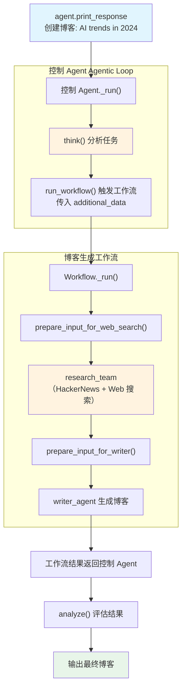

# workflow_tools.py — 实现原理分析

> 源文件：`cookbook/10_reasoning/tools/workflow_tools.py`

## 概述

本示例展示 **`WorkflowTools`（工作流工具）** 的使用：将一个完整的博客生成 `Workflow`（包含函数步骤、Team 成员、Agent 步骤）封装为工具，让 Agent 通过 `run_workflow` 工具调用来触发复杂的自动化流程。Agent 可以通过 `think/analyze` 工具（`enable_think=True, enable_analyze=True`）在调用工作流前后进行推理。

**核心配置一览（控制 Agent）：**

| 配置项 | 值 | 说明 |
|--------|------|------|
| `model` | `OpenAIChat(id="gpt-5-mini")` | 主控 Agent 模型 |
| `tools` | `[WorkflowTools(workflow=..., enable_think=True, enable_analyze=True, add_few_shot=True, few_shot_examples=...)]` | 工作流工具（含推理） |
| `markdown` | `True` | Markdown 格式化 |

**Workflow 内部成员：**

| 成员 | 类型 | 作用 |
|------|------|------|
| `prepare_input_for_web_search` | `StepFunction` | 格式化搜索输入 |
| `research_team` | `Team(members=[hackernews_agent, web_agent])` | 多渠道研究 |
| `prepare_input_for_writer` | `StepFunction` | 格式化写作输入 |
| `writer_agent` | `Agent` | 生成博客文章 |

## 架构分层

```
用户代码层                          agno.agent 层
┌──────────────────────────┐    ┌──────────────────────────────────┐
│ workflow_tools.py         │    │ 控制 Agent._run()                │
│                          │    │  └ Agentic Loop                  │
│ agent（控制层）:          │    │      ├ think() 规划              │
│   WorkflowTools(         │───>│      ├ run_workflow() 触发工作流  │
│     workflow=content_    │    │      └ analyze() 评估结果        │
│     creation_workflow)   │    │                                  │
│                          │    │ Workflow._run()（内部）           │
└──────────────────────────┘    │  ├ prepare_input_for_web_search  │
                                │  ├ research_team（Team）          │
                                │  ├ prepare_input_for_writer      │
                                │  └ writer_agent（Agent）          │
                                └──────────────────────────────────┘
```

## 核心组件解析

### WorkflowTools 的封装机制

`WorkflowTools` 将 `Workflow` 实例封装为 `run_workflow(input_data, additional_data)` 工具函数：
- 控制 Agent 通过调用此工具触发整个工作流
- `additional_data` 字典传递额外参数（topic、style、title 等）
- 工作流执行完毕后，结果作为工具返回值传回控制 Agent

### few_shot_examples 自定义示例

`few_shot_examples=FEW_SHOT_EXAMPLES` 传入了自定义的博客生成示例，替换 WorkflowTools 默认的 few-shot 示例，帮助模型理解正确的 `run_workflow` 调用格式（包括如何传 `additional_data`）。

### Workflow 步骤组合

```python
steps=[
    prepare_input_for_web_search,  # StepFunction（Python 函数）
    research_team,                  # Team（多 Agent 协作）
    prepare_input_for_writer,       # StepFunction
    writer_agent,                   # Agent
]
```

步骤间通过 `StepInput.previous_step_content` 传递上一步输出，实现顺序流水线处理。

## System Prompt 组装

| 序号 | 组成部分 | 本文件中的值/来源 | 是否生效 |
|------|---------|-----------------|---------|
| 3.2.1 | `markdown` | `True` | 是 |
| 3.3.5 | `_tool_instructions` | WorkflowTools 说明（含自定义 FEW_SHOT） | 是 |
| 其他 | 未设置 | — | 否 |

## Mermaid 流程图



## 关键源码文件索引

| 文件 | 关键函数/类 | 作用 |
|------|------------|------|
| `agno/tools/workflow.py` | `WorkflowTools` | 工作流工具 Toolkit |
| `agno/workflow/workflow.py` | `Workflow` | 工作流执行引擎 |
| `agno/workflow/types.py` | `StepInput`, `StepOutput` | 步骤输入输出类型 |
| `agno/team/team.py` | `Team` | 多 Agent 团队 |
| `agno/db/sqlite` | `SqliteDb` | 工作流会话持久化 |
