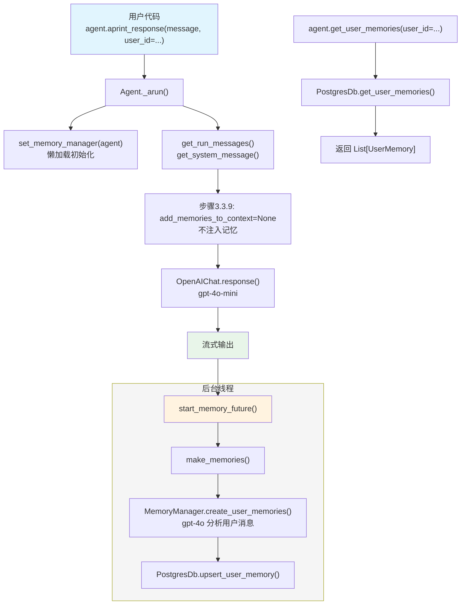

# 01_agent_with_memory.py — 实现原理分析

> 源文件：`cookbook/11_memory/01_agent_with_memory.py`

## 概述

本示例展示 Agno 的 **`update_memory_on_run`** 机制：每次对话结束后，框架自动在后台线程中提取用户信息并写入持久化记忆库，下一轮对话时这些记忆注入 system prompt 供模型参考。

**核心配置一览：**

| 配置项 | 值 | 说明 |
|--------|------|------|
| `model` | `OpenAIChat(id="gpt-4o-mini")` | Chat Completions API |
| `db` | `PostgresDb(db_url=...)` | 持久化存储（记忆 + 会话） |
| `update_memory_on_run` | `True` | 每次运行后自动提取记忆 |
| `enable_agentic_memory` | `False`（未设置） | 不启用工具式记忆 |
| `add_memories_to_context` | `None`（未设置） | 未显式开启记忆注入 |
| `memory_manager` | `None`（自动创建） | 运行时自动初始化 |

## 架构分层

```
用户代码层                          agno.agent 层
┌──────────────────────────────┐   ┌──────────────────────────────────────────────────┐
│ 01_agent_with_memory.py      │   │ Agent._run() / Agent._arun()                     │
│                              │   │  ├─ set_memory_manager(agent)                    │
│ update_memory_on_run=True    │──>│  │    (懒加载初始化 MemoryManager)               │
│ db=PostgresDb(...)           │   │  ├─ get_run_messages()                           │
│                              │   │  │    get_system_message()                       │
│ asyncio.run(                 │   │  │      步骤 3.3.9: add_memories_to_context=None  │
│   agent.aprint_response(...) │   │  │      (默认不注入记忆到 prompt)                │
│ )                            │   │  ├─ Model.response()                             │
│                              │   │  └─ [运行后] start_memory_future()               │
│ agent.print_response(...)    │   │         ↓                                        │
│ agent.get_user_memories()    │   │    background_executor.submit(make_memories)     │
└──────────────────────────────┘   └──────────────────────────────────────────────────┘
                                              │
                                              ▼
                                   ┌──────────────────────────────┐
                                   │ MemoryManager (后台线程)      │
                                   │  create_user_memories()       │
                                   │    ↓ gpt-4o (默认)            │
                                   │  db.upsert_user_memory()      │
                                   │  PostgresDb                   │
                                   └──────────────────────────────┘
                                              │
                                              ▼
                                   ┌──────────────────┐
                                   │ OpenAIChat       │
                                   │ gpt-4o-mini      │
                                   └──────────────────┘
```

## 核心组件解析

### update_memory_on_run — 自动记忆提取

`update_memory_on_run=True` 触发运行后台记忆任务，位于 `_managers.py:start_memory_future()`（L177）：

```python
# _managers.py L200-209
if (
    run_messages.user_message is not None
    and agent.memory_manager is not None
    and agent.update_memory_on_run
    and not agent.enable_agentic_memory  # 互斥条件：agentic 模式时不走后台
):
    log_debug("Starting memory creation in background thread.")
    return agent.background_executor.submit(
        make_memories, agent, run_messages=run_messages, user_id=user_id
    )
```

`make_memories()`（L29）提取用户消息并调用 `MemoryManager.create_user_memories()` 写入数据库。

### MemoryManager 懒加载

Agent 不显式配置 `memory_manager` 时，框架在运行时自动创建（`_init.py:set_memory_manager()`），默认使用 `gpt-4o` 作为记忆分析模型，复用 Agent 的 `db`。

### get_user_memories — 程序式查询

```python
# agent.py L939 → _managers.get_user_memories()
memories = agent.get_user_memories(user_id=john_doe_id)
```

直接读数据库，不依赖 MemoryManager 的内存缓存。

### 混合同步/异步运行

本例展示了同一个 Agent 实例可同时用于 `asyncio.run(agent.aprint_response(...))` 和 `agent.print_response(...)`，两者共享同一 PostgresDb 持久化层。

## System Prompt 组装

| 序号 | 组成部分 | 本文件中的值/来源 | 是否生效 |
|------|---------|-----------------|---------|
| 1 | `system_message`（自定义） | None | 否 |
| 3.1 | `instructions` | None | 否 |
| 3.1.1 | 模型指令（`get_instructions_for_model`） | 无（gpt-4o-mini 无额外指令） | 否 |
| 3.2.1 | `markdown` | False | 否 |
| 3.2.2 | `add_datetime_to_context` | False | 否 |
| 3.3.9 | `add_memories_to_context` | None（未设置） | 否 |

### 最终 System Prompt

```text
（空）— 未设置 instructions，未开启记忆注入，系统消息为空或 None
```

> 注意：`update_memory_on_run=True` 仅控制"运行后写记忆"，不控制"读记忆到 prompt"。若要将记忆注入 prompt，需额外设置 `add_memories_to_context=True`。

## 完整 API 请求

```python
# 第一轮（告知名字和爱好）
client.chat.completions.create(
    model="gpt-4o-mini",
    messages=[
        # system 消息为空，不发送
        {"role": "user", "content": "My name is John Doe and I like to hike in the mountains on weekends."}
    ],
    stream=True,
    stream_options={"include_usage": True}
)

# 运行后后台线程调用 MemoryManager（使用 gpt-4o）提取记忆并写入 PostgresDb

# 第二轮（询问爱好）
client.chat.completions.create(
    model="gpt-4o-mini",
    messages=[
        {"role": "user", "content": "What are my hobbies?"}
    ],
    stream=True,
    stream_options={"include_usage": True}
)
```

> 由于未设置 `add_memories_to_context=True`，记忆不会注入 system prompt。实际项目中通常配合 `add_memories_to_context=True` 使用，使模型能利用已存储的记忆。

## Mermaid 流程图



## 关键源码文件索引

| 文件 | 关键函数/类 | 作用 |
|------|------------|------|
| `agno/agent/agent.py` | `update_memory_on_run` L115 | 控制是否后台写记忆 |
| `agno/agent/_managers.py` | `start_memory_future()` L177 | 提交后台线程任务 |
| `agno/agent/_managers.py` | `make_memories()` L29 | 同步提取记忆（后台执行） |
| `agno/memory/manager.py` | `MemoryManager` L44 | 记忆管理器类 |
| `agno/memory/manager.py` | `create_user_memories()` L368 | 从消息批量创建记忆 |
| `agno/agent/_messages.py` | `get_system_message()` L106 | 步骤3.3.9：记忆注入判断 |
