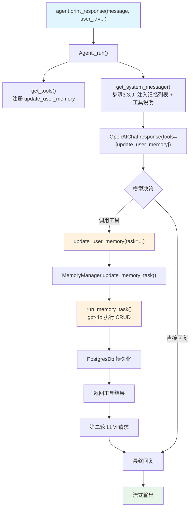

# 02_agentic_memory.py — 实现原理分析

> 源文件：`cookbook/11_memory/02_agentic_memory.py`

## 概述

本示例展示 Agno 的 **`enable_agentic_memory`** 机制：模型在对话过程中主动调用 `update_user_memory` 工具来创建、更新、删除用户记忆，实现模型驱动的自主记忆管理。与 `update_memory_on_run` 不同，这是对话中同步的工具调用，而非运行后的后台任务。

**核心配置一览：**

| 配置项 | 值 | 说明 |
|--------|------|------|
| `model` | `OpenAIChat(id="gpt-4o-mini")` | Chat Completions API |
| `db` | `PostgresDb(db_url=...)` | 持久化存储 |
| `enable_agentic_memory` | `True` | 注册 `update_user_memory` 工具 |
| `update_memory_on_run` | `False`（未设置） | 不走后台记忆提取 |
| `add_memories_to_context` | `None`（未设置） | 未显式开启记忆注入 |
| `memory_manager` | `None`（自动创建） | 运行时懒加载 |

## 架构分层

```
用户代码层                          agno.agent 层
┌──────────────────────────────┐   ┌──────────────────────────────────────────────────┐
│ 02_agentic_memory.py         │   │ Agent._run()                                     │
│                              │   │  ├─ _tools.get_tools()                           │
│ enable_agentic_memory=True   │──>│  │    注册 update_user_memory 工具               │
│ db=PostgresDb(...)           │   │  ├─ get_run_messages()                           │
│                              │   │  │    get_system_message()                       │
│ agent.print_response(        │   │  │      步骤3.3.9: add_memories_to_context       │
│   "My name is John Doe...",  │   │  │        注入记忆列表 + <updating_user_memories> │
│   user_id=john_doe_id,       │   │  ├─ Model.response() [含工具]                   │
│ )                            │   │  ├─ [工具调用] update_user_memory(task=...)      │
└──────────────────────────────┘   │  │    MemoryManager.update_memory_task()         │
                                   │  └─ 继续对话循环                                 │
                                   └──────────────────────────────────────────────────┘
                                              │
                                   ┌──────────────────────────────┐
                                   │ MemoryManager（同步调用）     │
                                   │  update_memory_task()         │
                                   │    run_memory_task()          │
                                   │    → gpt-4o (默认)            │
                                   │    → CRUD DB 操作             │
                                   └──────────────────────────────┘
                                              │
                                              ▼
                                   ┌──────────────────┐
                                   │ OpenAIChat       │
                                   │ gpt-4o-mini      │
                                   └──────────────────┘
```

## 核心组件解析

### enable_agentic_memory — 工具注册

`enable_agentic_memory=True` 时，`_tools.get_tools()`（`_tools.py:L150-151`）注册 `update_user_memory` 工具：

```python
# agent/_tools.py L150-151（简化）
if agent.enable_agentic_memory and agent.memory_manager is not None:
    tools.append(get_update_user_memory_function(agent, user_id=user_id))
```

工具函数由 `_default_tools.get_update_user_memory_function()`（L38）创建：

```python
def update_user_memory(task: str) -> str:
    """Use this function to submit a task to modify the Agent's memory.
    Args:
        task: The task to update the memory. Be specific and describe the task in detail.
    """
    response = agent.memory_manager.update_memory_task(task=task, user_id=user_id)
    return response
```

### update_memory_task — 记忆 CRUD 执行

`MemoryManager.update_memory_task()`（`memory/manager.py:L481`）构建独立 LLM 请求执行记忆操作：

```python
# memory/manager.py L503-512
response = self.run_memory_task(
    task=task,
    existing_memories=existing_memories,  # 现有记忆列表
    user_id=user_id,
    db=self.db,
    delete_memories=self.delete_memories,
    update_memories=self.update_memories,
    add_memories=self.add_memories,
    clear_memories=self.clear_memories,
)
```

`run_memory_task()` 调用独立模型（默认 gpt-4o）使用 add_memory/update_memory/delete_memory/clear_memory 工具操作数据库。

### System Prompt 中的记忆工具说明

步骤 3.3.9（`_messages.py:L282`）：当 `enable_agentic_memory=True` 时，在记忆列表后追加工具使用说明：

```python
# _messages.py L310-320
if agent.enable_agentic_memory:
    system_message_content += (
        "\n<updating_user_memories>\n"
        "- You have access to the `update_user_memory` tool that you can use to add new memories, "
        "update existing memories, delete memories, or clear all memories.\n"
        "- If the user's message includes information that should be captured as a memory, "
        "use the `update_user_memory` tool to update your memory database.\n"
        "- Memories should include details that could personalize ongoing interactions with the user.\n"
        "- Use this tool to add new memories or update existing memories that you identify in the conversation.\n"
        "- Use this tool if the user asks to update their memory, delete a memory, or clear all memories.\n"
        "</updating_user_memories>\n\n"
    )
```

### 与 update_memory_on_run 的区别

| 维度 | `enable_agentic_memory` | `update_memory_on_run` |
|------|------------------------|------------------------|
| 触发方式 | 模型主动调用工具 | 运行后框架自动触发 |
| 执行时机 | 对话过程中（同步） | 模型响应后（后台线程） |
| 控制粒度 | 模型决策 CRUD 操作 | 自动提取，写入策略固定 |
| 互斥条件 | 两者可同时设置，但 agentic 优先 | `start_memory_future()` 中检测 `not enable_agentic_memory` |

## System Prompt 组装

| 序号 | 组成部分 | 本文件中的值/来源 | 是否生效 |
|------|---------|-----------------|---------|
| 1 | `system_message`（自定义） | None | 否 |
| 3.1 | `instructions` | None | 否 |
| 3.3.9 | `add_memories_to_context` | None（懒加载后实际执行） | 是（隐式）|
| 3.3.9 | `<updating_user_memories>` 工具说明 | 因 `enable_agentic_memory=True` 追加 | 是 |

### 最终 System Prompt（首次运行，无历史记忆）

```text
You have the capability to retain memories from previous interactions with the user,
but have not had any interactions with the user yet.

<updating_user_memories>
- You have access to the `update_user_memory` tool that you can use to add new memories, update existing memories, delete memories, or clear all memories.
- If the user's message includes information that should be captured as a memory, use the `update_user_memory` tool to update your memory database.
- Memories should include details that could personalize ongoing interactions with the user.
- Use this tool to add new memories or update existing memories that you identify in the conversation.
- Use this tool if the user asks to update their memory, delete a memory, or clear all memories.
- If you use the `update_user_memory` tool, remember to pass on the response to the user.
</updating_user_memories>
```

## 完整 API 请求

```python
# 第一轮请求（带 update_user_memory 工具）
client.chat.completions.create(
    model="gpt-4o-mini",
    messages=[
        {"role": "system", "content": "You have the capability to retain memories...\n<updating_user_memories>...</updating_user_memories>"},
        {"role": "user", "content": "My name is John Doe and I like to hike in the mountains on weekends."}
    ],
    tools=[{
        "type": "function",
        "function": {
            "name": "update_user_memory",
            "description": "Use this function to submit a task to modify the Agent's memory...",
            "parameters": {
                "type": "object",
                "properties": {
                    "task": {"type": "string", "description": "The task to update the memory..."}
                },
                "required": ["task"]
            }
        }
    }],
    stream=True,
    stream_options={"include_usage": True}
)

# 模型决定调用工具，第二轮请求（含工具结果）
client.chat.completions.create(
    model="gpt-4o-mini",
    messages=[
        {"role": "system", "content": "..."},
        {"role": "user", "content": "My name is John Doe and I like to hike in the mountains on weekends."},
        {"role": "assistant", "tool_calls": [{"id": "...", "function": {"name": "update_user_memory", "arguments": "{\"task\": \"Add memory: User's name is John Doe. User likes to hike in the mountains on weekends.\"}"}}]},
        {"role": "tool", "tool_call_id": "...", "content": "Memory added successfully"}
    ],
    tools=[...],
    stream=True
)

# 内部 MemoryManager 对 gpt-4o 的独立请求（update_memory_task 触发）
client.chat.completions.create(
    model="gpt-4o",
    messages=[
        {"role": "system", "content": "You are a Memory Manager...<memories_to_capture>..."},
        {"role": "user", "content": "Add memory: User's name is John Doe. User likes to hike..."}
    ],
    tools=[add_memory, update_memory, delete_memory, clear_memory]
)
```

## Mermaid 流程图



## 关键源码文件索引

| 文件 | 关键函数/类 | 作用 |
|------|------------|------|
| `agno/agent/agent.py` | `enable_agentic_memory` L113 | 启用代理式记忆 |
| `agno/agent/_tools.py` | 注册 `update_user_memory` L150-151 | 将工具加入工具列表 |
| `agno/agent/_default_tools.py` | `get_update_user_memory_function()` L38 | 创建工具函数 |
| `agno/memory/manager.py` | `update_memory_task()` L481 | 工具调用入口 |
| `agno/memory/manager.py` | `run_memory_task()` | 独立 LLM 调用执行 CRUD |
| `agno/agent/_messages.py` | 步骤3.3.9 L282-320 | 注入记忆 + 工具说明到 system prompt |
