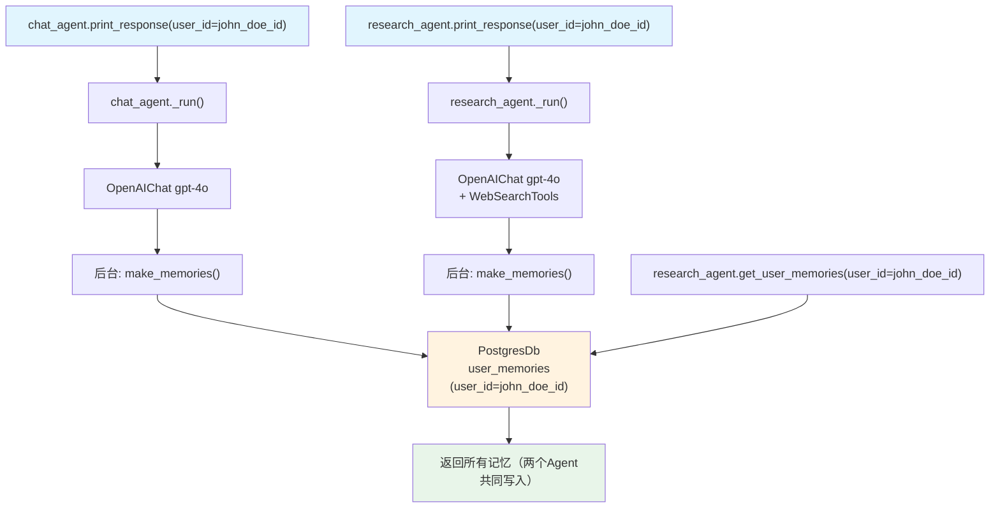

# 03_agents_share_memory.py — 实现原理分析

> 源文件：`cookbook/11_memory/03_agents_share_memory.py`

## 概述

本示例展示 Agno 的 **多 Agent 共享记忆** 机制：两个不同用途的 Agent（聊天助手 + 研究助手）通过共享同一个 `PostgresDb` 数据库和相同的 `user_id`，实现用户记忆的跨 Agent 共享。记忆以 `user_id` 为键存储，任何配置了相同 `db` 的 Agent 都可读写同一用户的记忆。

**核心配置一览：**

| 配置项 | chat_agent | research_agent |
|--------|-----------|---------------|
| `model` | `OpenAIChat("gpt-4o")` | `OpenAIChat("gpt-4o")` |
| `description` | 聊天助手 | 研究助手 |
| `tools` | None | `[WebSearchTools()]` |
| `db` | `PostgresDb(db_url=...)` | 同一个 `db` 实例 |
| `update_memory_on_run` | `True` | `True` |

## 架构分层

```
用户代码层                              agno.agent 层
┌──────────────────────────────────┐   ┌──────────────────────────────────────────┐
│ 03_agents_share_memory.py        │   │ chat_agent._run()                        │
│                                  │   │  ├─ 后台: make_memories()               │
│ chat_agent = Agent(              │   │  │    memory_manager.create_user_memories│
│   db=db,                         │──>│  │    db.upsert_user_memory(user_id=...) │
│   update_memory_on_run=True,     │   │  └─ 写入 PostgresDb                      │
│ )                                │   │                                          │
│ research_agent = Agent(          │   │ research_agent._run()                    │
│   db=db,                         │──>│  ├─ 共享同一 PostgresDb                  │
│   update_memory_on_run=True,     │   │  └─ 后台: make_memories()               │
│ )                                │   │       写入同一 user_id 的记忆              │
└──────────────────────────────────┘   └──────────────────────────────────────────┘
                                                  │ 共享
                                       ┌──────────┴──────────┐
                                       │ PostgresDb           │
                                       │ user_memories 表     │
                                       │ ──────────────────── │
                                       │ user_id → memories[] │
                                       └─────────────────────┘
```

## 核心组件解析

### 记忆共享原理

记忆在数据库中以 `user_id` 作为分区键存储。两个 Agent 使用相同的 `db` 对象，因此：

```python
# 两个 Agent 写入的记忆都挂载在同一 user_id 下
chat_agent.print_response("My name is John Doe...", user_id="john_doe@example.com")
# → PostgresDb: {user_id: "john_doe@example.com", memory: "User's name is John Doe"}

research_agent.print_response("I love quantum computing...", user_id="john_doe@example.com")
# → PostgresDb: {user_id: "john_doe@example.com", memory: "User is interested in quantum computing"}

# research_agent 可读取 chat_agent 存储的记忆
memories = research_agent.get_user_memories(user_id="john_doe@example.com")
# 返回两个 Agent 存储的所有记忆
```

### MemoryManager 实例与 db 的关系

每个 Agent 在懒加载时创建自己的 `MemoryManager` 实例，但都指向同一个 `db`。MemoryManager 只是操作层，数据实际存储在 db 中：

```python
# _managers.py L212 get_user_memories
def get_user_memories(agent, user_id=None):
    # 通过 agent.memory_manager 读取 db
    # 因为 db 共享，所以可以读到另一个 Agent 写入的数据
    return agent.memory_manager.get_user_memories(user_id=user_id)
```

### research_agent 带工具运行

`research_agent` 额外配置了 `WebSearchTools()`，每次运行时工具列表中包含网络搜索工具。记忆功能与工具功能正交，互不影响。

## System Prompt 组装

两个 Agent 的 system prompt 结构相同，以 `chat_agent` 为例：

| 序号 | 组成部分 | 值 | 是否生效 |
|------|---------|-----|---------|
| 3.3.1 | `description` | "You are a helpful assistant that can chat with users" | 是 |
| 3.3.9 | `add_memories_to_context` | None（未设置） | 否 |

### 最终 System Prompt

```text
You are a helpful assistant that can chat with users
```

> 注意：`update_memory_on_run=True` 不自动注入记忆到 prompt。需要额外设置 `add_memories_to_context=True` 才能将存储的记忆注入 system prompt 供模型参考。

## 完整 API 请求

```python
# chat_agent 第一轮（无工具）
client.chat.completions.create(
    model="gpt-4o",
    messages=[
        {"role": "system", "content": "You are a helpful assistant that can chat with users"},
        {"role": "user", "content": "My name is John Doe and I like to hike in the mountains on weekends."}
    ],
    stream=True,
    stream_options={"include_usage": True}
)

# research_agent 第一轮（带 web_search 工具）
client.chat.completions.create(
    model="gpt-4o",
    messages=[
        {"role": "system", "content": "You are a research assistant that can help users with their research questions"},
        {"role": "user", "content": "I love asking questions about quantum computing. What is the latest news..."}
    ],
    tools=[{"type": "function", "function": {"name": "web_search", ...}}],
    stream=True,
    stream_options={"include_usage": True}
)
```

## Mermaid 流程图



## 关键源码文件索引

| 文件 | 关键函数/类 | 作用 |
|------|------------|------|
| `agno/memory/manager.py` | `MemoryManager` L44 | 记忆管理器（每个 Agent 独立实例，共享 db） |
| `agno/agent/_managers.py` | `make_memories()` L29 | 后台提取并写入记忆 |
| `agno/agent/_managers.py` | `get_user_memories()` L212 | 按 user_id 读取记忆 |
| `agno/db/postgres/` | `PostgresDb` | 共享存储后端 |
