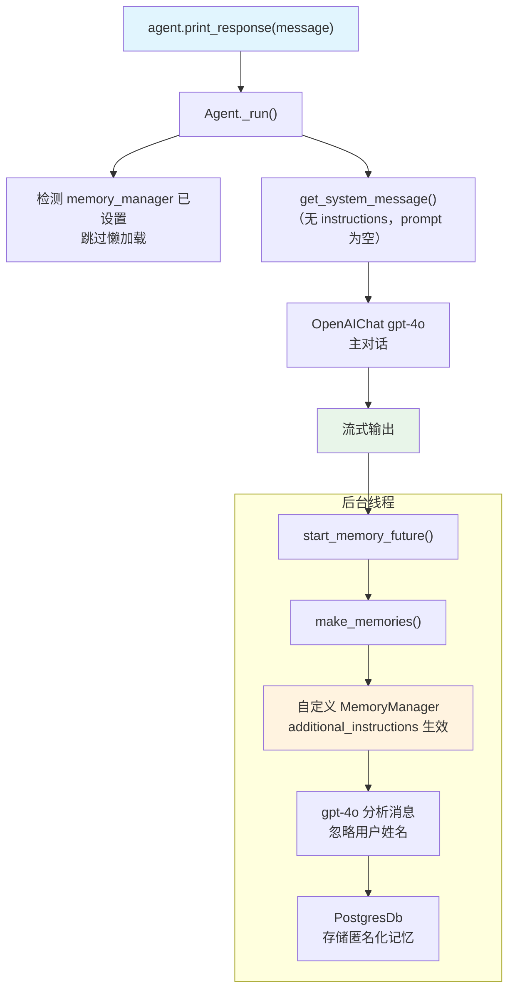

# 04_custom_memory_manager.py — 实现原理分析

> 源文件：`cookbook/11_memory/04_custom_memory_manager.py`

## 概述

本示例展示 Agno 的 **自定义 `MemoryManager`** 机制：通过显式创建 `MemoryManager` 实例并注入 `additional_instructions`，可以精确控制记忆提取的行为规则（例如，禁止存储用户姓名）。自定义的 `MemoryManager` 通过 `memory_manager` 参数传给 Agent。

**核心配置一览：**

| 配置项 | 值 | 说明 |
|--------|------|------|
| `model`（Agent） | `OpenAIChat(id="gpt-4o")` | 主对话模型 |
| `model`（MemoryManager） | `OpenAIChat(id="gpt-4o")` | 记忆分析专用模型 |
| `additional_instructions` | `"Don't store any memories about the user's name..."` | 自定义记忆规则 |
| `db` | `PostgresDb(db_url=...)` | 持久化存储 |
| `memory_manager` | 自定义实例 | 显式传入自定义管理器 |
| `update_memory_on_run` | `True` | 自动后台提取 |
| `user_id` | `"john_doe@example.com"` | 固定用户 ID |

## 架构分层

```
用户代码层                              agno.agent 层
┌──────────────────────────────────┐   ┌──────────────────────────────────────────┐
│ 04_custom_memory_manager.py      │   │ Agent._run()                             │
│                                  │   │  ├─ 检测 memory_manager 已设置           │
│ memory_manager = MemoryManager(  │   │  │    跳过懒加载                         │
│   model=OpenAIChat("gpt-4o"),    │──>│  ├─ get_run_messages()                  │
│   additional_instructions="""    │   │  │    get_system_message()               │
│     Don't store name...           │   │  └─ 后台: start_memory_future()         │
│   """,                           │   │         make_memories()                  │
│   db=db,                         │   │         memory_manager.create_user_mem() │
│ )                                │   └──────────────────────────────────────────┘
│ agent = Agent(                   │
│   memory_manager=memory_manager, │
│   update_memory_on_run=True,     │
└──────────────────────────────────┘
              │
              ▼
┌──────────────────────────────────┐
│ MemoryManager（自定义规则）       │
│  get_system_message():           │
│   memory_capture_instructions    │
│   + additional_instructions      │
│     "Don't store user's name"    │
│  → gpt-4o 执行记忆 CRUD          │
└──────────────────────────────────┘
```

## 核心组件解析

### additional_instructions 注入自定义规则

`MemoryManager.get_system_message()`（`memory/manager.py:L958`）构建系统提示时，将 `additional_instructions` 追加到默认规则之后：

```python
# memory/manager.py L969-978（简化）
memory_capture_instructions = self.memory_capture_instructions or dedent(
    """\
    Memories should capture personal information about the user that is relevant to the current conversation, such as:
    - Personal facts: name, age, occupation, location, interests, and preferences
    ...
"""
)
# 如果设置了 additional_instructions，追加在系统提示末尾
# 例如："IMPORTANT: Don't store any memories about the user's name. Just say 'The User' instead"
```

这使得 MemoryManager 的 LLM 在提取记忆时会遵循自定义约束，从对话 "My name is John Doe and I like to swim" 中只提取爱好信息，忽略姓名。

### 显式传入 memory_manager 的优先级

`Agent.__init__` 接收显式 `memory_manager` 参数时，不再自动创建：

```python
# agent.py L377
memory_manager: Optional[MemoryManager] = None

# 运行时 _init.set_memory_manager() 检测已设置则跳过
# 自定义 memory_manager 的 model、instructions、db 完全由用户控制
```

### MemoryManager 独立的 model

本例中 `MemoryManager` 使用 `OpenAIChat("gpt-4o")`（高智能模型），而非默认的同 Agent 模型，适合需要高质量记忆提取的场景。Agent 主对话使用同样的 `gpt-4o`。

### 记忆提取结果验证

```python
# 调用后验证记忆内容
memories = agent.get_user_memories(user_id=john_doe_id)
# 期望结果：不含 "John Doe"，仅含爱好信息
# 例如：["The User likes to swim", "The User likes to play soccer"]
```

## System Prompt 组装

| 序号 | 组成部分 | 值 | 是否生效 |
|------|---------|-----|---------|
| 1 | `system_message` | None | 否 |
| 3.1 | `instructions` | None | 否 |
| 3.3.9 | `add_memories_to_context` | None | 否 |

Agent 本身 system prompt 为空。记忆的 system prompt 在 MemoryManager 内部独立构建，影响的是 MemoryManager 的 LLM，而非主 Agent。

### MemoryManager 内部 System Prompt（关键部分）

```text
You are a Memory Manager that is responsible for managing information and preferences about the user.
...

<memories_to_capture>
Memories should capture personal information about the user that is relevant to the current conversation...
</memories_to_capture>

IMPORTANT: Don't store any memories about the user's name. Just say "The User" instead of referencing the user's name.
```

## 完整 API 请求

```python
# Agent 主对话请求（system 为空）
client.chat.completions.create(
    model="gpt-4o",
    messages=[
        {"role": "user", "content": "My name is John Doe and I like to swim and play soccer."}
    ],
    stream=True,
    stream_options={"include_usage": True}
)

# 后台 MemoryManager 对 gpt-4o 的独立请求
client.chat.completions.create(
    model="gpt-4o",
    messages=[
        {"role": "system", "content": "You are a Memory Manager...\n<memories_to_capture>...\nIMPORTANT: Don't store any memories about the user's name..."},
        {"role": "user", "content": "My name is John Doe and I like to swim and play soccer."}
    ],
    tools=[add_memory, update_memory, delete_memory, clear_memory]
)
```

## Mermaid 流程图



## 关键源码文件索引

| 文件 | 关键函数/类 | 作用 |
|------|------------|------|
| `agno/memory/manager.py` | `MemoryManager.__init__()` L76 | 接受自定义 instructions |
| `agno/memory/manager.py` | `get_system_message()` L958 | 构建含自定义规则的 system prompt |
| `agno/memory/manager.py` | `additional_instructions` L56 | 追加自定义约束的字段 |
| `agno/agent/_managers.py` | `make_memories()` L29 | 后台调用 MemoryManager |
| `agno/agent/agent.py` | `memory_manager` L111 | 接收显式传入的 MemoryManager |
