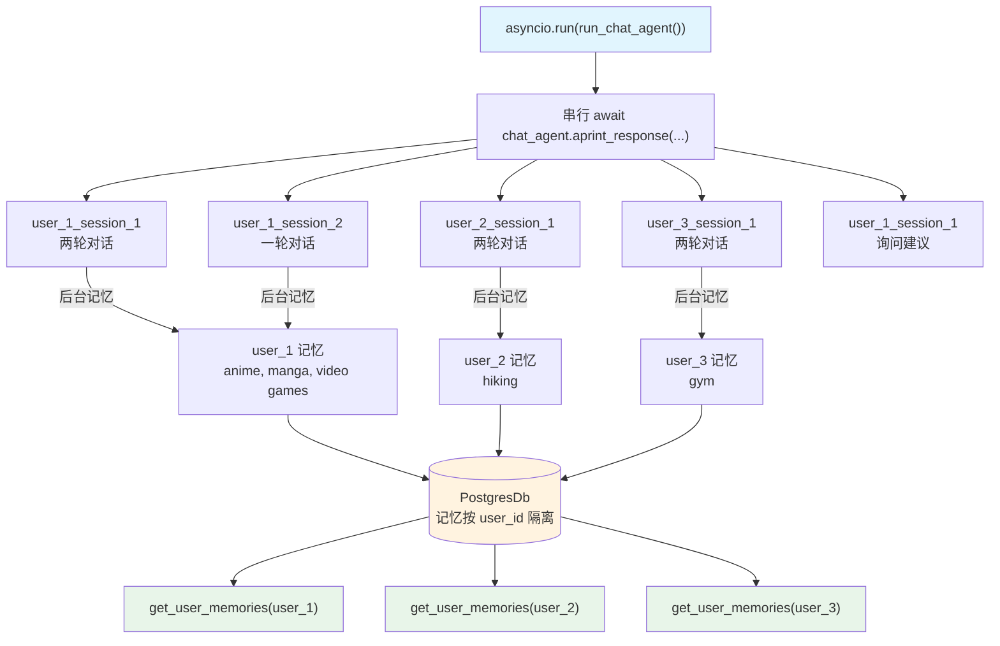

# 05_multi_user_multi_session_chat.py — 实现原理分析

> 源文件：`cookbook/11_memory/05_multi_user_multi_session_chat.py`

## 概述

本示例展示 Agno 的 **多用户多会话隔离 + 跨会话记忆共享** 机制：单个 Agent 实例服务多个用户，每个用户有独立的记忆空间（按 `user_id` 隔离），同一用户跨不同会话（`session_id`）共享记忆。这是生产级多租户聊天机器人的核心模式。

**核心配置一览：**

| 配置项 | 值 | 说明 |
|--------|------|------|
| `model` | `OpenAIChat(id="gpt-4o")` | Chat Completions API |
| `db` | `PostgresDb(db_url=...)` | 持久化存储 |
| `update_memory_on_run` | `True` | 每次运行后提取记忆 |
| 用户数量 | 3 个（user_1/2/3） | 记忆按 user_id 隔离 |
| 会话数量 | 4 个（user_1 有 2 个） | 同用户跨会话共享记忆 |

## 架构分层

```
用户代码层                              agno.agent 层
┌──────────────────────────────────┐   ┌────────────────────────────────────────────────┐
│ 05_multi_user_multi_session.py   │   │ chat_agent._run(user_id, session_id)           │
│                                  │   │  ├─ read_or_create_session(user_id,session_id) │
│ 单个 chat_agent 实例              │   │  │    按 user_id+session_id 加载会话           │
│                                  │   │  ├─ get_run_messages()                         │
│ user_1_id / user_2_id / user_3_id│──>│  ├─ Model.response()                          │
│ user_1_session_1 / session_2     │   │  └─ 后台: make_memories(user_id=user_1_id)    │
│                                  │   │         → 记忆按 user_id 写入 PostgresDb       │
└──────────────────────────────────┘   └────────────────────────────────────────────────┘
                                                  │
                                       ┌──────────┴──────────────────┐
                                       │ PostgresDb 存储结构          │
                                       │ ────────────────────────────│
                                       │ user_memories:               │
                                       │   user_1@example.com → [记忆] │
                                       │   user_2@example.com → [记忆] │
                                       │   user_3@example.com → [记忆] │
                                       │ agent_sessions:              │
                                       │   user_1_session_1 → 会话    │
                                       │   user_1_session_2 → 会话    │
                                       │   user_2_session_1 → 会话    │
                                       └──────────────────────────────┘
```

## 核心组件解析

### user_id 记忆隔离

记忆以 `user_id` 为分区键存储，不同用户互不影响：

```python
# user_1 记忆（anime、manga、video games）
await chat_agent.aprint_response("I like anime and video games.", user_id=user_1_id, session_id=user_1_session_1_id)

# user_2 记忆（hiking）
await chat_agent.aprint_response("I'm planning to hike this weekend.", user_id=user_2_id, session_id=user_2_session_1_id)

# 读取各自记忆，完全隔离
user_1_memories = chat_agent.get_user_memories(user_id=user_1_id)  # 只含 user_1 的记忆
user_2_memories = chat_agent.get_user_memories(user_id=user_2_id)  # 只含 user_2 的记忆
```

### 跨会话记忆共享

同一用户的多个会话 ID 写入的记忆都挂载在同一 `user_id` 下：

```python
# user_1 在 session_1 建立记忆
await chat_agent.aprint_response("I like anime.", user_id=user_1_id, session_id=user_1_session_1_id)
# → 后台写入 user_1 记忆

# user_1 在 session_2 可享受 session_1 积累的记忆
await chat_agent.aprint_response("I'm going to the movies.", user_id=user_1_id, session_id=user_1_session_2_id)
# → 后台继续追加 user_1 记忆（若设置 add_memories_to_context=True，则 session_2 可读到 session_1 的记忆）
```

### 异步串行执行

本例将多用户的对话组织在 `async def run_chat_agent()` 中顺序 `await`。虽然使用 `asyncio` 但仍是串行的，便于控制顺序和调试。并发版本见 `06_multi_user_multi_session_chat_concurrent.py`。

```python
async def run_chat_agent() -> None:
    # user_1 的两次对话（session_1）
    await chat_agent.aprint_response("...", user_id=user_1_id, session_id=user_1_session_1_id)
    await chat_agent.aprint_response("...", user_id=user_1_id, session_id=user_1_session_1_id)
    # user_1 的第二个会话（session_2）
    await chat_agent.aprint_response("...", user_id=user_1_id, session_id=user_1_session_2_id)
    # user_2 ...
    # user_3 ...
    # user_1 最后一条（跨会话问建议）
    await chat_agent.aprint_response("What do you suggest I do this weekend?", user_id=user_1_id, ...)
```

## System Prompt 组装

| 序号 | 组成部分 | 值 | 是否生效 |
|------|---------|-----|---------|
| 1 | `system_message` | None | 否 |
| 3.1 | `instructions` | None | 否 |
| 3.3.9 | `add_memories_to_context` | None | 否 |

Agent system prompt 为空。若需要模型利用记忆回答最后的 "What do you suggest" 问题，需设置 `add_memories_to_context=True`。

## 完整 API 请求

```python
# user_1 第一次对话
client.chat.completions.create(
    model="gpt-4o",
    messages=[
        # system 为空
        {"role": "user", "content": "My name is Mark Gonzales and I like anime and video games."}
    ]
)
# 后台: MemoryManager → 写入 user_1 记忆

# user_1 最终询问建议（如未开启 add_memories_to_context，则模型无法使用记忆）
client.chat.completions.create(
    model="gpt-4o",
    messages=[
        {"role": "user", "content": "What do you suggest I do this weekend?"}
    ]
)
```

## Mermaid 流程图



## 关键源码文件索引

| 文件 | 关键函数/类 | 作用 |
|------|------------|------|
| `agno/agent/agent.py` | `update_memory_on_run` L115 | 控制记忆提取触发 |
| `agno/agent/_managers.py` | `amake_memories()` L84 | 异步版后台记忆提取 |
| `agno/memory/manager.py` | `create_user_memories()` L368 | 从消息批量创建记忆 |
| `agno/db/postgres/` | `PostgresDb` | 按 user_id 隔离存储 |
